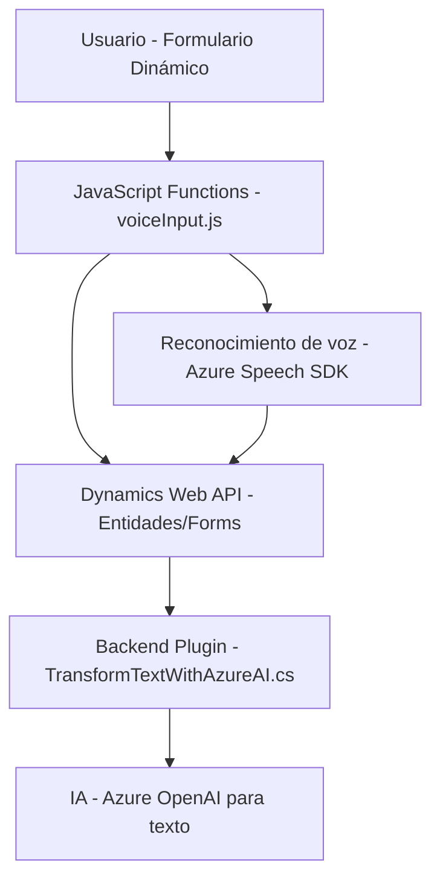

### Breve resumen técnico

El repositorio incluye tres componentes clave interconectados:
1. **Frontend:** Archivos JavaScript (`voiceInput.js`, `speechInputHandler.js`) diseñados para integración con formularios web, permitiendo entrada y salida de voz mediante Azure Speech SDK.
2. **Backend Dynamics Plugin:** Un archivo C# (`TransformTextWithAzureAI.cs`) que implementa un plugin para Dynamics 365 con soporte para procesamiento de texto mediante Azure OpenAI.
3. **Dependencias externas:** Azure Speech SDK y Azure OpenAI, junto con APIs del ecosistema Dynamics 365 y navegador DOM, establecen comunicación entre frontend, backend y servicios externos de inteligencia artificial.

---

### Descripción de arquitectura

La solución es una **arquitectura híbrida basada en n capas**:
1. **Capa de presentación (Frontend):** Permite al usuario interactuar mediante formularios de Dynamics 365 y soporta input/output por voz.
2. **Capa lógica y procesamiento (Plugin):** Implementa un plugin para Dynamics 365 que integra la lógica de negocio con servicios externos de IA (Azure OpenAI) para transformar texto.
3. **Capa de integración:** Conexión dinámica con **Azure Speech SDK** en frontend y **Azure OpenAI** en backend como servicios externos.
4. **Capa de datos (Dynamics 365 Web API):** Manejo de datos estructurados mediante entidades y relaciones de CRM.

La solución adopta patrones como **modularidad**, **dynamically loaded dependencies**, **DTOs JSON**, y el diseño basado en eventos para gestionar asincronismo. Aunque la estructura es de tipo n capas, incorpora microservicios externos para IA y procesamiento de voz.

---

### Tecnologías usadas

#### Frontend
1. **JavaScript**: Implementación de lógica de voz.
2. **Azure Speech SDK**: Procesamiento de entrada y salida de voz.
3. **Dynamics Web API**: Vinculación con entidades CRM.
4. **DOM (Browser)**: Manipulación dinámica de HTML/formularios.

#### Backend
1. **C# (.NET)**: Desarrollo del plugin.
2. **Dynamics 365 (IPlugin)**: Estructura del plugin para lógica de negocio.
3. **Azure OpenAI**: Procesamiento avanzado de texto.
4. **Newtonsoft.Json.Linq / System.Text.Json**: Manejo de JSON.

#### Servicios y configuraciones generales
- **HTTP Client**: Comunicación con servicios externos como Azure OpenAI.
- **Dynamics CRM Web API**: Gestión de operaciones y datos de CRM.

---

### Diagrama Mermaid

---

### Conclusión final

La solución sigue un enfoque moderno de integración de servicios basados en n capas, combinando procesamiento de voz y texto mediante servicios de Azure (Speech SDK, OpenAI). Presenta una clara separación de responsabilidades entre componentes frontend (formulario y voz), backend (plugins y lógica de negocio), y servicios externos (IA). Su diseño modular con dependencias cargadas dinámicamente lo hace adaptable, escalable y eficiente para formularios dinámicos y experiencias de usuario enriquecidas en Dynamics CRM.