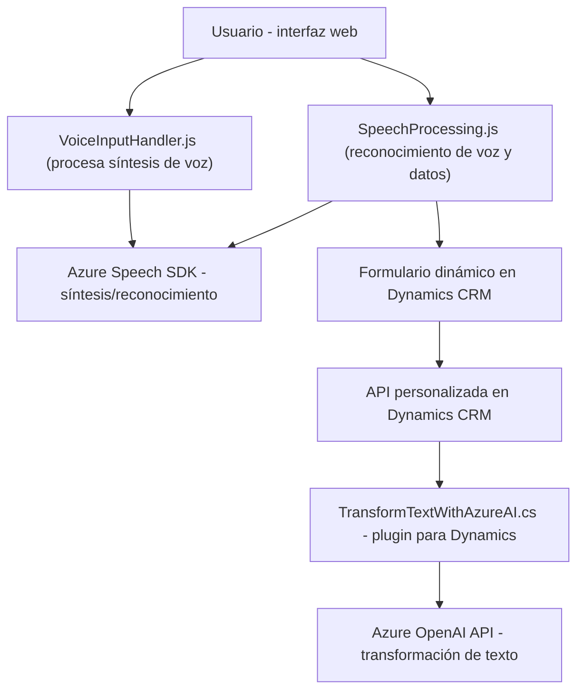

### Breve resumen técnico

El repositorio muestra una solución híbrida, orientada al manejo de interacciones entre usuarios y datos dinámicos, usando reconocimiento y síntesis de voz en combinación con procesamiento natural de lenguaje. La arquitectura incorpora componentes para la interfaz de usuario, lógica de negocio en plugins personalizados y APIs en Microsoft Dynamics CRM. Utiliza tecnologías de Microsoft Azure y AI para la interpretación y síntesis de texto y datos.

---

### Descripción de la arquitectura

La arquitectura puede clasificarse como **n capas distribuida**, al combinar varias capas funcionales:
1. **Capa de interfaz de usuario (Frontend)**: Archivos de JavaScript ejecutados en el navegador interactúan con el usuario y consumen el Speech SDK.
2. **Capa de aplicación**: Implementación en Dynamics CRM mediante plugins (.NET) y procesamiento adicional en el servidor.
3. **Capa de lógica externa**: Uso de APIs externas como Azure Speech SDK y Azure OpenAI para tareas específicas de voz y transformación de texto dinámico.

---

### Tecnologías usadas

1. **Front-end**
   - **Lenguaje**: JavaScript.
   - **Azure Speech SDK**: Para reconocimiento y síntesis de voz.
   - **Microsoft Dynamics CRM SDK**: Para manipular y acceder a datos del formulario en la API de Dynamics.

2. **Back-end y Plugins**
   - **Lenguaje**: C# (.NET Framework).
   - **Microsoft Dynamics CRM SDK**: Implementaciones de procesos y APIs vinculadas.
   - **Azure OpenAI API**: Para transformar texto de entrada en JSON con reglas específicas.

3. **Patrones de diseño**
   - Módulos desacoplados: Separación de responsabilidades en funciones y clases.
   - Integración API y cliente-servidor.
   - Event-driven (reacciones a eventos de voz del usuario).
   - Carga dinámica de dependencias (SDK de Azure).

---

### Dependencias o componentes externos

- **Azure Speech SDK**: Reconocimiento y síntesis de voz.
- **Microsoft Dynamics CRM SDK**: Acceso y modificación de datos en la capa de negocio.
- **Azure OpenAI API**: Transformación de texto en estructuras JSON.
- **Newtonsoft.Json**: Serialización de objetos para uso en API.
- **HTTP Client**: Comunicación con servicios web (Azure).

---

### Diagrama Mermaid válido para GitHub

---

### Conclusión final

Este repositorio presenta una solución mixta con una arquitectura de **n capas** distribuida que interactúa entre APIs de terceros (Azure Speech SDK, Azure AI), un frontend dinámico en JavaScript, y procesamiento empresarial mediante plugins en Microsoft Dynamics CRM. Los archivos están diseñados para ser altamente modulares y optimizados, siguiendo principios de desacoplamiento y reactivos. Es ideal para aplicaciones como sistemas de accesibilidad mediante voz o plataformas CRM enriquecidas con IA.