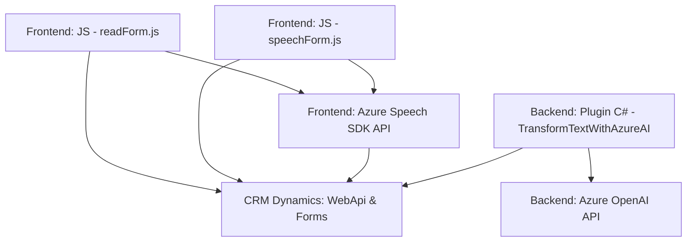

### Breve resumen técnico
El repositorio contiene componentes diseñados para integrar capacidades de reconocimiento de voz, procesamiento de voz y procesamiento de texto con servicios externos y un sistema CRM Dynamics. Las funcionalidades incluyen reconocimiento y síntesis de voz (Azure Speech SDK) y transformación avanzada de texto (Azure OpenAI) para aplicar valores en formularios CRM o transformar contenido según reglas configurables.

---

### Descripción de arquitectura
Con base en los archivos analizados, se trata de una arquitectura **orientada a servicios** que integra diferentes módulos especializados para interactuar con servicios externos (Azure Services) y un sistema interno de Dynamics CRM. La lógica está repartida de manera modular:
1. **Frontend (JavaScript):**
   - Procesa formularios y gestiona entrada/salida de voz.
   - Utiliza API de reconocimiento de voz y síntesis de voz de Azure.
   - Modularidad clara por funcionalidades en archivos separados "readForm.js", "speechForm.js", entre otros.
2. **Backend (C# Plugin para Dynamics CRM):**
   - Integra elementos para procesamiento avanzado de texto mediante Azure OpenAI.
   - Funcionamiento plug-and-play dentro del ecosistema CRM.

La arquitectura sigue un enfoque de **n capas**, con separación entre:
- **Capa de presentación (Frontend)**: Scripts que interactúan directamente con el usuario y el navegador.
- **Capa lógica de negocio (Backend Plugin)**: Gestiona procesos orientados a servicios, reglas personalizadas y transformación de datos.
- **Capa de servicios externos**: Azure Speech SDK y Azure OpenAI.

---

### Tecnologías usadas
1. **Frontend:**
   - **JavaScript:** Lenguaje principal para gestionar la lógica en el navegador.
   - **Azure Speech SDK:** SDK usado para reconocimiento y síntesis de voz.
   - **Dynamics CRM WebApi (`Xrm.WebApi`)**: Para interacción con datos del sistema CRM.

2. **Backend:**
   - **C# (.NET Framework):** Lenguaje principal del plugin en Dynamics CRM.
   - **Azure OpenAI API:** Servicio para procesamiento avanzado de texto.
   - **Newtonsoft.Json/JObject:** Para manejar JSON en C#.
   - **Microsoft.Xrm.Sdk:** APIs para integrar el plugin con el CRM.

---

### Diagrama Mermaid válido para GitHub

---

### Conclusión final
El repositorio presenta una solución técnica diseñada para integrar capacidades de interacción avanzada mediante voz y procesamiento de datos en un entorno CRM, combinando APIs de reconocimiento de voz, síntesis y transformación de texto con un enfoque modular y orientado a servicios. La arquitectura es **n capas**, dado que tiene separación clara entre frontend, backend y servicios externos. Las dependencias clave incluyen plataformas Azure (Speech SDK y OpenAI) y Microsoft Dynamics CRM.