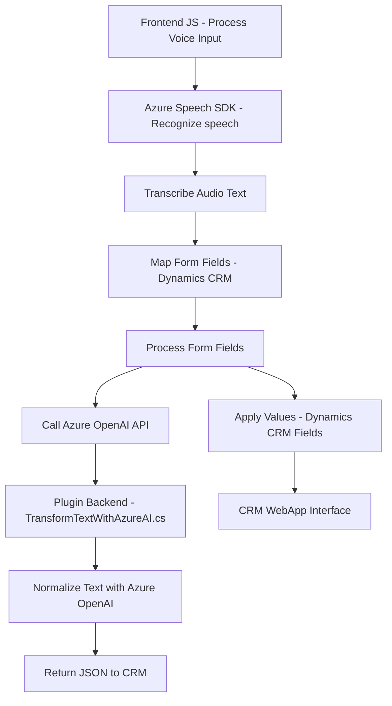

### Breve resumen técnico

El repositorio contiene una solución tecnológica integrada entre un **frontend** en JavaScript (que interactúa con formularios y el SDK de Azure Speech) y un **plugin backend** desarrollado en .NET (para Microsoft Dynamics CRM). Ambas piezas están diseñadas para capturar, procesar y transformar datos combinando análisis de voz, operaciones sobre formularios y servicios externos avanzados (Azure Speech SDK y Azure OpenAI). La solución es adecuada para escenarios empresariales de CRM con procesos de automatización por voz e inteligencia artificial.

---

### Descripción de arquitectura

La arquitectura tiene elementos de **n-capas** y características distribuidas. El frontend se encarga de la interacción con el usuario y procesamiento localizado de voz y formularios a través del SDK de Azure Speech, mientras que el backend está implementado como un **plugin CRM** que comunica datos estructurados a través de servicios externos como Azure OpenAI para realizar transformaciones avanzadas. La relación funcional sigue un flujo organizado: el frontend recoge y transforma datos, que luego son adaptados y estructurados en el backend según reglas específicas.

**Características principales:**
- **Frontend**: Modular, basado en funciones con capacidad de carga dinámica de SDKs y asincronía.
- **Backend**: Acoplado al modelo de Microsoft Dynamics CRM como un plugin y con integración directa a servicios RESTful externos (Azure OpenAI).
- **Dependencias externas**: Integración con Azure Speech SDK y Azure OpenAI API.

---

### Tecnologías usadas

1. **Frontend:**
   - Lenguaje: JavaScript.
   - SDK: Azure Speech SDK.
   - Modelo de Funcionalidad: Interacción con formularios en un contexto CRM.
   - Navegador: Elementos nativos como `Promise` y `window`.

2. **Backend:**
   - Lenguaje: C# (.NET Framework para Dynamics CRM).
   - SDK: Microsoft Dynamics CRM SDK.
   - API externa: Azure OpenAI (para procesamiento avanzado de texto).
   - Librerías: Newtonsoft.Json, System.Net.Http, System.Text.Json.

3. **Patrones de diseño utilizados:**
   - **Patrón Event-Driven** (captura de eventos en el frontend y ejecución de acciones).
   - **Patrón Plugin** (backend específicamente diseñado como extensión CRM).
   - **Patrón RESTful API Gateway** (en la conexión con Azure OpenAI en el backend).
   - **Patrón Funcional** en el frontend (modularización por tareas específicas).

---

### Diagrama Mermaid válido en GitHub Markdown

---

### Conclusión final

El repositorio representa una solución tecnológica híbrida para interactuar con un CRM mediante reconocimiento de voz combinado con capacidades avanzadas de inteligencia artificial. Se distingue por su modularidad en el frontend y su extensibilidad en el backend, aprovechando integraciones con servicios cloud como **Azure Speech SDK** y **Azure OpenAI**. La arquitectura está bien alineada con patrones empresariales, siendo escalable y flexible para procesos de automatización en organizaciones que se manejan con CRM avanzado.