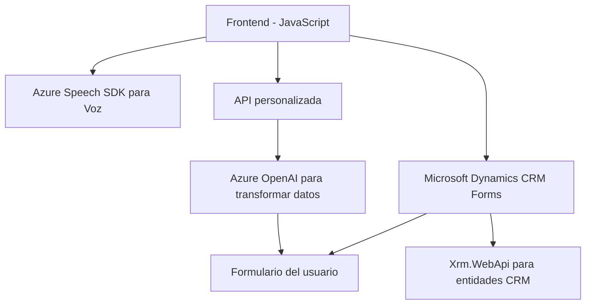

### **Breve resumen técnico**
El repositorio implementa una solución integrada para gestionar datos dinámicos en formularios de Microsoft Dynamics CRM mediante entrada y síntesis de voz. Utiliza el **Azure Speech SDK** para convertir datos en texto o voz, integrándose también con el servicio **Azure OpenAI** para realizar transformaciones avanzadas de texto. La solución se distribuye entre un **frontend** (basado en JavaScript) y **plugins** del backend integrados en Dynamics CRM.

---

### **Descripción de arquitectura**
La solución tiene una arquitectura híbrida que combina un frontend en JavaScript (cliente) y un backend basado en plugins para Dynamics CRM (servidor). Aunque no sigue estrictamente un patrón tradicional, se aproxima a una arquitectura de **n capas** con comunicación a API externas (Azure Speech y Azure OpenAI). Los tres principales componentes del sistema son:

1. **Frontend:** 
   - Implementa funcionalidades de síntesis de voz y entrada por voz.
   - Se conecta dinámicamente a los formularios para extraer y rellenar datos.
   - Usa una API personalizada para transformar datos.

2. **Backend:** 
   - Plugins de Dynamics CRM ejecutan lógica específica.
   - Interactúan con entidades CRM y externalizan operaciones de IA a través de la API de Azure OpenAI.

3. **Servicios externos:** 
   - Integración con Azure Speech SDK en el frontend para entrada/salida de voz.
   - Consumición de Azure OpenAI en plugins para transformar datos estructuralmente.

---

### **Tecnologías y patrones usados**
#### **Tecnologías:**
1. **Azure Speech SDK:** Para síntesis y reconocimiento de voz.
2. **Azure OpenAI:** Para transformar texto y generar JSON con GPT.
3. **Microsoft Dynamics CRM SDK:** Para interacción con formularios y entidades CRM.

#### **Patrones:**
1. **Microcliente/acciones por contexto:**
   - La lógica en archivos JavaScript se adapta dinámicamente según el contexto del formulario.
   - Extracción y manipulación directa de datos de formularios.

2. **Event-driven:** 
   - Mecanismo basado en eventos para la activación de entrada y salida de voz.

3. **Dependencia de API externas:** 
   - La solución delega procesamiento y capacidades avanzadas a Servicios Azure (Speech y OpenAI), centrando la lógica en integraciones.

4. **Plugin pattern:** 
   - Implementación clásica de Dynamics CRM para la inyección de lógica personalizada.

5. **Asincronía:** 
   - Uso extensivo de `async` y Promesas para consumir APIs y manejar dependencias.

---

### **Diagrama Mermaid**
A continuación, se presenta un diagrama simplificado de los principales componentes de la solución y sus relaciones.

---

### **Conclusión final**
La solución es una integración sólida que combina entrada/salida de voz, procesamiento de texto estructurado, y manipulación dinámica de formularios en Microsoft Dynamics CRM mediante servicios de Azure. Aunque se aproxima a una arquitectura de **n capas**, toda la lógica depende fuertemente de APIs externas como Speech SDK y OpenAI para llevar a cabo operaciones avanzadas. La implementación logra acoplar funcionalidad avanzada (IA y voz) dentro de una estructura modular adecuada para sistemas CRM dinámicos.

#### **Recomendaciones:**
1. **Seguridad:** Evitar el almacenamiento de claves API directamente en código fuente y utilizar mecanismos como Azure Key Vault.
2. **Optimización de configuración:** Asumir configuraciones dinámicas para idiomas, voces o reglas de transformación para mayor flexibilidad.
3. **Documentar más configuraciones estándar:** La arquitectura podría beneficiarse de mayor documentación acerca de la interacción contextual entre plugins y formularios complejos en Dynamics.