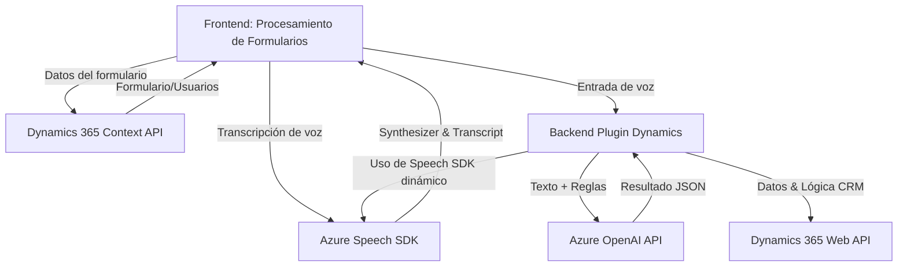

### Breve resumen técnico
El repositorio parece ser parte de una solución integrada para sistemas basados en Dynamics CRM. Los archivos están estructurados en tres capas:
1. **Frontend (JavaScript)**: Procesa formularios y realiza tareas de síntesis de voz y transcripción (con y sin inteligencia artificial) utilizando el **Azure Speech SDK**.
2. **Backend (Plugin C#)**: Incluye un módulo que utiliza **Azure OpenAI** para transformar texto en formato JSON conforme a reglas específicas.
3. **APIs externas**: Utiliza servicios de Azure (Speech SDK, OpenAI) y APIs de Dynamics 365 para la interacción y procesamiento de datos.

---

### Descripción de arquitectura
La solución utiliza **arquitectura basada en capas** con integración a servicios externos. Las capas identificadas son:
1. **Capa de presentación**: Archivos frontend y las interacciones de usuarios con los formularios.
2. **Capa de lógica de negocios**: El plugin en C# interactúa con Dynamics y Azure OpenAI para brindar resultados procesados.
3. **Capa de integración**: Comunicación con APIs externas como Azure Speech SDK y OpenAI.

Aunque no es puramente monolítica debido a la dependencia de diversos servicios, no se puede considerar completamente distribuida como un sistema de microservicios. El uso del SDK, plugins integrados en Dynamics, y la separación de responsabilidades por tecnologías lo aproxima a una arquitectura **n-capas híbrida cliente/servidor**.

---

### Tecnologías usadas
1. **Frontend**:
   - **Languages**: JavaScript.
   - **SDKs**:
     - Azure Speech SDK: Synthesis de texto, entrada de audio y transcripción de voz.
   - **API Integration**:
     - Dynamics 365 Context API: Recuperación de datos del formulario del sistema CRM.
   - **Patrones**: Modularización, cliente-servicio, carga dinámica.

2. **Backend/Plugin (C#)**:
   - **Languages**: C#.
   - **Framework**:
     - Dynamics CRM SDK: Interacción con formularios y datos del sistema CRM.
   - **APIs externas**:
     - Azure OpenAI: Transformación de texto con reglas configuradas.
   - **Libraries**: Newtonsoft.Json, System.Net.Http para manipulación de JSON y solicitudes HTTP.
   - **Patrones**:
     - Plugin para extensibilidad en Dynamics CRM.
     - Encapsulación: Métodos aislados para interactividad con servicios externos.

---

### Posibles dependencias externas
1. **Azure Speech SDK** (JavaScript): Utilizado para la síntesis de voz y transcripciones.
2. **Azure OpenAI API** (C# Plugin): Procesa texto basado en IA y devuelve JSON estructurado.
3. **Dynamics 365 Web API**: Acceso a datos de formularios dentro del contexto CRM.
4. Otras bibliotecas externas para manejo de JSON (`Newtonsoft.Json`) y solicitudes HTTP.

---

### Diagrama Mermaid (válido para GitHub)

---

### Conclusión final
La solución está claramente orientada a mejorar la interacción entre usuario y formularios en Dynamics 365 mediante funcionalidades asistidas por voz, inteligencia artificial y reglas predefinidas. Utiliza una arquitectura modular de **n-capas híbrida**, donde cada capa se especializa en su rol: presentación, integración y lógica de negocios. La integración robusta con servicios de **Azure Speech SDK** y **OpenAI** muestra un enfoque moderno y escalable.