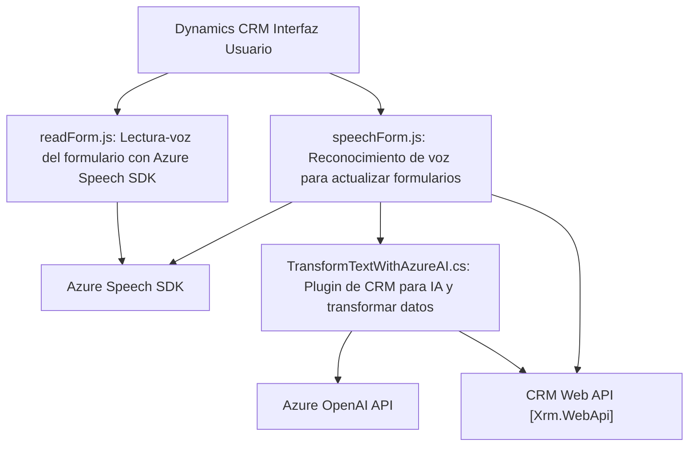

### Breve resumen técnico

El repositorio contiene una solución orientada al procesamiento y síntesis de voz, junto con transformación de texto mediante servicios externos como **Azure Speech SDK** y **Azure OpenAI**, integrados con **Dynamics CRM**. 

Los archivos analizados (`readForm.js`, `speechForm.js`, `TransformTextWithAzureAI.cs`) poseen funcionalidad que permite:
1. **Lectura en voz** de formularios y datos en la interfaz de usuario.
2. **Reconocimiento de voz** para actualizar formularios basado en transcripciones.
3. **Transformación de texto mediante normas definidas** usando inteligencia artificial con **Azure OpenAI**.

---

### Descripción de arquitectura

La solución combina distintos elementos de arquitectura:
1. **Cliente-Servidor**: Interacción de la UI (frontend) con control y APIs del backend.
2. **Integración de Servicios Externos**:
   - **Azure Speech SDK**: Reconocimiento y síntesis de voz.
   - **Azure OpenAI**: Transformación de texto.
3. **Plugins de CRM**: Extensión de Dynamics CRM mediante arquitectura basada en `IPlugin` (Microsoft.Xrm.Sdk).
4. **Patrones de Modularidad**:
   - Funciones desacopladas para tareas específicas (adaptadores de datos, transformación de texto, actualización dinámica de formularios).
   - Plugins como componentes independientes que usan API externas.

---

### Tecnologías usadas

1. **Frontend (JavaScript/HTML)**:
   - Modularidad y callbacks para manejo de eventos.
   - **Azure Speech SDK** para reconocimiento y síntesis de voz.

2. **Backend (Dynamics CRM)**:
   - `Microsoft.Xrm.Sdk`: Manipulación de datos y lógica basada en plugins.
   - **Azure OpenAI API**: Procesamiento de texto inteligente, integración con servicios de IA.

3. **Servicios Externos**:
   - `https://aka.ms/csspeech/jsbrowserpackageraw`: SDK de Azure Speech para JavaScript.
   - `System.Net.Http` y `Newtonsoft.Json`: Comunicación HTTP JSON con Azure OpenAI API.

4. **Patrones arquitectónicos**:
   - **Plugin-based Design** y **Pipeline Architecture**: En el archivo del backend.
   - **Adaptadores y Modularidad**: Separación lógica en funciones reutilizables para leer formularios, transformar datos y sintetizar voz.

---

### Diagrama Mermaid válido para GitHub

---

### Conclusión final

Esta solución es una arquitectura híbrida combinando **frontend dinámico** con capacidades accesibles de voz y un **backend basado en plugins** para Dynamics CRM con IA integrada. La funcionalidad se basa en el procesamiento de datos formulados y voz, destacándose por la modularidad y la integración profunda con prestaciones de **Azure**. Este sistema está diseñado para optimizar accesibilidad y mejorar la interacción con formularios mediante tecnologías modernas.