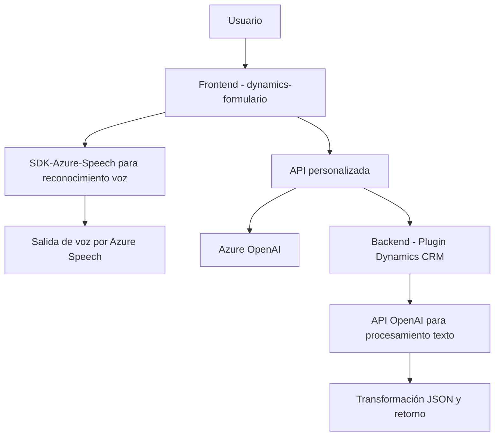

### Breve resumen técnico

El repositorio comprende tres archivos principales:

1. **Frontend**:
   - `readForm.js` y `speechForm.js`.
   - Implementan funciones para la interacción mediante voz y formateo/modificación de datos dentro de formularios web en Dynamics CRM, usando el SDK de Azure Speech y APIs de Dynamics.
   
2. **Plugin Backend**:
   - `TransformTextWithAzureAI.cs`.
   - Aborda la integración con el servicio Azure OpenAI dentro de un flujo de trabajo de Dynamics CRM.
   - Realiza transformación avanzada de texto mediante procesamiento de lenguaje natural.

---

### Descripción de arquitectura

El repositorio tiene dos componentes clave:

1. **Frontend** (véase los archivos en `FRONTEND/JS`):
   - Facilita la interacción entre usuarios y formularios web en Dynamics utilizando entrada y salida de voz gracias al Azure Speech SDK y APIs personalizadas.
   - Aproximación modular basada en funciones, con integración directa de servicios externos.

2. **Backend** (véase `Plugins/TransformTextWithAzureAI.cs`):
   - Implementa el patrón de **plugin** para procesos internos de Dynamics CRM. Este diseño sigue una arquitectura de **n capas**, separando la lógica empresarial (recepción y transformación de datos) del sistema CRM, mientras delega tareas complejas a servicios externos como Azure OpenAI.

En conjunto, la solución tiene un modelo híbrido:
- El **frontend** refleja una arquitectura de integración con servicios externos con funcionalidades específicas para formularios y comunicación por voz.
- El **backend**, como complemento, maneja procesamiento complejo en servicios de IA mediante arquitectura basada en plugins conectados al CRM.

---

### Tecnologías usadas

1. **Frontend**:
   - **JavaScript**: Usado con funciones puras y modularidad.
   - **Azure Speech SDK**: Para entrada/salida de voz.
   - **Microsoft Dynamics SDK**: Integración directa de formularios y entidades.

2. **Backend**:
   - **C#**: Para lógica empresarial y extensión de CRM.
   - **Azure OpenAI Service**: Procesamiento de lenguaje natural.
   - **Microsoft.Xrm.Sdk**: Librería para comunicación entre el plugin y Dynamics CRM.
   - **Newtonsoft.Json / System.Text.Json**: Manipulación y serialización JSON.
   - **HTTP Client**: Consumo de APIs externas.

---

### Diagrama Mermaid

---

### Conclusión final

Este repositorio proporciona una solución que combina interacción avanzada entre voz y datos en formularios web conectados a Dynamics CRM, apoyándose en servicios poderosos como Azure Speech y Azure OpenAI para procesamiento de texto y voz. 

**Aspectos destacados:**
- **Modularidad**: Cada componente se enfoca en tareas específicas, siguiendo principios como SRP (Single Responsibility Principle).
- **Integraciones potentes**: Uso eficiente de APIs externas y servicios avanzados (OpenAI, Azure Speech).
- **Patrones de arquitectura híbrida**: Integración directa de servicios de frontend con procesamiento backend mediante plugins CRM.

**Aspectos a mejorar**:
- **Seguridad**: Las credenciales de servicios externos deben ser gestionadas en configuraciones seguras.
- **Flexibilidad de configuración**: Los parámetros y normas deberían ser más configurables, separados del código fuente.

En resumen, el diseño implementa una solución robusta enfocada en interacciones por voz y procesamiento estructurado de texto, pero puede beneficiarse de mejoras en gestión de seguridad y configuración modular.