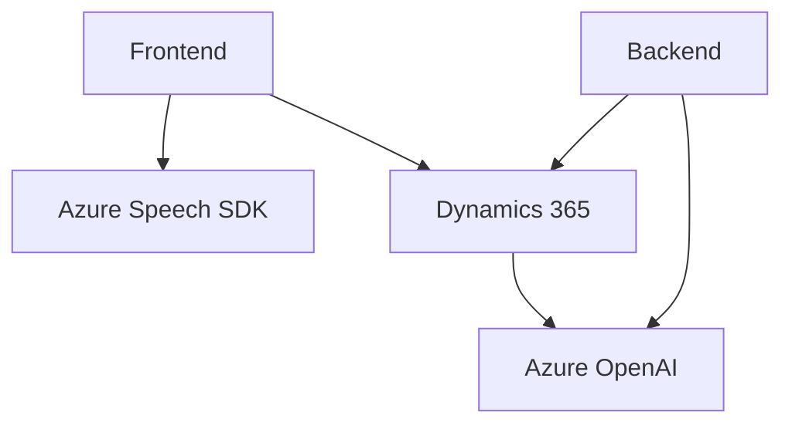

### Breve resumen técnico

El repositorio contiene dos componentes principales: un frontend basado en JavaScript que gestiona funcionalidades de entrada y salida de voz mediante Azure Speech SDK (readForm.js y speechForm.js), y un backend en C# implementado como un plugin para Dynamics CRM (TransformTextWithAzureAI.cs). El objetivo principal es habilitar un sistema que interprete texto, lo transforme con Azure AI y utilice reconocimiento de voz para interacciones con formularios dinámicos en un entorno CRM (presumiblemente Dynamics 365).

---

### Descripción de arquitectura

La solución refleja una arquitectura **mixta**:
1. El **frontend** utiliza módulos con funciones claras, configuradas de forma modular.
2. El **backend** es un plugin especializado en Dynamics CRM con lógica encapsulada que interactúa con la API de Azure OpenAI.

La solución no sigue una arquitectura completamente desacoplada o moderna como microservicios, pero puede considerarse **n-capas** con componentes que interactúan mediante comunicación asincrónica (REST APIs y SDK cloud).

---

### Tecnologías usadas

#### Frontend
- **JavaScript ES6**: Base del código para manejar eventos formales y procesamiento de datos.
- **Azure Speech SDK**: Para síntesis y reconocimiento de voz en tiempo real.
- **Dynamics 365 SDK**: Llamadas directas a objetos dentro del CRM.

#### Backend
- **Microsoft y .NET Core Framework**:
  - `IPlugin`: Interfaz de extensibilidad nativa en Dynamics.
  - `System.Text.Json` y `Newtonsoft.Json.Linq`: Para procesamiento JSON.
- **Azure OpenAI Service**:
  - Servicios REST para transcripción y transformación usando GPT.

#### Patrones observados
- **Modularidad**: Se implementa separación de responsabilidades con funciones específicas según principios SOLID, especialmente en los archivos JavaScript. 
- **Callback y Promesas**: Uso en frontend para manejar asincronismo con SDK y APIs.
- **Plugin architecture**: Backend basado en la extensión de Dynamics CRM utilizando eventos predefinidos.
- **Integración de APIs externas**: Uso destacado de Azure Speech SDK y OpenAI Service.

---

### Diagrama Mermaid válido para GitHub

---

### Conclusión final

La solución es una integración avanzada entre frontend y backend centrada en la gestión de datos dinámicos en formularios CRM. El **frontend** facilita interacción mediante voz, mientras que el **backend** ejecuta transformaciones de texto usando inteligencia articulada en Azure. La arquitectura puede considerarse como **n-capas** con una dependencia crítica en los servicios de Microsoft Azure (Speech SDK y OpenAI). Si bien el diseño es funcional, se identifica un cierto acoplamiento entre las herramientas y una falta de configuraciones dinámicas, lo cual podría refinarse.