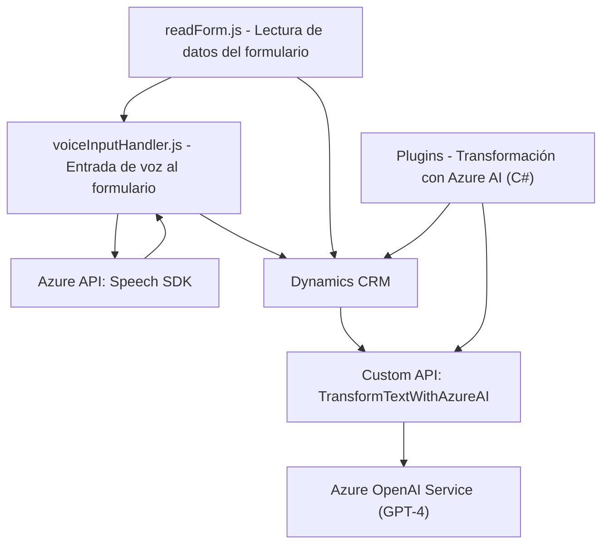

### Breve Resumen Técnico

Este sistema implementa una solución basada en procesamiento de voz, validación y manipulación de datos en formularios interactivos. Utiliza tecnologías de Azure como el Speech SDK para síntesis y reconocimiento de voz, así como un plugin que conecta con Azure OpenAI API para generar respuestas altamente estructuradas. Los módulos de JavaScript integran funcionalidades frontend para trabajar con formularios y datos en tiempo real. Por su parte, el plugin en C# actúa como un componente backend que extiende las capacidades de Dynamics CRM.

---

### Descripción de arquitectura

Esta solución sigue una arquitectura híbrida caracterizada por un enfoque de **servicios distribuidos** y **n-capas**. La solución está compuesta por separadas capas de frontend y backend, cada una siguiendo patrones de diseño limpios. El backend utiliza un **patrón de integración con servicios externos** como Azure OpenAI para text-to-JSON, mientras que el frontend tiene un enfoque modular que organiza la interacción como controladores y vistas. Además, usa la arquitectura **Service-Oriented**, con dependencias explícitas de servicios externos y comunicación entre capas mediante APIs y SDKs.

---

### Tecnologías usadas

1. **Frontend (JavaScript):**
   - **Frameworks/librerías integradas**:
     - Azure Speech SDK (sintetización y reconocimiento de voz).
     - Xrm.WebApi (operaciones con Microsoft Dynamics CRM).
   - **Patrones:**
     - Modularización.
     - Delegación (para cargar el SDK dinámicamente usando callbacks).
     - MVC (separación de responsabilidades entre procesamiento y las vistas).
   - **Principales técnicas:**
     - Manipulación del DOM.
     - Llamadas a API (incluida la integración con una Custom API de Dynamics CRM).

2. **Backend (C#, Plugin en Dynamics CRM):**
   - **Frameworks/librerías**:
     - Azure OpenAI (GPT-4).
     - System.Net.Http (para consumo de API vía REST).
     - System.Text.Json (manejo de datos JSON).
     - Microsoft.Xrm.Sdk (integración con Dynamics CRM).
     - Newtonsoft.Json.Linq (manipulación adicional de JSON).
   - **Patrones:**
     - Facade (abstracción de la llamada a la OpenAI API).
     - Singleton (uso de contexto de servicios organizacionales).
     - Arquitectura basada en API.

---

### Diagrama Mermaid válido para GitHub Markdown

---

### Conclusión Final

El repositorio contiene componentes tanto frontend como backend para implementar un sistema interactivo mediante reconocimiento de voz, manipulación de formularios y generación de datos JSON estructurados utilizando inteligencia artificial. La solución usa uno de los SDKs líderes en el mercado (Azure Speech SDK) para generar audio y texto procesados en tiempo real, integrados perfectamente mediante eventos en formularios.

La arquitectura es una combinación de **n-capas** (frontend y backend) y **Service-Oriented**, apoyado en patrones de diseño como **modularización**, **delegación** y **facade**. Las dependencias externas clave incluyen servicios de Azure como el Speech SDK y OpenAI, junto con APIs para el ecosistema Dynamics CRM.