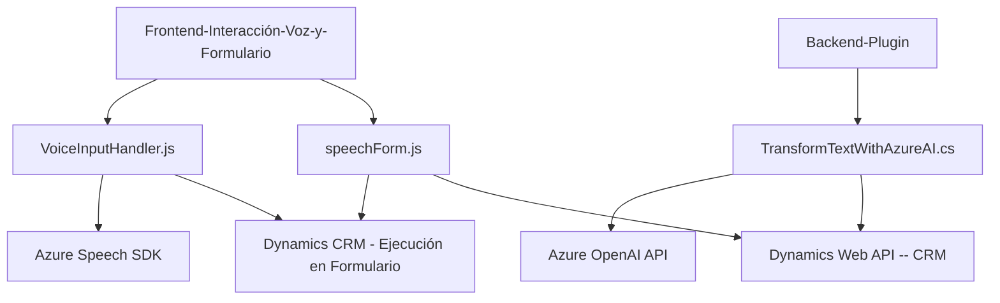

### Resumen Técnico:
El repositorio describe tres componentes principales: un frontend interactivo basado en voz y texto, y un plugin de backend para Dynamics CRM que utiliza servicios avanzados de inteligencia artificial. Estos archivos están orientados a implementar funcionalidades accesibles e inteligentes mediante una integración con Azure Speech SDK y Azure OpenAI. Los componentes trabajan para mejorar la interacción entre usuarios y formularios en Dynamics CRM, permitiendo un procesamiento por voz y transformación avanzada de datos.

---

### Descripción de Arquitectura:
La arquitectura parece estar estructurada bajo un enfoque **n-capas**, con las siguientes características principales:
1. **Frontend (Interacción con el Usuario):**
   - Directamente integrado en Dynamics CRM.
   - Proporciona interacción por voz y formularios accesibles.
   - Manejo asíncrono de SDKs y APIs externas.
   
2. **Backend (Plugin de Transformación):**
   - Implementa un plugin centrado en la lógica empresarial dentro del pipeline de Dynamics CRM, comunicándose con Azure OpenAI para realizar operaciones avanzadas de inteligencia.

3. **Servicios Externos:**
   - Integración con **Azure Speech SDK** para síntesis de voz y reconocimiento de comandos de usuario.
   - Uso de **Azure OpenAI API** para transformar texto según reglas predefinidas.

La arquitectura en sí no califica como microservicios, pero aplica patrones modulares dentro de los componentes. 

---

### Tecnologías Usadas:
1. **Frontend:**
   - **JavaScript**: Uso predominante en los componentes del frontend.
   - **Azure Speech SDK**: Reconocimiento de voz y síntesis de texto.
   - **Dynamics CRM context API** (`executionContext`, `Xrm.WebApi`): Interacción con datos y metas básicas del formulario.

2. **Backend Plugin:**
   - **C#**: Lenguaje principal para crear el plugin en Dynamics CRM.
   - **Azure OpenAI API**: Comunicación con modelos GPT-4 para transformar texto.
   - **Dynamics CRM SDK**: Para la ejecución de plugins en el pipeline CRM.
   - **HTTP Client** y **System.Text.Json** para hacer solicitudes JSON hacia Azure.

3. **Patterns en la arquitectura y código:**
   - **Integración con APIs**: Los tres archivos dependen de servicios de Azure.
   - **Modularidad**: Separación de funciones por responsabilidad única.
   - **Async/Await**: Uso de operaciones asíncronas en frontend y backend.
   - **Plugin Design Pattern**: Implementación para extensibilidad en Dynamics CRM.

---

### Dependencias y Componentes Externos:
- **Azure Speech SDK**: Conexión con el servicio de síntesis y reconocimiento de voz.
- **Azure OpenAI API**: Procesamiento y transformación avanzada de datos en JSON.
- **Dynamics API (`Xrm.WebApi`)**: Comunicación directa con la base de datos y estructura CRM.
- **Serialización JSON**: Uso de `System.Text.Json` o `Newtonsoft.Json` para trabajar con objetos complejos.
- **Plugins CRM**: Activación de lógica empresarial en determinados eventos.

---

### Diagrama Mermaid Compatible con GitHub:

---

### Conclusión Final:
Este repositorio implementa una solución modular para mejorar la experiencia con un CRM, como Dynamics 365, a través del reconocimiento de voz, síntesis de datos y transformación de texto con IA. La integración con Azure Speech SDK y Azure OpenAI API facilita una solución accesible e inteligente. La arquitectura se basa en **n-capas**, combinando un frontend enfocado en UX y un backend orientado a lógica empresarial mediante plugins. El diseño está bien estructurado, empleando tecnologías modernas y patrones de modularidad y funcionalidad única para garantizar escalabilidad y mantenibilidad.