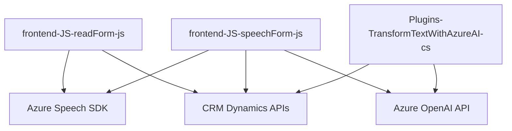

### Breve resumen técnico

El repositorio expuesto consiste en archivos para la implementación de funcionalidades orientadas a la interacción con formularios en el frontend (JavaScript) y un plugin para CRM Dynamics que realiza transformaciones textuales. Se utiliza el SDK de Azure Speech para síntesis/interpretación de voz y la API de Azure OpenAI para procesamiento de entrada mediante inteligencia artificial.

---

### Descripción de la arquitectura

La solución está diseñada siguiendo los principios de **arquitectura por componentes** y una mezcla entre patrones **MVC** y **orientado a servicios**. Se trata de un sistema basado en la capacidad de extensión por medio de integraciones con APIs externas (Azure Speech y OpenAI) y plug-ins internos para la plataforma Dynamics CRM.

La arquitectura puede ser clasificada de la siguiente manera:
- **Front-end**:
  Diseñado para integrar servicios de voz y formularios dinámicos utilizando tecnologías client-side. La estructura modular y el uso de SDK externos sugiere una organización capaz de interactuar con REST APIs.
  
- **Back-end plugin**:
  Diseñado específicamente para trabajar en la arquitectura preexistente de Dynamics CRM (event-driven/pattern-based). Utiliza el modelo de plugin basado en `IPlugin` para trabajar en contexto con el CRM y delegar la transformación avanzada de datos a la API de Azure OpenAI.

- **General**:
  El diseño global no es estrictamente monolítico ni microservicio. Se asemeja más a una solución de **arquitectura híbrida**, que combina servicios externos y módulos internos definidos para un ecosistema CRM con capacidad extensible.

---

### Tecnologías y frameworks usados

#### Frontend:
1. **JavaScript**:
   - Manipulación de DOM y formulación de eventos client-side.
   - Procesamiento de datos del formulario.
   - Carga dinámica de scripts.
2. **Azure Speech SDK**:
   - Integración para síntesis y reconocimiento de voz utilizando servicios en la nube.
3. **Working with CRM Dynamics APIs**:
   - Uso del contexto de formularios (`formContext`, `attributes`) en Dynamics CRM para recolectar y asignar valores.

#### Backend Plugin:
1. **C#**:
   - Programación orientada a objetos siguiendo el estándar de implementación de plugins.
   - Uso de servicios internos de Dynamics CRM (IServiceProvider, IOrganizationService).
2. **Azure OpenAI API**:
   - Integración del endpoint GPT (inteligencia artificial) para procesos de transformación avanzada de textos.
3. **System.Net.Http y JSON Libraries (Newtonsoft.Json)**:
   - Comunicación REST entre el plugin y la API de OpenAI.
   - Procesamiento y manipulación de datos en formato JSON.

#### Patrones:
1. **MVC**: Separación de la lógica de procesamiento/control de datos (modelo), tareas específicas para interacción (controlador y eventos), e interfaces para formularios (vista).
2. **Modularidad**: Organización basada en funciones independientes en los scripts.
3. **Delegación y eventos**: Uso extensivo de callbacks y triggers en las integraciones.
4. **Carga Lazy**: Utilizado para optimización durante la integración con el SDK de Azure Speech.

---

### Diagrama **Mermaid** (GitHub compatible):

---

### Conclusión final

El repositorio contiene una solución híbrida modular orientada a la integración con servicios externos y extensiones personalizadas para un entorno CRM Dynamics. Los archivos frontend permiten el manejo dinámico de voz y datos en formularios CRM, mientras que el plugin asociado transforma información textual mediante el procesamiento avanzado de inteligencia artificial. 

Este enfoque combina elementos clásicos de arquitectura (MVC y eventos) con integraciones modernas basadas en SDK y APIs REST, mostrando una solución adaptada a satisfacer la necesidad de flexibilidad y escalabilidad en un ecosistema empresarial.