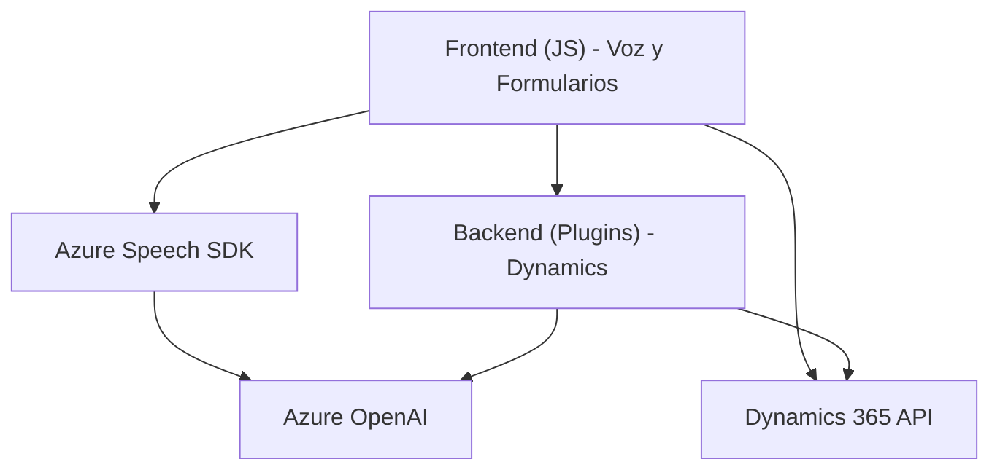

### Breve resumen técnico

El repositorio incluye una solución que combina **frontend interacciones**, **procesamiento backend** y **plugins especializados** para Dynamics CRM que se integran con **Azure AI services**. Los archivos muestran una integración sólida de servicios de voz y IA para mejorar formularios interactivos y flujos de trabajo en Dynamics CRM, con un enfoque modular y eficiente.

---

### Descripción de arquitectura

La arquitectura utilizada parece ser basada en **microservicios con integración a APIs externas**. El frontend utiliza funciones JavaScript para interactuar con el DOM y procesar datos visibles en un formulario. Estas funciones acceden al SDK de Azure Speech para síntesis y reconocimiento de voz, mientras que el backend se organiza como una **plugin architecture** establecida en Dynamics CRM que invoca servicios como **Azure OpenAI** mediante peticiones HTTP.

La comunicación entre componentes hace uso extensivo de APIs externas mediante patrones de integración, y los archivos están diseñados con modularidad y separación de responsabilidades. 

---

### Tecnologías usadas

#### Frontend
1. **JavaScript estándar**: Para manipulación del DOM y manejo de lógica local.
2. **Azure Speech SDK**: Para interacción y servicios de voz.
3. **Dynamics 365 Xrm.WebApi**: Para realizar operaciones con entidades de CRM.

#### Backend
1. **C#**: Implementa plugins con una estructura orientada a servicios.
2. **Microsoft.Xrm.Sdk**: Para acceder a servicios internos de Dynamics CRM.
3. **Azure OpenAI Service**: Para realizar operaciones de transformación de texto con IA.
4. **Newtonsoft.Json** y **System.Text.Json**: Para manipulación de datos JSON.

#### General
- **Modularidad**: Funciones específicas independientes por responsabilidad.
- **Arquitectura orientada a servicios**: Integración de servicios API con Dynamics y Azure.
- **Carga dinámica de recursos**: SDK de Azure cargado dinámicamente en tiempo de ejecución.

---

### Diagrama Mermaid válido para GitHub

A continuación, un diagrama que muestra las interacciones principales entre los componentes del sistema:

---

### Conclusión final

El repositorio implementa una solución híbrida con fuerte dependencia de servicios externos (Azure AI y Dynamics 365) para operaciones de voz, formularios interactivos y procesamiento de datos mediante IA. La arquitectura modular facilita la integración entre frontend y backend, mostrando buenas prácticas como la separación de responsabilidades y el uso de patrones orientados a servicios. Esto permite escalabilidad y reusabilidad, ideal para soluciones empresariales basadas en Dynamics CRM.