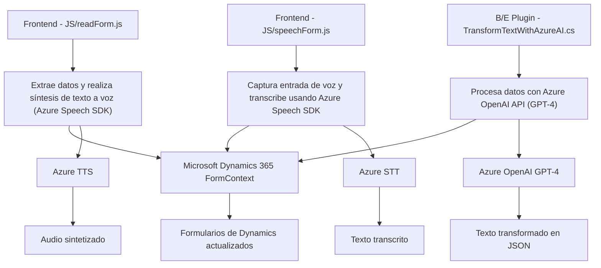

### Breve resumen técnico
El repositorio contiene tres archivos que implementan funcionalidades distintas, pero conectadas, principalmente para un sistema que parece estar integrado con **Microsoft Dynamics CRM** y utiliza servicios de **Azure AI** para realizar operaciones como síntesis de voz, transcripción de voz, y transformación de texto basado en IA. Integra dependencias como **Azure Speech SDK**, **Dynamics 365 Web API**, y **Azure OpenAI**.

---

### Descripción de arquitectura
La solución implementada muestra características de una arquitectura **n capas**, aunque también utiliza elementos de integración con servicios externos (como Azure Speech SDK y Azure OpenAI) que podrían acercarse al uso de microservicios si se encapsulan adecuadamente. A nivel granular:

1. **Frontend (JS):** Implementación de funcionalidades como generación de audio (text-to-speech) y transcripción de voz hacia texto en Dynamics CRM.
2. **Backend (Plugin en C#):** A través de un plugin en Dynamics CRM, el texto procesado es transformado por IA utilizando el servicio Azure OpenAI.

Ambos interactúan con APIs externas y locales para realizar tareas específicas. La arquitectura combina elementos de integración, modularidad y capacidad de configuración para adaptarse a sistemas en la nube.

---

### Tecnologías usadas
1. **Lenguajes de Programación:**
   - JavaScript: Para la lógica de clientes (sintetización y transcripción).
   - C#: Para el plugin que se ejecuta en Dynamics CRM.

2. **Servicios y Frameworks:**
   - **Microsoft Dynamics CRM SDK**: Extensión funcional de Dynamics CRM.
   - **Azure Speech SDK**: Utilizado en la síntesis y el reconocimiento de voz.
   - **Azure OpenAI API**: Procesamiento de texto con IA avanzada.

3. **Patrones arquitectónicos:**
   - Modularidad: Funciones organizadas por propósito definido.
   - Event-driven: Los métodos son activados por eventos específicos (como carga de SDK o comando del usuario).
   - Data Mapper: Para mapear etiquetas del frontend a campos del backend en Dynamics CRM.
   - External Service Integration: Uso extensivo de servicios externos como Azure.

---

### Diagrama Mermaid válido para GitHub Markdown

---

### Conclusión final
La solución construida integra funcionalidades clave para una plataforma CRM como Dynamics 365, agregando soporte contextual de voz (transcripción y síntesis) y procesamiento avanzado de texto mediante inteligencia artificial. El diseño arquitectónico, organizado bajo una estructura **n capas** con integración dinámica de servicios externos, favorece la modularidad y extensibilidad, permitiendo que la solución crezca en capacidad y funcionalidades. Sin embargo, la dependencia fuerte de servicios externos como Azure puede requerir soluciones de contingencia para garantizar la continuidad ante fallos en dichos servicios.