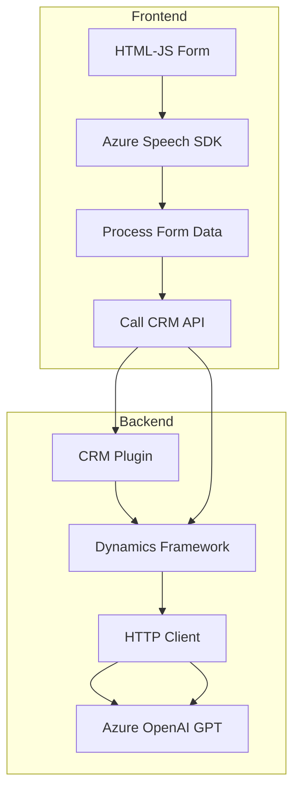

### Breve Resumen Técnico
El repositorio contiene tres archivos que implementan funcionalidades relacionadas con formularios y reconocimiento de voz mediante **Azure Speech SDK** y procesamiento de texto usando **Azure OpenAI**. Las aplicaciones parecen ser una combinación entre una frontend, que interactúa con usuarios y SDKs en la web, y un backend en forma de plugin para Microsoft Dynamics CRM, donde se realiza integración con servicios externos.

---

### Descripción de Arquitectura
El proyecto está diseñado para interactuar con formularios web y el ecosistema de Microsoft Dynamics CRM. Utiliza a Azure Speech SDK para reconocimiento y síntesis de voz en el frontend, e integra Azure OpenAI mediante un plugin backend que vincula estos servicios a los datos del CRM.

#### Arquitectura Potencial:
1. **Frontend**: Aplicación escrita en **JavaScript**, modularizada, diseñada para interactuar directamente con formularios en un navegador. Sigue un patrón de **n-capas** con Modularización y Adapters para UI y SDK.
2. **Backend**: Plugin desarrollado en **C#**, interactúa con Dynamics CRM. Implementa un diseño **SOA** para integrar el procesamiento de texto a un servicio externo como Azure OpenAI. Este plugin también actúa como un "Proxy" para comunicar los sistemas backend de Dynamics con Azure.

#### Flujo General:
- **Frontend:** Los usuarios interactúan con formularios mediante reconocimiento de voz. La lógica implementada transforma los datos de interacción en texto enriquecido interpretado por el SDK.
- **Backend Plugin:** Procesa datos entrantes desde Dynamics CRM y, mediante solicitudes al servicio de OpenAI, transforma textos o mensajes según reglas definidas.

---

### Tecnologías Usadas
#### Frontend:
1. **JavaScript**: Lenguaje principal para la interacción con el DOM y funciones del sitio.
2. **Azure Speech SDK**: Para reconocer y generar síntesis de audio desde texto.
3. **Xrm.WebApi.online**: Realiza llamadas al servicio API del CRM.
4. **Dynamic Form Handling**: Manejo de formularios web mediante el DOM (likely a CRM-specific form context).

#### Backend:
1. **C# (Microsoft Dynamics SDK)**: Lenguaje para el plugin que interactúa directamente con el CRM.
2. **System.Net.Http**: Manejo de solicitudes HTTP, utilizado para comunicar Azure OpenAI.
3. **Azure OpenAI (GPT)**: Servicio para procesamiento avanzado de texto.
4. **Newtonsoft.Json / System.Text.Json**: Librerías para análisis y transformación de JSON.

---

### Dependencias o Componentes Externos
1. **Azure Speech SDK**: Servicio esencial para funcionalidades de reconocimiento de voz y síntesis de audio.
2. **Azure OpenAI Service**: API GPT para transformación de texto.
3. **Microsoft Dynamics CRM SDK**: Acceso al contexto de formulación y lógica empresarial del CRM.
4. **HTTP Cliente**: Interactuar con sistemas externos como OpenAI.

---

### Diagrama Mermaid

---

### Conclusión Final
La solución es una arquitectura híbrida que combina componentes frontend diseñados en JavaScript y backend en C# como plugin para Dynamics CRM. Utiliza tecnologías de Microsoft Azure (Speech SDK y OpenAI GPT) para funcionalidades avanzadas, como la interacción de voz y el procesamiento de texto en formularios. Los patrones observados resaltan modularización, integración con servicios "as-a-Service," y diseño orientado a eventos/callbacks en el frontend. La calidad de la implementación dependerá de las validaciones en el flujo de datos y la seguridad para interactuar con servicios externos como OpenAI.

La arquitectura propuesta combina **n-capas** en el frontend con una **SOA** basada en plugins en el backend, consolidando una integración robusta y adaptable a aplicaciones empresariales modernas.