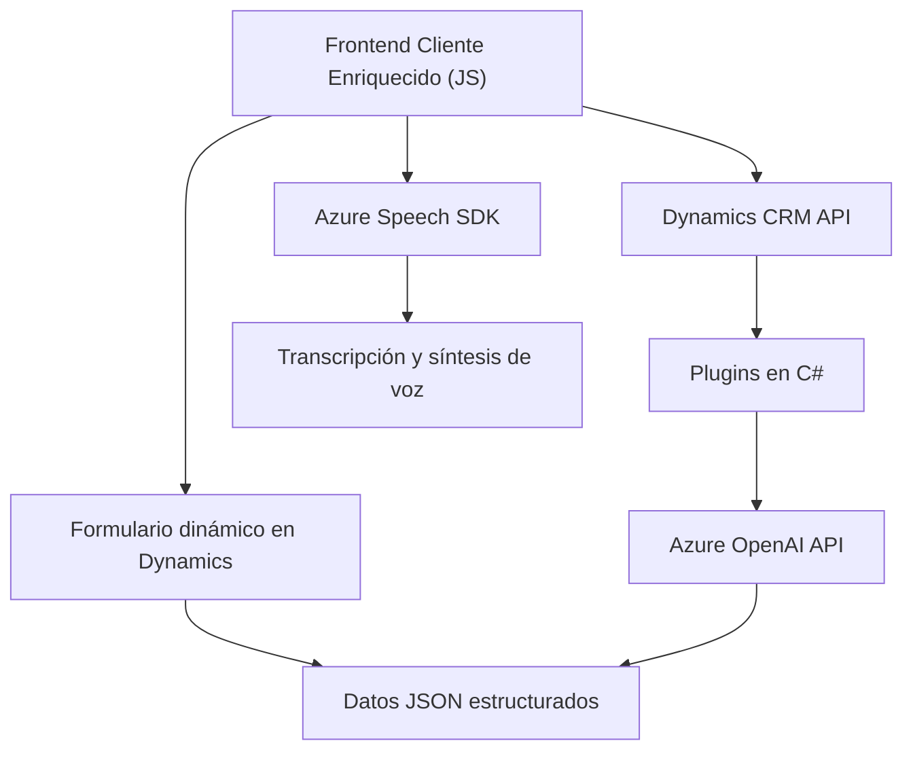

### **Breve resumen técnico**
Este repositorio se enfoca en la seguridad, transcripción de voz, síntesis de texto, y mapeo automatizado utilizando tecnologías para integraciones avanzadas. Los tres archivos analizados reflejan una solución que implementa:
1. **Frontend (un cliente enriquecido JavaScript):** Manejo de formularios y asistencia conversacional por voz.
2. **Backend (Plugins y APIs):** Integración directa con Dynamics CRM y Azure OpenAI API para procesamiento de datos.

La solución parece formar parte de una aplicación empresarial que utiliza Microsoft Dynamics 365 como base para administrar formularios y datos estructurados.

---

### **Descripción de la arquitectura**
La arquitectura se basa en un **modelo de capas** con las siguientes estructuras principales:
1. **Frontend (Capa de presentación):** El cliente interactúa directamente con formularios en Dynamics CRM para la síntesis y transcripción de texto, usando un frontend basado en JavaScript y Azure Speech SDK.
2. **Middleware/API personalizada (Capa de aplicación):** Módulos y plugins que activan funcionalidad de IA mediante la transformación de texto en JSON estructurado, integrándose con la plataforma Dynamics CRM.
3. **Servicios externos (Capa de integración):** Azure Speech SDK y Azure OpenAI API son utilizados como servicios externos para procesamiento de voz y texto.

---

### **Tecnologías usadas**
1. **Frontend:**
   - **JavaScript:** Lógica de cliente enriquecida para procesamiento de voz y formulario.
   - **Azure Speech SDK:** Para transcripción y síntesis de voz.
2. **Backend:**
   - **C#** (Microsoft Dynamics Plugins): Lógica del servidor para transformar datos mediante Azure OpenAI API.
   - **Newtonsoft.Json & System.Text.Json:** Manejo de datos JSON.
   - **System.Net.Http:** Comunicación con la API de Azure OpenAI.
3. **Servicios:** 
   - **Azure OpenAI (GPT-4):** Procesamiento de texto estructurado.
   - **Dynamics CRM API:** Integración y manipulación directa del contexto de formulario.

---

### **Diagrama Mermaid**

---

### **Conclusión final**
La solución presentada es una integración avanzada centrada en la interacción con formularios mediante reconocimiento de voz, síntesis de texto y mapeo automatizado en Microsoft Dynamics CRM utilizando Azure OpenAI API y Azure Speech SDK. Combina un **modelo en capas** basado en separación de responsabilidades claras entre frontend, middleware (API personalizada) y servicios externos.

El diagrama muestra cómo las piezas (frontend, CRM API, plugins en C#, y servicios externos de Azure) se interconectan para proporcionar una solución eficiente que mejora la experiencia del usuario con herramientas de IA y automatización en entornos empresariales.