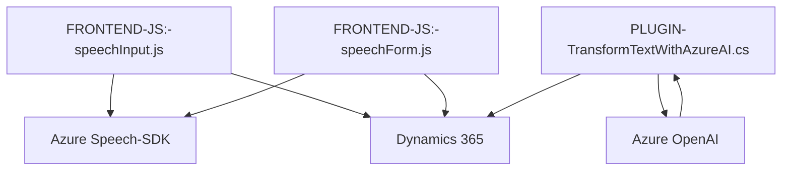

### Breve Resumen Técnico
El repositorio proporcionado integra funcionalidades para gestión de formularios en un entorno CRM (Dynamics 365), con complementos de interacción a través de reconocimiento de voz y síntesis de texto en audio. Utiliza el Azure Speech SDK para implementar estas capacidades y una integración adicional con Azure OpenAI desde un plugin en backend. Su enfoque se orienta a mejorar la experiencia del usuario con entrada por voz, procesamiento de datos estructurados y generación de respuestas en tiempo real.

---

### Descripción de Arquitectura
La solución combina **frontend desacoplado** con **backends especializados**. En conjunto, implementa una arquitectura basada en servicios distribuidos:
1. **Frontend (Capas de Presentación en Dynamics 365):** Incluye archivos JavaScript que extienden la funcionalidad de los formularios gestionados en Dynamics 365, conectándose al Speech SDK y APIs externas.
2. **Backend (Plugin):** Utiliza un **plugin extendido** escrito en C# para Dynamics 365, que se encarga de integrarse con Azure OpenAI y la lógica empresarial. El backend procesa texto con la inteligencia artificial de Azure OpenAI y actúa como un transformador de datos, devolviendo resultados en JSON.
   
La estructura muestra patrones de **microservicio acoplado** al ecosistema de Dynamics 365, con separación funcional:
- **Funcionalidad de síntesis/reconocimiento:** Responsabilidad del cliente, implementada en frontend.
- **Transformación avanzada del texto:** Responsabilidad del backend (plugin).

### Tecnologías Utilizadas
**Frontend:**
- **JavaScript** con modularidad (functions segmentadas).
- **Azure Speech SDK:** Para síntesis y reconocimiento de voz.
- **Dynamics 365 Client API:** Para manipular formularios.

**Backend:**
- **C#:**
  - Para extensión mediante plugins en Dynamics CRM.
- **Azure OpenAI API:** Para procesamiento de texto mediante inteligencia artificial.
- **Bibliotecas JSON:**
  - `Newtonsoft.Json.Linq`
  - `System.Text.Json`
- **Patrones Plugin:** Implementación del patrón estándar de Dynamics 365.

**Infraestructura:**
- **Microsoft Dynamics CRM**
- **Azure Services**:
  - Azure Speech SDK (Texto a voz y reconocimiento de voz).
  - Azure OpenAI (GPT-4o para transformación de texto).

### Diagrama Mermaid

### Conclusión Final
La solución implementa una arquitectura basada en **servicios distribuidos**, alineada al entorno de Dynamics CRM. Aprovecha capacidades cognitivas y de voz de Azure para enriquecer la usabilidad, al tiempo que brinda extensibilidad a través de un plugin que conecta con OpenAI. Este diseño permite desacoplar la lógica y facilita modularidad, actualización y mantenimiento en un ecosistema empresarial.