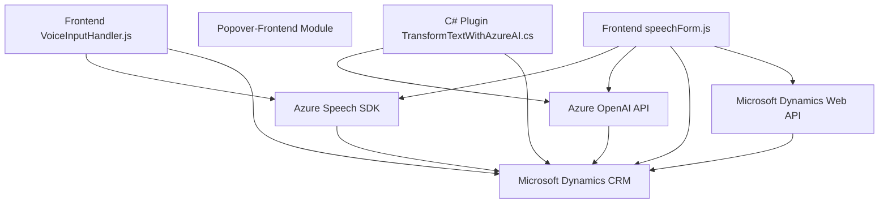

### Breve resumen técnico

El repositorio contiene componentes para una solución integrada que combina procesamiento de datos con inteligencia artificial y capacidades de voz mediante el uso de servicios de Microsoft Azure y su Speech SDK. Está diseñado para interactuar dinámicamente con formularios en un contexto que parece orientarse hacia un entorno CRM como Microsoft Dynamics.

---

### Descripción de arquitectura

1. **Tipo de solución**:  
   El repositorio es una solución híbrida que combina una **API** utilizada para procesamiento en Microsoft Dynamics (con un plugin de C#), además de **componentes frontend integrados** desarrollados en JavaScript. La solución permite la interacción entre usuarios y formularios mediante entrada y salida de voz, así como procesamiento inteligente de datos.

2. **Tipo de arquitectura**:  
   La arquitectura indicada es **modular híbrida**, dado que combina un enfoque **API-centric** (backend) con componentes cliente en forma de un extensible frontend web. Además, los patrones detectados incluyen **event-driven programming** y ciertas prácticas del enfoque **hexagonal**, dado que las funcionalidades están encapsuladas para interactuar con diferentes plugins, SDKs o APIs (por ejemplo, Azure Speech).

---

### Tecnologías usadas

1. **Backend**:
   - **C# (.NET Framework)**: Para la implementación de plugins de Dynamics.
   - **Microsoft Dynamics SDK & Plugins API**: En el plugin `TransformTextWithAzureAI`.
   - **Azure OpenAI Endpoint**: Para la transformación del texto en JSON.

2. **Frontend**:
   - **JavaScript**: Código para el manejo de formularios en cliente, integración con Azure Speech SDK y APIs Dynamics.
   - **Azure Speech SDK**: Para síntesis y reconocimiento de voz.
   - **Microsoft Dynamics Web API** (`Xrm.WebApi`): Para integración directa con el sistema CRM.

3. **Patrones arquitectónicos**:
   - **Command Pattern**: Procesamiento de datos modular y asignación de valores en lógica frontend.
   - **Event-driven**: Uso de callbacks y eventos en SDK y APIs (e.g. manejo asíncrono).
   - **Cargador dinámico de dependencias**: SDK de Azure Speech se carga bajo demanda.
   - **Factory Method**: Creación controlada de configuraciones en ambos SDKs (C# y Azure Speech).

---

### Diagrama **Mermaid**

El diagrama ilustra la relación entre los principales elementos de la solución y sus dependencias tecnológicas.  

---

### Conclusión final

Este repositorio presenta una solución escalable diseñada para plataformas CRM, con un enfoque basado en la integración de inteligencia artificial y capacidades de voz mediante tecnologías Azure. Su arquitectura modular facilita su mantenimiento y extensibilidad, integrando componentes frontend dinámicos y backend orientado a plugins específicos. La elección de patrones como el **Command Pattern**, el **event-driven** y el **factory method** asegura que el sistema pueda evolucionar con mínimo impacto en las funcionalidades existentes. La interacción con APIs externas como Azure Speech SDK y OpenAI abre camino para una solución innovadora en entornos corporativos.