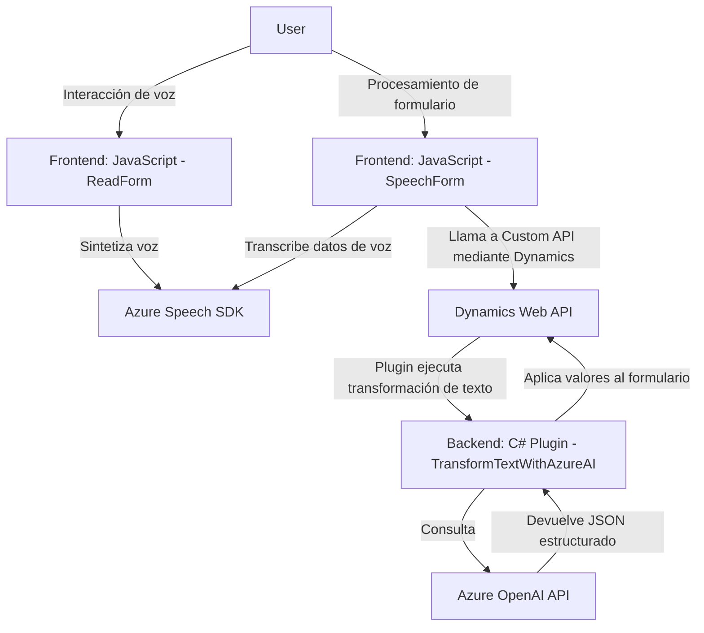

### Breve resumen técnico
El repositorio parece contener componentes orientados a integrar un sistema que emplea Azure Speech SDK y OpenAI Service para interactuar con formularios en Dynamics 365. Combina un frontend en JavaScript para la captura de voz y procesamiento visual con un backend basado en Microsoft Dynamics CRM que utiliza un plugin para integrar el servicio OpenAI. Este ecosistema busca mejorar la experiencia de usuario y la interacción con formularios mediante voz y procesamiento automatizado de texto.

---

### Descripción de la arquitectura
La solución combinada sigue una arquitectura de **sistema híbrido** que integra un frontend basado en JavaScript con un **plugin de Dynamics CRM** en .NET y consume servicios de terceros (Azure Speech SDK para reconocimiento/síntesis de voz y Azure OpenAI Service para procesamiento de texto basado en IA). 

La separación funcional entre el frontend (captura de datos y voz a texto) y el backend (transformación de los datos con Azure OpenAI y procesamiento en Dynamics CRM) sigue un esquema de **arquitectura de n capas**, donde cada capa tiene su responsabilidad específica. No se usa una arquitectura de microservicios.

### Tecnologías usadas
1. **Frontend:** 
   - Lenguaje: JavaScript.
   - Dependencia: Azure Speech SDK para reconocimiento y síntesis de voz.
   - Frameworks: No se utiliza ningún framework explícito como React/Angular, solo librerías de Azure y APIs nativas del navegador.

2. **Backend (Plugins CRM):**
   - Lenguaje: C#.
   - Dependencias:
     - `Microsoft.Xrm.Sdk` y `Dynamics Web API` para consumo dentro del entorno Microsoft Dynamics.
     - Azure OpenAI Service para realizar transformaciones avanzadas de texto.
     - Librerías HTTP (`System.Net.Http`), JSON (`System.Text.Json`), y manipulación de texto (`Newtonsoft.Json.Linq`).

3. **Servicios de nube:**
   - Azure Speech SDK.
   - Azure OpenAI Service.

### Diagrama Mermaid válido para GitHub

### Conclusión final
La solución presentada es una arquitectura híbrida orientada a integrar funcionalidades avanzadas de accesibilidad mediante voz y procesamiento automatizado de texto con Dynamics CRM. El frontend se enfoca en capturar datos y realizar interacciones con el usuario a través de servicios de conversación (Azure Speech SDK), mientras que el backend utiliza un plugin en C# para transformar el texto mediante Azure OpenAI.

Este diseño aprovecha las capacidades de los servicios nativos de Azure para inteligencia artificial y su SDK para voz, además del modelo extensible de los plugins en Dynamics CRM, logrando una solución sólida que mejora la experiencia de usuario en escenarios dinámicos. Sin embargo, la arquitectura no utiliza servicios desacoplados como un enfoque de microservicio, y podría beneficiarse de una refactorización hacia una estructura más orientada a APIs RESTful si la escalabilidad se volviera crítica en aplicaciones más grandes.