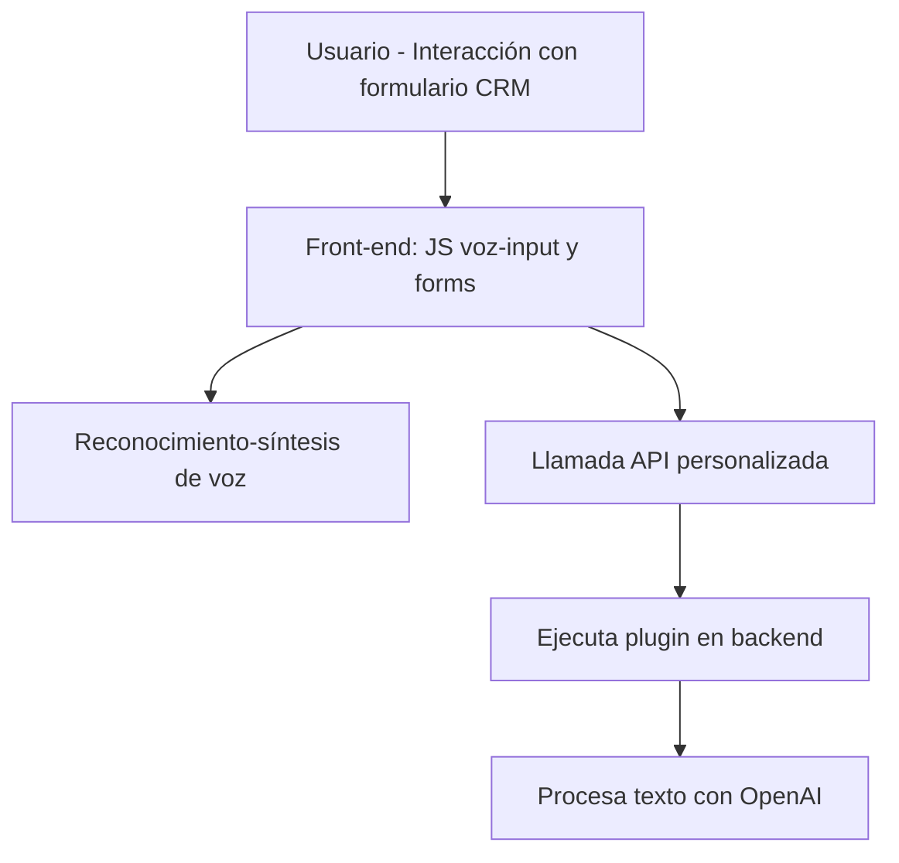

### Breve resumen técnico:
Los archivos analizados forman parte de un sistema que integra voz, texto y procesamiento mediante servicios de Azure. Esta solución transforma entradas de voz y texto en datos estructurados, interactuando con formularios de Dynamics CRM y APIs externas usando el SDK de **Azure Speech** y **Azure OpenAI**.

---

### Descripción de arquitectura:
Esta solución adopta una arquitectura **modular con integración de servicios externos**:
1. **Front-end basado en JavaScript**:
   - Permite capturar voz, procesar datos de formularios, y sintetizar texto en voz utilizando **Azure Speech SDK**.
   - Realiza comunicación con un backend mediante **APIs personalizadas**.
   - Utiliza el patrón de **event-driven** para reaccionar a la disponibilidad del SDK o a eventos en los formularios.

2. **Backend basada en plugins**:
   - Desarrollado para integrarse con **Microsoft Dynamics CRM**.
   - El plugin de Azure OpenAI realiza el procesamiento avanzado del texto, implementando el patrón de **adaptadores externos** y encapsulando transformaciones en DTOs.
   
Aunque los componentes funcionan como módulos separados, la interacción entre ellos ocurre desde el front al back mediante servicios externos. La arquitectura puede ser vista como **n capas** con un enfoque **modular**.

---

### Tecnologías y enfoques utilizados:
1. **Front-end:**
   - Lenguaje: **JavaScript**.
   - SDK externo: **Azure Speech SDK** (para síntesis de voz y reconocimiento de voz).
   - Framework de CRM: **Microsoft Dynamics CRM APIs** (gestión de campos/formularios).
   - Enfoque arquitectónico:
     - Modularidad (funciones específicas).
     - Event-driven.
     - Integración con servicios externos (Azure SDK).
     - Buen uso de transformación de datos.

2. **Backend:**
   - Lenguaje: **C#**.
   - Framework de CRM: **Microsoft Dynamics SDK**.
   - Servicio externo: **Azure OpenAI API**.
   - Enfoque arquitectónico:
     - Diseño basado en **plugins** (IPlugin para Dynamics CRM).
     - Encapsulación lógica en métodos individuales (GetOpenAIResponse para la transformación de texto).
     - Manejo de dependencias con librerías externas (`Newtonsoft.Json`, `System.Net.Http`, etc.).

---

### Dependencias o componentes externos:
1. **Azure Speech SDK**:
   - Sintetización de voz y reconocimiento de voz.
   - Dependencia del archivo JS mediante carga externa (https://aka.ms/csspeech/jsbrowserpackageraw).

2. **Azure OpenAI API**:
   - Procesamiento del texto utilizando GPT.
   - JSON estructurado como resultado del procesamiento.

3. **Microsoft Dynamics SDKs/APIs**:
   - Manejo de contexto del formulario (front-end).
   - Implementación de plugins para la plataforma CRM en el backend.

4. **Dependencias en C#**:
   - `System.Net.Http`, `System.Text.Json`, `Newtonsoft.Json`, entre otros.

---

### Diagrama Mermaid
El siguiente diagrama ilustra la interacción entre los componentes en la arquitectura:

---

### Conclusión final:
Esta solución integra de manera efectiva tecnologías de Azure (Speech y OpenAI) con formularios y personalizaciones en Microsoft Dynamics CRM. Sigue una arquitectura modular con n capas y un enfoque orientado a eventos. Utiliza patrones de integración para servicios externos y separación lógica entre frontend y backend.

Las áreas de oportunidad incluyen:
1. Implementar un mayor manejo de errores en el front-end y backend para casos extremos.
2. Separación más estricta entre lógica de negocio y lógica de integración.
3. Considerar el uso de un framework completo como Angular/React para mejorar la escalabilidad en el front-end.

En términos generales, la solución presenta un diseño robusto con un uso eficiente de servicios de Azure y Dynamics CRM.