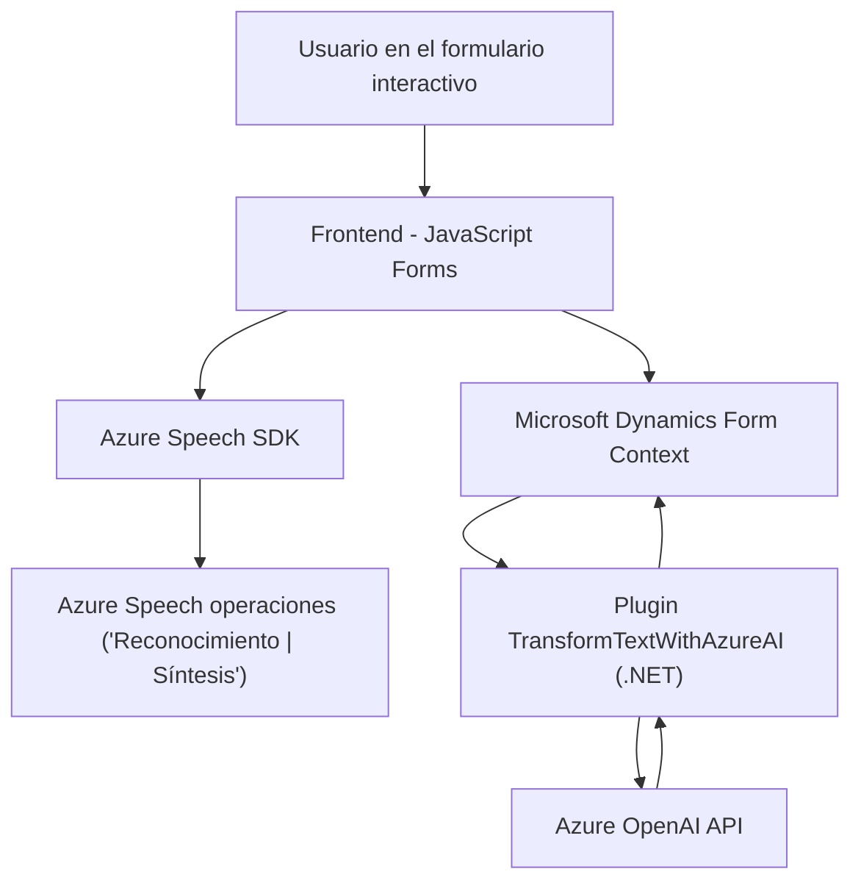

### Breve resumen técnico

El repositorio engloba soluciones para un entorno integrado que vincula una interfaz de usuario basada en formularios, reconocimiento y síntesis de voz con Azure Speech SDK (en JavaScript) y un plugin para Microsoft Dynamics CRM que utiliza Azure OpenAI API (en C#). El frontend interactúa directamente con Dynamics CRM, sirviendo como punto principal de manipulación de datos y voz, mientras que el backend centraliza transformaciones de texto mediante inteligencia artificial.

---

### Descripción de arquitectura

#### Tipo de arquitectura
La solución en su conjunto parece seguir la arquitectura **n-capas** y un diseño modular:
1. **Capa de presentación (frontend)**:
   - Contiene lógica para la interacción directa con el usuario en formularios dinámicos.
   - Usa Azure Speech SDK para acciones de reconocimiento y conversión de texto a voz.
2. **Capa lógica de negocio (plugin y API)**:
   - Centraliza la transformación de texto mediante Azure OpenAI API.
   - Implementa un plugin como middleware entre Dynamics CRM y servicios Azure.

#### Patrones utilizados
- **MVC** en la capa de presentación (estructura en formularios visuales, lógica modular y datos desde CRM).
- **Cliente-Servicio:** Para interactuar con Azure Speech SDK y OpenAI API.
- **Extensiones Plugin-Based:** Capa de lógica de negocio basada en eventos del CRM.
- **Middleware:** Comunicación y transformación de datos entre el plugin y Azure OpenAI.

---

### Tecnologías usadas
1. **Frontend (JavaScript)**:
   - **Azure Speech SDK**: Reconocimiento de voz y síntesis de audio.
   - **DOM Manipulation**: Inclusión dinámica de scripts en el navegador.
   - **Dynamics CRM API (Xrm.WebApi)**.
2. **Backend (C#)**:
   - **Microsoft.Xrm.Sdk**: Lógica extensible en Dynamics CRM.
   - **Azure OpenAI API**: Procesamiento de texto basado en GPT-4.
   - **HTTP Client**: Para la conexión con servicios externos.
   - **JSON serialization/deserialization**.

---

### Diagrama **Mermaid** para GitHub Markdown

---

### Conclusión final

La solución en este repositorio es una integración **n-capas** entre un frontend modificado dinámicamente en tiempo de ejecución con Azure Speech SDK y una extensión para el backend en Dynamics CRM utilizando servicios de Azure OpenAI. La arquitectura exhibe buenas prácticas en modularización, separación de responsabilidades, y compatibilidad con servicios externos. Aunque es eficiente, podría explorarse el uso de eventos locales o un middleware propio para optimizar futuras solicitudes entre capas.