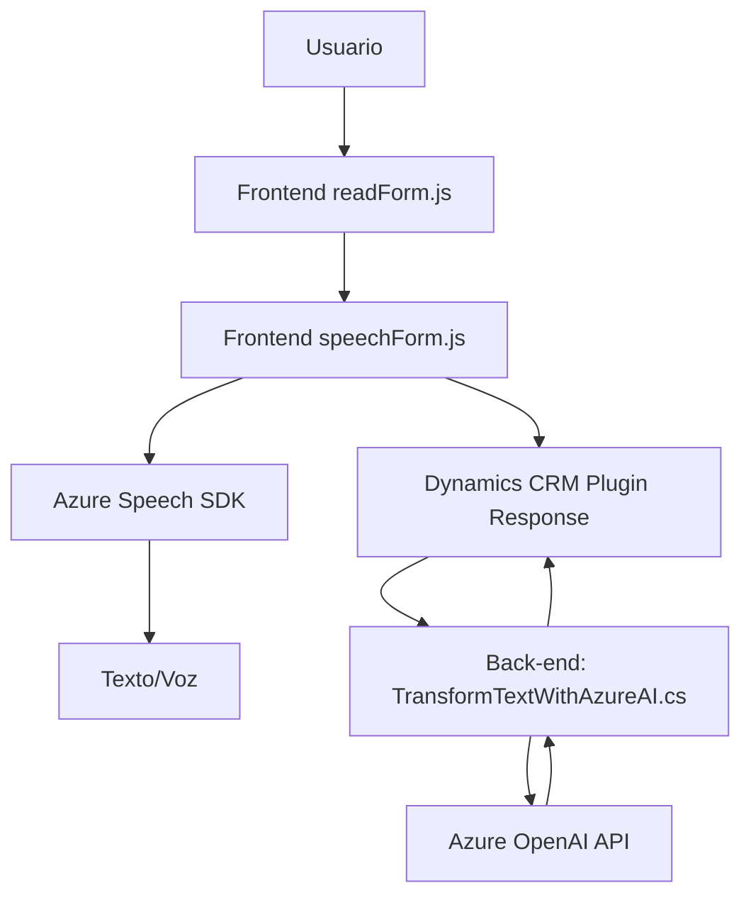

### Breve Resumen Técnico
El repositorio parece contener una solución híbrida que implementa funcionalidades de entrada y salida de datos a través de voz. Usa **Azure Speech SDK** para transformar texto a voz y comandos de voz en acciones. El frontend (JavaScript) trabaja sobre un entorno de formularios y contextos de Dynamics CRM o Power Apps, mientras el backend (C#) usa plugins para procesamiento avanzado del texto mediante **Azure OpenAI API**. La solución tiene dependencias externas como el Azure Speech SDK y APIs de OpenAI para añadir capacidades basadas en IA.

---

### Descripción de Arquitectura
La solución sigue un **modelo de arquitectura n-capas**:
1. **Presentación**: Representada por los archivos de JavaScript (e.g., `readForm.js`, `speechForm.js`) que interactúan con el cliente directamente a través de un sistema frontend (Dynamics CRM/Power Apps).
2. **Lógica de Aplicación**: Implementada en métodos JavaScript como `processTranscript` y en el plugin C# (`TransformTextWithAzureAI.cs`). Estas capas orquestan la transformación de voz y texto.
3. **Acceso a Datos**: Interactúa con APIs externas (Azure Speech y Dynamics CRM WebAPI) y, en el plugin, consume **Azure OpenAI API**.

**Patrones destacados**:
- **Modularidad**: Todas las funciones están diseñadas con propósitos definidos.
- **Carga dinámica de SDK**: Usada en funciones como `ensureSpeechSDKLoaded`.
- **Plugin extensible**: Backend usa un patrón de extensibilidad típico de Dynamics CRM (interfaz `IPlugin`).

---

### Tecnologías Usadas
1. **Frontend**:
   - **Azure Speech SDK**: Capacidades de texto a voz y reconocimiento de comandos.
   - **JavaScript**: Interacción con el DOM, formulación de comandos API y lógica de cliente.
   - **Dynamics CRM API**: Framework nativo de Dynamics CRM para manipular datos del formulario.

2. **Backend**:
   - **C#**: Lenguaje principal para los plugins.
   - **Azure OpenAI API**: Procesamiento de texto con integración a GPT-4.
   - **Newtonsoft.Json**: Manejo de JSON en el plugin.
   - **HTTPClient**: Comunicación entre el plugin y API de Azure.

---

### Dependencias o Componentes Externos
1. **Azure Speech SDK**: Formación de voz, texto y comandos basados en entradas audibles o textuales.
2. **Azure OpenAI API**: Procesa texto en el plugin C#.
3. **Dynamics CRM Web API**: Manipula los datos del formulario en las soluciones de Dynamics CRM / Power Apps.
4. **Newtonsoft.Json y System.Text.Json**: Serialización/deserialización de JSON en el backend.

---

### Diagrama Mermaid
Este diagrama describe las principales dependencias y flujo de datos entre los componentes:

---

### Conclusión Final
La solución analiza datos de voz/texto en interacción con formularios de Dynamics CRM. Su arquitectura modular facilita la extensión y la integración de funcionalidades IA (Azure OpenAI API) y soporte para texto a voz/reconocimiento de voz (Azure Speech SDK). La elección de tecnologías dinámicas como Azure services y el patrón de plugin en Dynamics CRM refuerzan la escalabilidad del sistema.

Este diseño es óptimo para aplicaciones empresariales que necesitan soluciones interactivas y contextuales basadas en voz y formularios dinámicos.