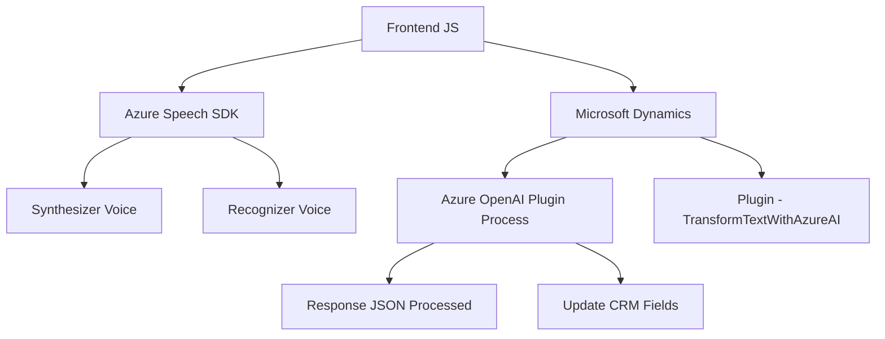

### Breve Resumen Técnico
El repositorio describe un conjunto de archivos asociados con el desarrollo de funcionalidades interactivas entre un frontend basado en JavaScript y componentes de Microsoft Dynamics. Se utilizan servicios en la nube como Azure Speech SDK y Azure OpenAI API para reconocimiento de voz, síntesis de voz y procesamiento avanzado de texto. También incluye un plugin escrito en C# para la integración directa con Dynamics CRM. La solución está optimizada para aprovechar módulos externos y dinámicos que delegan procesos específicos a servicios de Azure.

---

### Descripción de Arquitectura
La arquitectura general es **n-capas**, combinando:
- **Frontend** (JavaScript): Responsable de la interfaz del usuario y lógica en el cliente para síntesis y reconocimiento de voz. Se ejecuta dinámicamente en un navegador y tiene una alta dependencia del SDK de Azure Speech.
- **Backend Services (Dynamics y Plugins)**: Utiliza plugins en .NET para interactuar con Dynamics CRM y servicios externos como Azure OpenAI. Todo procesamiento relacionado con IA y reglas definidas se delega al backend, manteniendo la lógica del negocio dentro de Dynamics CRM.
- **Servicios Externos (Cloud Services)**: Ejecutan la inteligencia artificial (Azure Speech SDK, Azure OpenAI API) y responden de acuerdo a las solicitudes del frontend o backend.

---

### Tecnologías Usadas
1. **Frontend:**
   - JavaScript: Principal lenguaje para interacción del cliente.
   - Azure Speech SDK: Usado para síntesis de voz y reconocimiento de comandos.
   - Microsoft Dynamics Environment: Contexto `executionContext` usado para obtener datos del formulario.

2. **Backend:**
   - C#: Implementación de plugins para extensión de Dynamics CRM.
   - Microsoft.Xrm.SDK: Framework SDK para extender Dynamics con plugins.
   - Json Libraries: Manejo de datos JSON (Newtonsoft.Json y System.Text.Json).

3. **Integraciones Cloud:**
   - Azure OpenAI API: Procesamiento avanzado de texto.
   - Azure Speech SDK: Reconocimiento de voz y síntesis.

4. **Patrones:**
   - Modularidad: División funcional por método especializado.
   - Plugin Pattern: Para combinar eventos de Dynamics con lógica externa.
   - Adaptador: Transformación de datos visible (frontend) y estructurado (backend).

---

### Diagrama Mermaid

Este diagrama representa la interacción entre las capas y servicios del sistema:

---

### Conclusión Final
La solución descrita combina una arquitectura **n-capas**, donde la lógica del cliente (frontend) y del servidor (backend con plugins) interoperan para ofrecer funcionalidades avanzadas, integrando interfaces de usuario con procesamiento por IA a través de servicios en la nube (Azure Speech SDK y OpenAI). Este enfoque permite escalabilidad y asegura que cada parte del sistema se enfoque en responsabilidades específicas: presentación (frontend), negocio (Dynamics/plugins) y lógica avanzada (Azure).

Optimizaciones como la separación de credenciales de APIs y un mejor manejo de errores podrían mejorar la calidad y la seguridad del código. Sin embargo, la modularidad y la interoperabilidad dinámicas ya establecen una base sólida para su mejora progresiva.