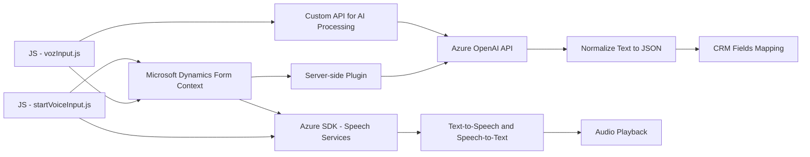

### Breve Resumen Técnico
El repositorio contiene tres archivos clave que, en conjunto, implementan servicios basados en voz y texto para interfaces de usuario en formularios dinámicos, integrándose con el servicio **Azure Speech SDK** y **Azure OpenAI API**. La solución tiene como propósito mejorar la accesibilidad (voz a texto y texto a voz) y la automatización con inteligencia artificial en plataformas como Microsoft Dynamics CRM.

---

### Descripción de Arquitectura
La arquitectura del sistema corresponde a un **modelo híbrido multicapa**, combinando las siguientes:
1. **Frontend**: Procesos distribuidos en archivos JavaScript, organizados de manera modular y orientados por eventos, ejecutando lógica en el navegador. Acceso al Azure Speech SDK para voz a texto y texto a voz.
2. **Backend plugin (Server-side)**: Enfocado en transformaciones textuales mediante la API de Azure OpenAI y ejecutado dentro del entorno Microsoft Dynamics CRM (patrón de extensibilidad tipo Plugin).
3. **API externa y servicios**: Integra servicios de Azure para reconocimiento de voz y procesamiento de inteligencia artificial textual.

---

### Tecnologías Usadas
1. **Frontend**: 
   - JavaScript (DOM API).
   - Azure Speech SDK (voz a texto, síntesis de voz).
2. **Backend**:
   - C# con **Microsoft.Xrm.Sdk** (contexto CRM).
   - Azure OpenAI para transformación y procesamiento textual.
   - **Newtonsoft.Json** para manejo de JSON.
   - **System.Net.Http** para manejar integraciones HTTP.
3. **Patrones de Diseño**:
   - Evento-Driven para la interacción con formularios.
   - Plugin-based extensibilidad en Dynamics CRM.
   - Modulo único por responsabilidad (`Single Responsibility Principle`) con funciones pequeñas y específicas.

---

### Dependencias o Componentes Externos
1. **Azure Speech SDK**: Para la síntesis de voz y reconocimiento de entrada por micrófono.
2. **Azure OpenAI Service**: Para transformar texto en JSON con reglas especificadas.
3. **Microsoft Dynamics CRM**: Plataforma base para la ejecución de plugins en el backend.
4. **API personalizada**: Implementada probablemente como un servicio REST para lógica avanzada adicional.

---

### Diagrama Mermaid

---

### Conclusión Final
El repositorio propone una solución orientada a mejorar la accesibilidad y automatización de tareas de formularios dinámicos. La integración de tecnologías de Azure como **Speech SDK** y **OpenAI** permite implementar características avanzadas de voz a texto y procesamiento basado en inteligencia artificial. 

La arquitectura multicapa destaca por ser modular y basada en principios de responsabilidades únicas mediante funciones ligeras y clases en el plugin. Sin embargo, el almacenamiento de parámetros sensibles como claves debe mejorarse para garantizar la seguridad en entornos productivos.