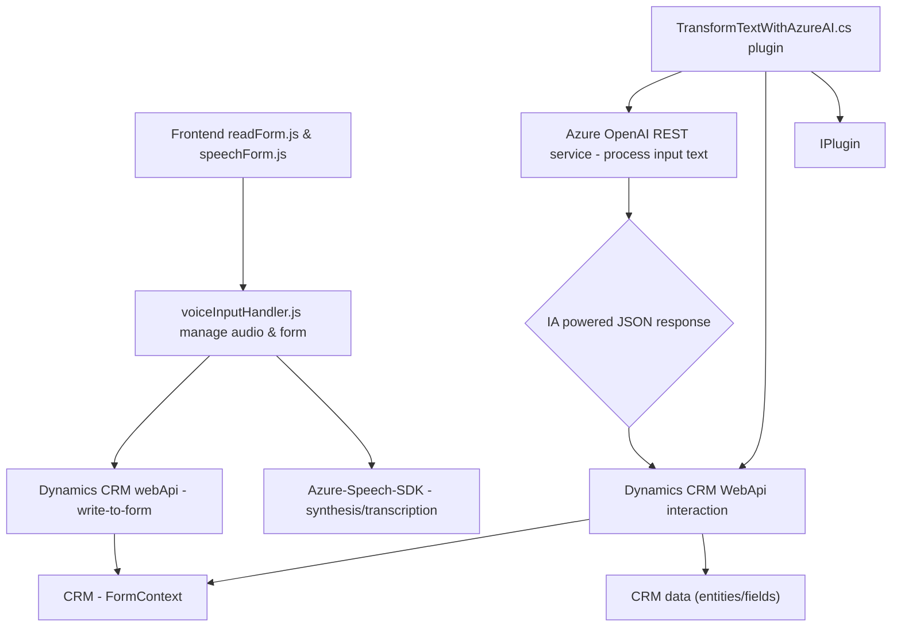

### Análisis técnico del repositorio

#### Breve resumen técnico
El repositorio implementa una solución basada en **integración de servicios cloud**, enfocada en el uso de inteligencia artificial y tecnologías de voz, integrada a **Microsoft Dynamics CRM**. Distribuye su funcionalidad entre un frontend (JavaScript para interacción con formularios y transcripciones de texto a voz/voz a texto), y un backend (plugin en C# para procesamiento y transformación de datos mediante Azure OpenAI).

---

#### Descripción de arquitectura
Se basa en una arquitectura de **n capas**, donde:
1. La capa de presentación (frontend JavaScript) gestiona la interacción visual y la captura de datos desde formularios CRM.
2. La capa de lógica de dominio (C# Plugin) procesa los datos aplicando la lógica avanzada de transformación textual con Azure OpenAI.
3. La capa de integración (APIs externas como Azure Speech SDK y Azure OpenAI) aporta capacidades de inteligencia artificial y síntesis de voz esenciales para el proyecto.

Se emplean patrones de arquitectura como:
- **Plugin pattern** para extender la funcionalidad de Dynamics CRM.
- **API Gateway pattern** para coordinar llamadas y flujos entre los servicios externos de Azure.
- **Facade pattern** para simplificar interacciones con APIs de terceros dentro de funciones del backend.
- **Event-driven programming** en el frontend, donde el flujo depende de eventos como la carga del SDK o la activación de controles por voz.

---

#### Tecnologías usadas
1. **Backend**:
   - Lenguaje: **C#**.
   - Framework: **Microsoft Dynamics CRM SDK**.
   - API externa: **Azure OpenAI** para transformación textual.
   - Protocolos: **REST** para comunicación con OpenAI.

2. **Frontend**:
   - Lenguaje: **JavaScript**.
   - SDK utilizado: **Azure Speech SDK** para síntesis y transcripción de voz.
   - API externa: **Xrm.WebApi** de Dynamics CRM para interacción y actualización de datos en formularios.

3. **General**:
   - Infraestructura Cloud: **Microsoft Azure** para hosting y servicios de IA.
   - HTTP Client: `System.Net.Http` para realizar llamados REST.
   - Manejo de JSON: `System.Text.Json`, `Newtonsoft.Json.Linq`.
   - Promesas y asíncronas en JavaScript (`Promise`, `Async/Await`).
   - Dinámica de carga de dependencias: SDK de Azure cargado en tiempo de ejecución.

---

#### Dependencias y componentes externos presentes
1. **Microsoft Azure Speech SDK**: Se integra en el frontend para síntesis de texto a voz y transcripción.
2. **Microsoft Dynamics CRM APIs**: Interconexión directa con formularios y datos de CRM.
3. **Azure OpenAI**: Utilizado en el backend para el procesamiento de texto avanzado mediante GPT.
4. **Javascript DOM**: Manipulación de formularios web para realizar las operaciones de lectura y escritura dinámicas.
5. **HTTP Client**: Comunicación entre el plugin y el servicio Azure OpenAI.
6. **Newtonsoft.JSON**: Manejo de objetos JSON en C#.

---

#### Diagrama Mermaid válido para GitHub

---

#### Conclusión final
El repositorio implementa una **solución para CRM** que utiliza herramientas de inteligencia artificial en **Microsoft Azure**, integrándose con Dynamics CRM para fomentar la transcripción, síntesis de voz y estructuración de datos dinámicos en tiempo real. Las tecnologías distribuidas entre el frontend y backend utilizan patrones de programación modernos como la modularización por responsabilidad, cargas dinámicas de dependencias, y comunicación asincrónica con APIs externas. Aunque la solución está correctamente organizada, aspectos como la gestión de secretos (Azure keys) podrían externalizarse para mejorar la seguridad global del sistema.

