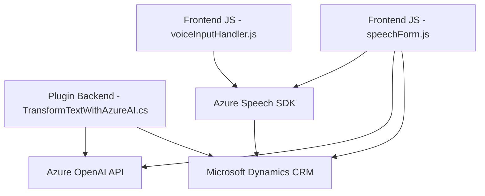

### Breve resumen técnico

El repositorio incluye componentes de un sistema centrado en entrada y procesamiento de voz, diseñado para interactuar con formularios dinámicos y servicios externos, principalmente Azure Speech SDK y Azure OpenAI. Los archivos de JavaScript gestionan tanto la entrada como la síntesis de voz, mientras que el archivo C# (`TransformTextWithAzureAI.cs`) actúa como un plugin en Microsoft Dynamics CRM para procesamiento avanzado de texto con Azure OpenAI.

---

### Descripción de arquitectura

La arquitectura utiliza una **n-capas estructurada**:
1. **Frontend**: Scripts en JavaScript gestionan la interacción con el usuario y la entrada/salida visual y en voz.
2. **Backend**: Plugins en C# procesan datos en Dynamics CRM y delegan tareas avanzadas al servicio Azure OpenAI.
3. **Servicios externos**: Azure Speech SDK para síntesis y entrada de voz, y Azure OpenAI API para transformación de texto.

Además, se observa un **Service-Oriented Architecture (SOA)** al delegar procesamiento especializado en servicios externos.

---

### Tecnologías usadas

1. **Frontend**:
   - **JavaScript**: Implementación de lógica de entrada/salida de voz.
   - **Azure Speech SDK**: Carga dinámica para reconocimiento y síntesis de voz.

2. **Backend**:
   - **C#**: Desarrollo de plugins avanzados para Dynamics CRM.
   - **Microsoft Dynamics CRM SDK**: Integración de negocios con lógica personalizada.
   - **Azure OpenAI API**: Procesamiento avanzado usando modelos GPT.

3. **Patrones de diseño**:
   - **Single Responsibility Principle**: Modulación de funciones en JavaScript y clases/métodos en C#.
   - **Dependencia dinámica**: Carga del SDK de Speech solo si es necesario.
   - **Service Layer**: Plugin que actúa como intermediario entre Dynamics CRM y Azure OpenAI.
   - **Pipeline de procesamiento**: Secuencia para toma de datos, transformación y síntesis.

---

### Dependencias o componentes externos

1. **Azure Speech SDK**: Reconocimiento y síntesis de entrada de voz.
2. **Azure OpenAI API**: Procesamiento avanzado y transformación de texto.
3. **Microsoft Dynamics CRM SDK**: Interacción con el contexto empresarial.
4. **Libraries**:
   - `System.Net.Http`, `System.Text.Json` en C# para solicitudes API.
   - Potencial uso de `Newtonsoft.Json` en versiones futuras.
5. **Servicios internos**:
   - `Xrm.WebApi` del SDK de Dynamics CRM para operaciones relacionadas con datos de formularios.

---

### Diagrama Mermaid válido para GitHub

---

### Conclusión final

Este repositorio representa un sistema altamente integrado para interacción dinámica mediante voz, con capacidades avanzadas de procesamiento textual. La combinación de servicios externos como Azure Speech SDK y Azure OpenAI, junto con la modulación entre frontend en JavaScript y backend en C#, sugiere una arquitectura escalable basada en **n-capas**. Excelente ejemplo de cómo desacoplar lógicas pesadas delegándolas a servicios externos y manteniendo estructuras limpias y modulares en la base de código.