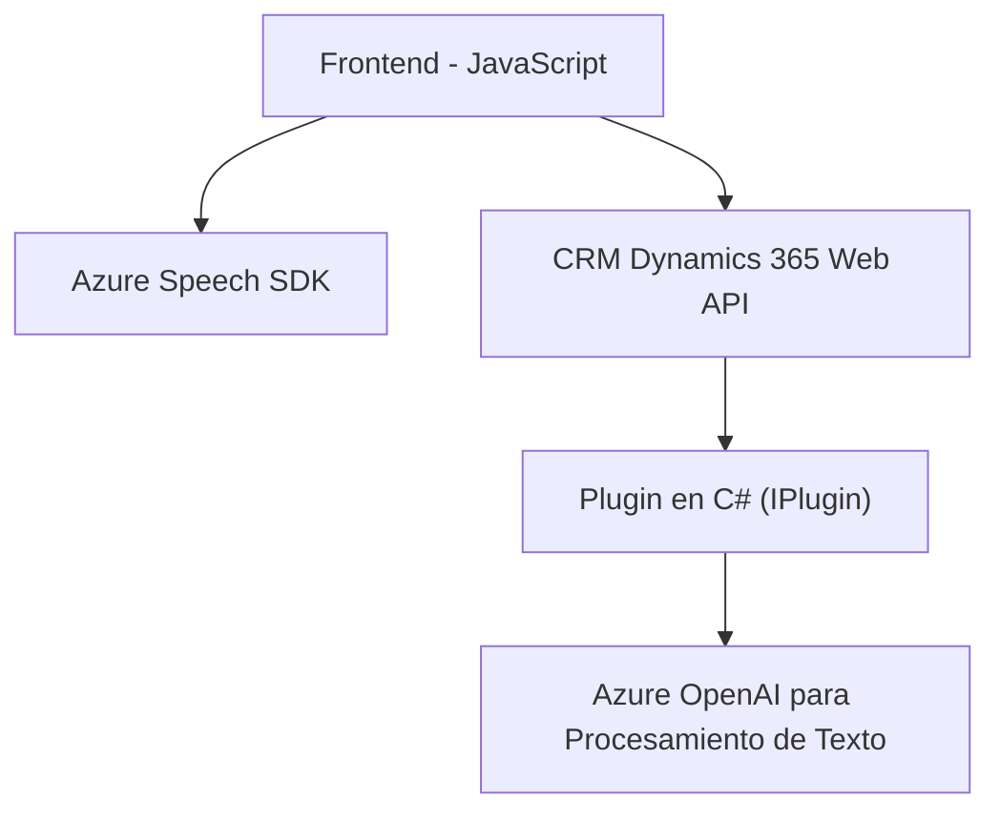

### Breve resumen técnico
El repositorio describe una solución que integra capacidades de reconocimiento de voz, síntesis de voz y procesamiento de texto basado en inteligencia artificial en un entorno Microsoft Dynamics CRM 365. Está compuesto por un frontend en JavaScript que interactúa con el CRM y una API externa (Azure Speech SDK y Azure OpenAI), junto con un plugin en C# que transforma texto mediante Azure OpenAI.

---

### Descripción de arquitectura
La solución implementa una arquitectura **híbrida** con los siguientes elementos:
1. **Frontend (JavaScript):** Actúa como un cliente que interpreta la voz del usuario y procesa comandos para realizar cambios en formularios del CRM. Este módulo comunica también con APIs externas (Azure Speech SDK y personalizadas del CRM) y la Web API del CRM.
2. **Backend (Plugin - C#):** Funciona dentro del framework de extensibilidad del CRM Dynamics 365 siguiendo el patrón Plugin para interceptar eventos y extender la lógica del sistema. Realiza procesamiento avanzado de texto utilizando Azure OpenAI.
3. **Integración de servicios externos:** 
   - Azure Speech SDK para reconocimiento y síntesis de voz.
   - Azure OpenAI para procesamiento y transformación del texto.

En conjunto, estos módulos forman una arquitectura **orientada a servicios**, dependiendo de integraciones con APIs externas y servicios cloud.

---

### Tecnologías usadas
1. **Frontend (JavaScript):**
   - Azure Speech SDK: Comunicación con el servicio para captura y síntesis de voz.
   - Crm Dynamics 365 API: Para la manipulación de datos en formularios.
   - Promesas: Para manejo de operaciones asíncronas, como la carga de dependencias y conexión con servicios externos.
   - DOM Manipulation: Inserción dinámica de scripts.

2. **Plugin en Backend (C#):**
   - Azure OpenAI: Usado para transformar texto mediante IA (GPT-4).
   - Frameworks de Dynamics CRM: Interaction mediante SDK (`Microsoft.Xrm.Sdk`) y ejecución bajo contexto específico.

---

### Diagrama Mermaid

---

### Conclusión final
La solución implementada en el repositorio combina tecnología avanzada (Azure Speech SDK y Azure OpenAI) con características de integración estándar de Dynamics CRM 365 para entregar funcionalidades inteligentes de entrada de voz y procesamiento de comandos. Este diseño presenta una arquitectura orientada a servicios que conecta funcionalidades frontend y backend mediante múltiples APIs y utiliza patrones como *Facade* y *Adapter*. Es una solución extensible y modular, aunque depende críticamente de servicios externos como Azure Speech y OpenAI, lo cual puede afectar la portabilidad y autonomía.