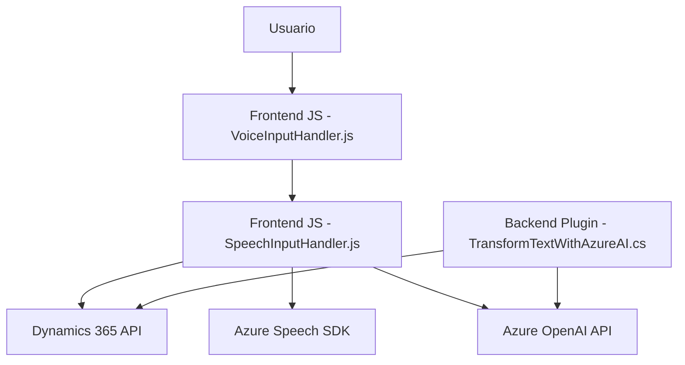

### Breve resumen técnico:
El repositorio incluye tres componentes principales que trabajan con funcionalidades de entrada/salida de voz y texto en formularios de Dynamics 365 mediante Azure Speech SDK y Azure OpenAI. Los archivos representan una solución híbrida de frontend, backend y plugin para integraciones avanzadas con servicios en la nube.

---

### Descripción de arquitectura:
Basado en los archivos analizados, la arquitectura general es **n capas**: una capa de frontend que captura y sintetiza audio usando Azure Speech SDK, una capa de lógica intermedia que gestiona la entrada de voz y su mapeo a formularios mediante APIs, y una capa de backend/plugin que transforma datos utilizando Azure OpenAI para ampliación funcional y normas personalizadas.

Si bien existe separación de responsabilidades, el frontend (JavaScript) y backend (C# plugin) interactúan usando APIs externas y Dynamics 365 como hub central, evidenciando elementos de una solución orientada a servicios (SOA).

---

### Tecnologías usadas:
1. **Frontend JavaScript**:
   - **Azure Speech SDK**: Para reconocimiento de voz, síntesis de texto y conversión de audio.
   - **Promise/async-await**: Gestión de concurrencia.
   - **Dynamics 365 API**: Manipulación y actualización de datos en formularios.
   - **DOM**: Para trabajar con estructuras de formularios dinámicos.
   
2. **Backend C#**:
   - **Microsoft.Xrm.Sdk**: Gestión de datos en Dynamics CRM.
   - **Azure OpenAI**: Transformación y estructurado avanzado de texto.
   - **System.Net.Http**: Consumir APIs externas.
   - **Newtonsoft.Json**: Convertir datos JSON complejos.

3. **Patrones de diseño**:
   - **Carga dinámica**: SDK externo es cargado condicionalmente.
   - **Modularidad funcional**: Cada funcionalidad está encapsulada en sus propios métodos.
   - **Plugin architecture**: Backend basado en plugins para eventos específicos.
   - **Integración SOA**: APIs externas (Azure y Dynamics).

---

### Diagrama Mermaid compatible con GitHub Markdown:

---

### Conclusión final:
La solución muestra una arquitectura híbrida entre **n capas** y **SOA**. La capa de frontend gestiona la experiencia de usuario mediante entrada de voz, mientras que el backend amplía funcionalidad con aplicaciones de Azure AI. Dynamics 365 actúa como el núcleo operativo integrando todas las capas. La estructura modular garantiza una buena separación de responsabilidades, pero una posible mejora sería externalizar configuraciones sensibles como claves API.