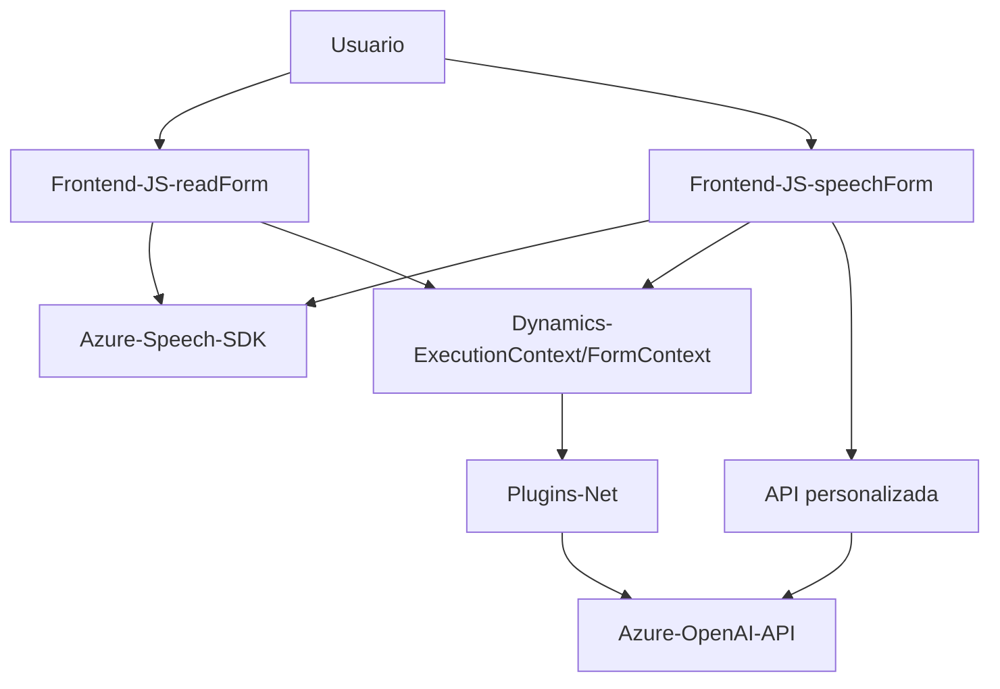

### Breve resumen técnico:
El conjunto de archivos presentados forma parte de una solución que combina un **frontend** basado en JavaScript asociado a Dynamics 365 CRM y la integración con servicios en la nube de Azure para el manejo de lógica avanzada de voz, texto y transformación mediante inteligencia artificial. La solución incluye:
- **Frontend:** Dos archivos JS para la síntesis y reconocimiento de voz con Azure Speech SDK.
- **Backend:** Un plugin (.NET) que extiende Dynamics 365 CRM usando Azure OpenAI API.

---

### Descripción de arquitectura:
La solución utiliza una arquitectura híbrida orientada hacia **n capas**, donde cada capa cumple objetivos específicos:
1. **Capa de presentación:** Archivos JavaScript (`readForm.js` y `speechForm.js`) manejan la UI y funcionalidad de voz del cliente (formularios). Se integran con Dynamics 365 y Azure Speech SDK para mejorar la experiencia del usuario.
2. **Capa de negocio:** El plugin en `.NET` implementa la lógica empresarial, conectándose con la Azure OpenAI API para la generación de respuestas inteligentes desde texto en Dynamics CRM.
3. **Capa de servicios/infraestructura:** Utiliza APIs externas, como **Azure Speech SDK** para voz y **Azure OpenAI API** para procesamiento de texto.

---

### Tecnologías usadas:
1. **Frontend (JavaScript):**
   - **Azure Speech SDK:** Para síntesis y reconocimiento de voz.
   - **Dynamics 365 (executionContext/formContext):** Para interacción con los formularios del CRM.
   - **Promesas, callbacks y asincronía:** Para la gestión de eventos y cargas externas.
   - **Facade Pattern:** Modularización en funciones para simplificar el flujo.
   - **IA básica:** Procesamiento de reglas (`campo=valor`) o uso directo de APIs IA.

2. **Backend (.NET Plugin):**
   - **Dynamics CRM SDK:** Para extender y personalizar la funcionalidad del sistema.
   - **Azure OpenAI API:** Para modelado y transformación avanzada de textos vía REST.
   - **System.Net.Http:** Solicitudes HTTP.
   - **System.Text.Json / Newtonsoft.Json:** Procesamiento de JSON.

---

### Posibles dependencias externas:
1. **Azure Speech SDK:** Para la funcionalidad de voz (síntesis y reconocimiento).
2. **Azure OpenAI API:** Para procesamiento avanzado de texto y uso de normas.
3. **Dynamics CRM Web API (`Xrm.WebApi`):** Manejo de formularios y datos del CRM.
4. **Microsoft Dynamics SDK:** Libs para funcionamiento del plugin.
5. **Servicios Lookup de Dynamics 365:** Consultas y operaciones relacionadas con entidades CRM.

---

### Diagrama Mermaid válido para GitHub:

---

### Conclusión final:
Esta solución demuestra un diseño modular destinado a mejorar la experiencia de usuario para formularios de Dynamics CRM mediante síntesis de voz y reconocimiento de comandos por voz, junto con el respaldo de inteligencia artificial en la transformación avanzada de texto. La arquitectura de **n capas**, reforzada por servicios en la nube de Azure, resalta la escalabilidad y capacidad de integración en entornos dinámicos. Sin embargo, destaca la dependencia de APIs externas, por lo que sería crucial optimizar la seguridad y el manejo de latencias en entornos de producción.