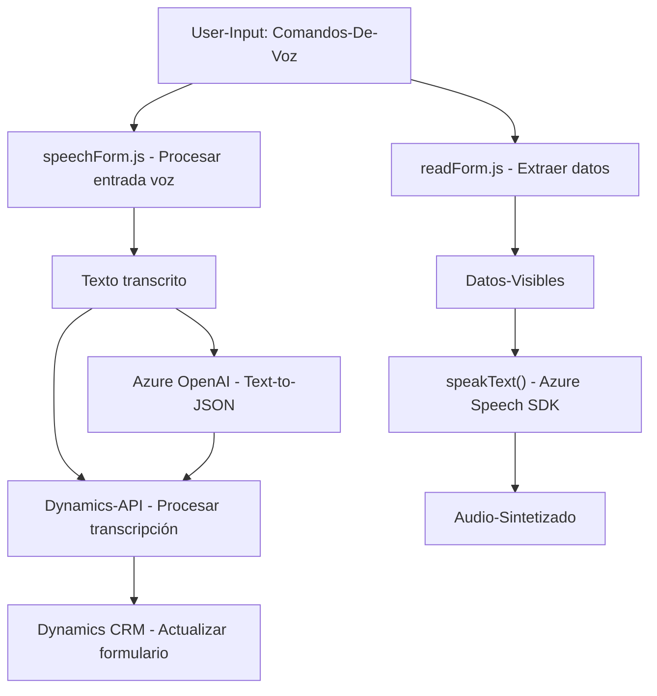

## Breve Resumen Técnico

El repositorio descrito contiene múltiples componentes que interactúan, enfocados principalmente en la integración de forma cómoda y automatizada entre entrada de datos mediante formularios o voz, procesamiento local, y transformación y interacción con servicios externos (Azure OpenAI, Azure Speech SDK y Microsoft Dynamics 365). Las tecnologías y patrones arquitectónicos usados denotan un diseño orientado a integración y modularidad.

---

## Descripción de Arquitectura

La solución presenta diferentes componentes:
1. **Frontend:** En la carpeta `FRONTEND/JS`, encontramos código JavaScript que gestiona la interacción entre usuarios y formularios de entrada, captura de datos y procesamiento de voz. Está diseñado en forma **modular** con funciones desacopladas.
   
2. **Backend (Plugins):** En la carpeta `Plugins`, específicamente el archivo C# `TransformTextWithAzureAI.cs`, hay un plugin diseñado para Dynamics CRM, implementado bajo un modelo de **plugin architecture**. Este ejecuta transformaciones avanzadas de texto usando Azure OpenAI.

### Patrón de arquitectura general
La solución parece alinearse con una **arquitectura de microservicios o integración modular**:
- Componentes del frontend implementan funcionalidades independientes, interactuando con APIs y servicios externos (Azure Speech, Dynamics Web API, y Azure OpenAI).
- Uso de servicios externos para funcionalidades específicas apunta a una **arquitectura basada en servicios** para encapsular responsabilidades.

---

## Tecnologías Usadas

1. **Frontend:**
   - **JavaScript:** Lenguaje principal para interacción con formularios y APIs.
   - **Azure Speech SDK:** Para síntesis y reconocimiento de voz.
   - **Dynamics 365 Web API:** Para acceder a servicios y entidades del CRM desde el cliente.

2. **Backend Plugins:**
   - **C# .NET Framework:** API de Microsoft para desarrollo y ejecución en Dynamics CRM.
   - **Azure OpenAI API:** Para procesamiento de lenguaje natural y texto estructurado mediante OpenAI.
   - **Newtonsoft.Json:** Libería utilizada para manipulación avanzada de JSON.
   - **HTTPClient (System.Net.Http):** Para la integración con Azure OpenAI.

3. **Hosting y CI/CD:**
   - **GitHub:** Como repositorio del código fuente.

### Patrones
- **Modularidad:** Código dividido en funciones individuales con única responsabilidad.
- **Fachadas:** Abstracción en métodos que interactúan con SDKs y APIs (es decir, simplificación en el uso del Azure Speech SDK y Dynamics Web API).
- **Plugin Architecture:** En el backend de Dynamics CRM.
- **Repository Pattern:** Utilizado implícitamente para integrar y gestionar datos del CRM en `speechForm.js`.
- **Event-driven Programming:** A través del manejo de callbacks (como el cargador de SDK).

---

## Diagrama Mermaid Compatible con GitHub Markdown

A continuación se presenta un diagrama Mermaid que describe la arquitectura y flujo de datos de la solución:

---

## Conclusión Final

La solución parece ser un **sistema basado en servicios y APIs** (Azure Speech y Azure OpenAI), diseñado para interacción con formularios mediante voz y texto, junto con funcionalidades extendidas implementadas como **plugins de Dynamics CRM**. Este diseño es eficiente, modular, y facilita la integración con herramientas modernas para la interacción basada en IA, voz, y datos estructurados. No obstante, su arquitectura sugiere un enfoque híbrido, entre un frontend y servicios desacoplados con un posible backend centralizado en Dynamics CRM.