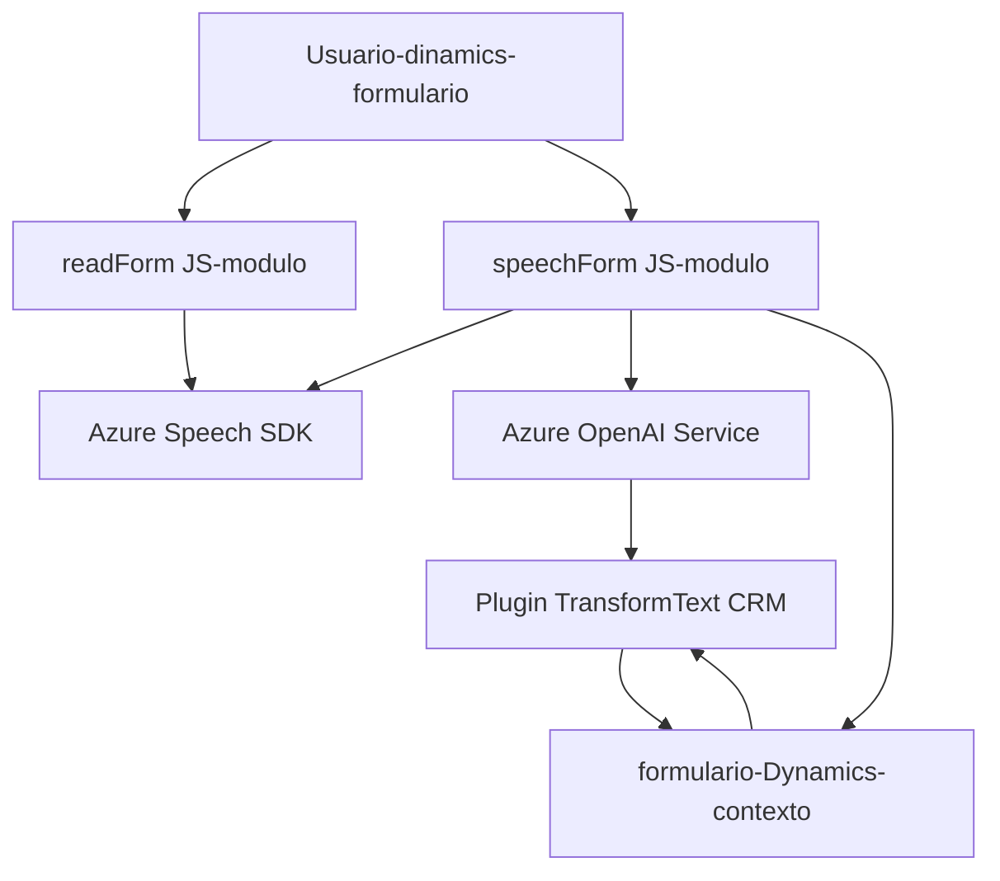

### Breve resumen técnico:

Este repositorio representa una solución tecnológica para mejorar la accesibilidad e interacción con formularios en Microsoft Dynamics 365, utilizando reconocimiento de voz y síntesis de voz con el Azure Speech SDK y procesamiento de texto con Azure OpenAI (GPT-4). La estructura está dividida en tres partes: `Frontend/JS/readForm.js` para lectura y síntesis de formularios, `Frontend/JS/speechForm.js` para el reconocimiento de voz y procesamiento de transcripciones, y `Plugins/TransformTextWithAzureAI.cs` para una integración directa con Dynamics CRM vía un plugin que transforma texto utilizando Azure OpenAI.

---

### Descripción de la Arquitectura

La arquitectura es un **combinación de diferentes patrones** que incluye:
1. **N capas**: La solución tiene una clara diferenciación entre la capa cliente (Frontend) y backend (plugin en Dynamics CRM).
2. **Híbrida (SOA)**: El backend (Dynamics Plugin) funciona como un servicio orquestador, interactuando con un servicio externo basado en la API de Azure OpenAI y enviando los datos al cliente.
3. **Patrón de Diseño Facade**: Los módulos JavaScript encapsulan la lógica de interacción dentro de funciones que facilitan la reutilización y gestión del SDK de Azure Speech.
4. **Event-driven architecture**: La lógica se dispara en función de eventos en el contexto del formulario (acciones del usuario como interacciones de voz).

---

### Tecnologías usadas:
1. **Frontend (JavaScript)**
   - JavaScript como lenguaje principal.
   - **Azure Speech SDK** para síntesis de texto a voz y reconocimiento de voz.
   - **Dynamics 365 SDK** para manipulación de datos y formularios.

2. **Backend (C# Plugin en Dynamics CRM)**
   - **C#** como lenguaje principal.
   - **Microsoft.Xrm.Sdk** para integración con Dynamics CRM.
   - **Azure OpenAI Service** para transformación avanzada de texto basado en IA.
   - JSON libraries (`Newtonsoft.Json.Linq`, `System.Text.Json`) para manejo de datos.

3. **Externas**
   - SDKs de **Azure Speech** y **OpenAI** vía API.

---

### Diagrama **Mermaid** válido para GitHub:

---

### Conclusión final:
Este repositorio implementa una solución eficiente para mejorar la accesibilidad y la experiencia de los usuarios en plataformas empresariales como Dynamics 365. Utiliza tecnologías modernas enfocadas en inteligencia artificial y accesibilidad, como el Azure Speech SDK y el servicio Azure OpenAI. La arquitectura emplea una lógica modular y orientada a servicios que divide las responsabilidades entre frontend, backend y APIs, manteniendo una clara separación de preocupaciones. 

El mayor desafío sería asegurar el manejo seguro de las claves API y optimizar la carga dinámica de los SDKs para evitar sobrecargas en el rendimiento del navegador o servidor.