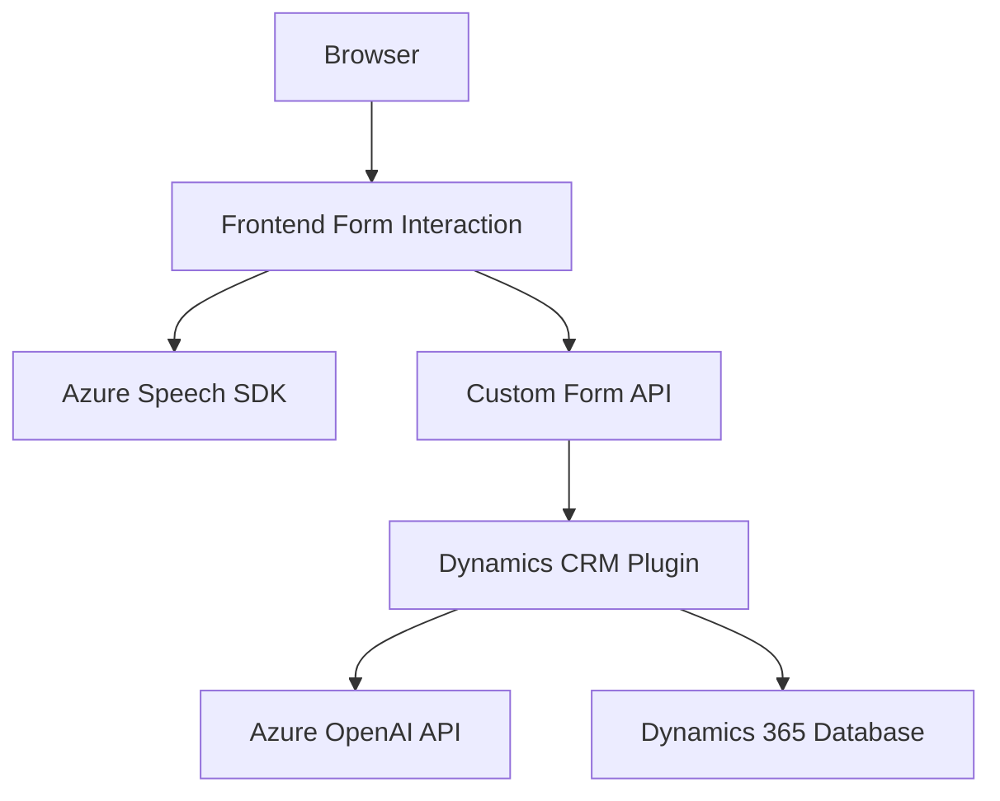

### Resumen técnico:
El repositorio contiene una solución orientada a la integración entre formularios de Dynamics 365, Azure Speech SDK, y Azure OpenAI. Combina funcionalidades de accesibilidad (a través de voz) con procesamiento avanzado mediante IA (GPT). Los archivos analizados reflejan una solución mixta que incluye lógica del lado cliente y servidor, así como comunicación con servicios externos.

---

### Descripción de arquitectura:
La arquitectura del repositorio parece estar diseñada utilizando un **modelo híbrido entre frontend y servicios en nube**. El **frontend** (JavaScript) interactúa con el SDK de Azure Speech para síntesis y reconocimiento de voz en el navegador, además de realizar llamadas a APIs personalizadas que integran IA. Del lado **servidor**, los plugins (.NET) interactúan directamente con Dynamics 365 para transformaciones de información y procesamiento avanzado bajo normas específicas establecidas por la lógica empresarial. El diseño general sugiere un enfoque **orientado a n capas** con integración de servicios distribuidos (SaaS).

---

### Tecnologías utilizadas:
1. **Frontend:**
   - **JavaScript**: Lenguaje principal para la programación del lado cliente.
   - **Azure Speech SDK**: Para síntesis y reconocimiento de voz.
   
2. **Backend:**
   - **C#:** Desarrollo de plugins para Dynamics 365.
   - **Azure OpenAI (GPT)**: Para IA basada en texto.
   - **Microsoft Dynamics CRM SDK**: Como base para la integración del sistema.
   - **Newtonsoft.Json / System.Text.Json**: Para manejo de JSON en plugins.

3. **Integración y servicios:**
   - REST APIs habilitadas en Azure Speech SDK y Azure OpenAI.
   - Dynamics 365 API (`Xrm.WebApi`) para manipulación de formularios.

---

### Diagrama Mermaid:

---

### Conclusión final:
El repositorio implementa una solución completa para mejorar la usabilidad y accesibilidad en formularios de Dynamics 365, al hacer uso de Azure Speech SDK para voz e integración con IA mediante un servicio externo. La arquitectura n capas y los patrones como **Facade** y **Plugin Architecture** aseguran una separación clara entre lógica del frontend, servicios en nube, y manipulación de datos en Dynamics. Es una solución sólida para contextos empresariales que buscan incorporar capacidades de IA en sus sistemas existentes.