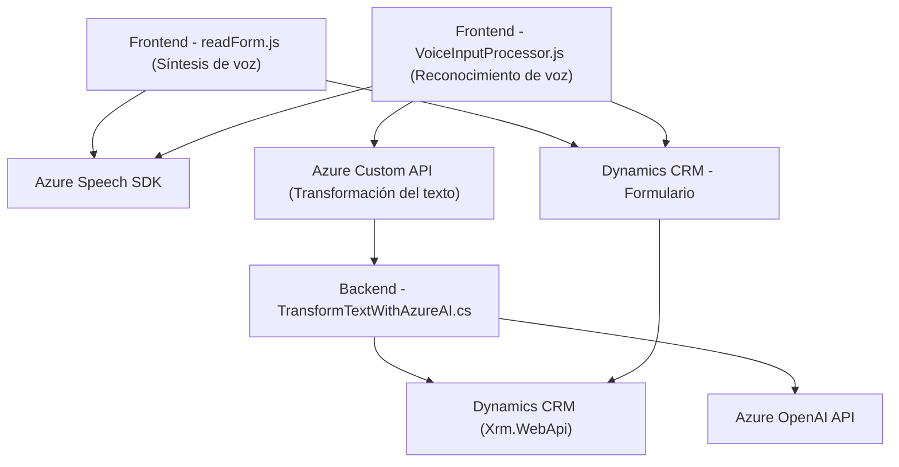

### Breve resumen técnico

El repositorio describe una solución orientada a mejorar la interacción entre usuarios y formularios de Dynamics CRM. Integra tres componentes principales que trabajan juntos:  
1. Un frontend basado en JavaScript, que implementa entrada y salida por voz con Azure Speech SDK.  
2. Un backend (plugin de Dynamics CRM en C#), que utiliza Azure OpenAI para estructurar y transformar datos textuales.  
3. Integración con APIs externas de Microsoft, como Azure Speech SDK y Azure OpenAI API para maximizar la interacción inteligente con los formularios.

---

### Descripción de arquitectura

La solución exhibe una **arquitectura híbrida** caracterizada por los siguientes enfoques:  

1. **Capas frontales:** Basada en JavaScript, el frontend opera en el navegador, procesando datos con la lógica orientada a capturar entradas de voz y generar resultados auditivos.  
2. **Capas de negocio:** Implementadas en el backend como un **plugin de Dynamics CRM** que actúa en eventos dentro del ecosistema de CRM y delega trabajo al servicio Azure OpenAI para enriquecer los datos.  
3. **Descentralización y desacoplamiento:** Las interacciones con servicios externos, como Azure Speech SDK y Azure OpenAI API, reflejan un patrón orientado a APIs para delegar responsabilidades especializadas fuera del sistema central.  
4. **Orientación a eventos:** El plugin responde directamente a eventos de Dynamics CRM, minimizando la interacción manual.

Patrón predominante: **Arquitectura de Integración de Servicios**.

---

### Tecnologías usadas

1. **Frontend:**  
   - **JavaScript/ES6**: Para funciones orientadas a captura de voz y salida por voz.  
   - **Azure Speech SDK**: Procesamiento de audio usando síntesis de voz y reconocimiento de voz.  

2. **Backend:**  
   - **Dynamics CRM SDK (C#)**: Uso del modelo de plugins del CRM.  
   - **Azure OpenAI API**: Transformación de texto con algoritmos de IA avanzados.  
   - **Newtonsoft.Json y System.Text.Json**: Procesamiento JSON para comunicación con APIs externas.  
   - **System.Net.Http**: Generación de solicitudes HTTP.

3. **Integración de servicios:**  
   - Azure Speech SDK: Modularidad para entrada y salida de voz.  
   - Azure OpenAI: Procesamiento textual avanzado para convertir comandos en objetos.

---

### Diagrama Mermaid (100 % compatible con GitHub Markdown)

---

### Conclusión final

La solución centra su funcionamiento en mejorar la interacción entre usuarios y formularios al implementar entrada/salida por voz y procesamiento de texto. Estas funcionalidades están cuidadosamente integradas con servicios avanzados, como Azure Speech SDK y Azure OpenAI API, ofreciendo un sistema intuitivo y escalable.  

La arquitectura presentada favorece la modularidad, el desacoplamiento y la integración con servicios externos, haciendo viable su implementación en sistemas empresariales que demanden interacciones dinámicas.  

