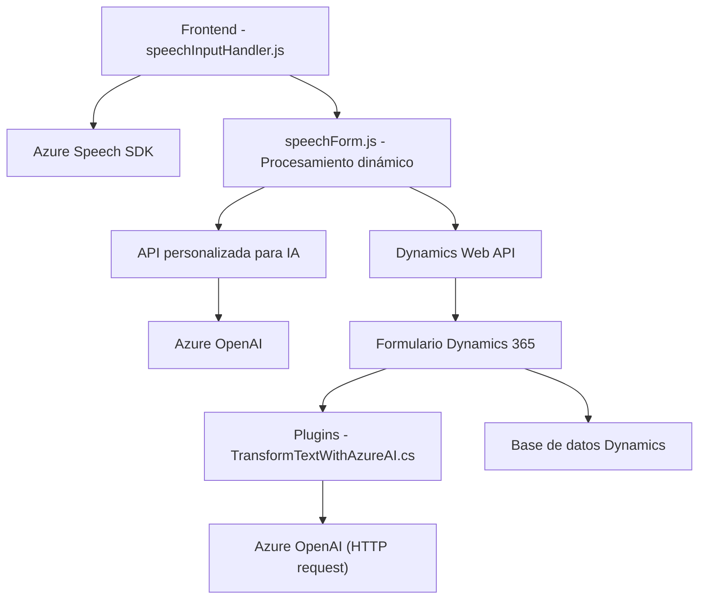

### Breve resumen técnico

Este repositorio contiene la implementación de una solución orientada a la mejora de interacción entre usuarios y formularios en un entorno Dynamics 365 mediante entrada y síntesis de voz, así como aplicaciones de inteligencia artificial para transformar y procesar texto. Las funcionalidades se dividen en tres componentes principales: el frontend desde donde ocurre la interacción, una capa de lógica en plugins para Dynamics, y una conexión a servicios externos como Azure Speech SDK y Azure OpenAI.

---

### Descripción de arquitectura

La arquitectura sigue un modelo híbrido compuesto de **n capas** y **microservicios** con integración de servicios gestionados en la nube. La lógica de negocio está dividida en:
1. **Frontend**: Utiliza el Azure Speech SDK para captar y sintetizar voz y conectarse directamente con la lógica del sistema Dynamics 365.
2. **Plugins de Dynamics CRM**: Se posiciona como un componente adicional que actúa mediante eventos disparados según las necesidades del plugin, responsable de conectar con servicios externos como Azure OpenAI.
3. **Servicios externos gestionados (SaaS)**: Azure Speech SDK para procesamiento de entrada y síntesis de voz, y Azure OpenAI para la transformación de datos en formato JSON procesable.

---

### Tecnologías usadas

1. **Frontend**: 
   - Lenguaje: JavaScript.
   - Frameworks/SDKs: Azure Speech SDK.
   - Servicios integrados: APIs del navegador (manipulación del DOM, carga dinámica de scripts).

2. **Backend en Dynamics CRM**:
   - Lenguaje: C# (.NET Framework).
   - Extensiones del sistema: Microsoft Dynamics CRM SDK (IPlugin, IOrganizationService).
   - Comunicación externa: REST API con `HttpClient` y JSON manipulación con `Newtonsoft.Json.Linq`.

3. **Servicios externos**:
   - **Azure Speech SDK**: Usado para captura de entrada de voz y síntesis de voz con soporte para múltiples idiomas.
   - **Azure OpenAI**: Utilizado para transformar texto en JSON y aplicar inteligencia artificial para procesar transcripciones.

---

### Dependencias internas y externas

1. **Dependencias externas**:
   - **Azure Speech SDK**
   - **Azure OpenAI**
   - APIs del navegador (DOM manipulation functions).
   - Dynamics 365 Web API (Xrm.WebApi).
   - .NET libraries (`System.Text.Json`, `System.Net.Http`, `Newtonsoft.Json.Linq`).

2. **Dependencias internas**:
   - Módulos frontend (`speechInputHandler.js`, `speechForm.js`) que interactúan directamente entre sí para manejar grabaciones y síntesis de voz.
   - Plugins backend (`TransformTextWithAzureAI.cs`) para comunicación con Dynamics CRM y servicios externos.

---

### Diagrama **Mermaid**

---

### Conclusión final

El repositorio refleja una solución modular basada en n capas con integración de servicios SaaS (Software as a Service) como Azure Speech SDK y Azure OpenAI. Estos componentes están diseñados para mejorar la interacción de usuarios con formularios en Dynamics 365, convirtiendo comandos de voz en datos estructurados y utilizando inteligencia artificial para el procesamiento avanzado de texto.

La arquitectura permite escalabilidad y adaptabilidad, al incluir servicios externos para tareas computacionalmente intensivas. Sin embargo, depende de herramientas específicas como Azure, Dynamics, y complementos de terceros para su funcionalidad completa, lo cual puede ser una limitación para implementar en entornos independientes.