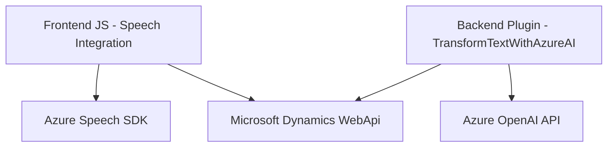

### Breve resumen técnico

El repositorio parece contener una solución híbrida orientada a la gestión de datos en formularios dinámicos vinculados a Microsoft Dynamics 365 CRM, con características impulsadas por inteligencia artificial y capacidades de síntesis/reconocimiento de voz. Los archivos se dividen en módulos para integrar servicios de Azure, en particular **Azure Speech SDK** y **Azure OpenAI**, para enriquecer la experiencia dinámica del usuario en un entorno web y servidor.

---

### Descripción de arquitectura

La solución emplea una **arquitectura n-capas**, en la que la lógica de negocio está separada entre componentes del **frontend** (JavaScript) y el **backend** (Plugins para Dynamics CRM en C#). En el frontend:
1. Archivos como `readForm.js` y `speechForm.js` manejan integración de voz y mapeo dinámico de campos en formularios web.
2. En el backend, el archivo `TransformTextWithAzureAI.cs` actúa como un **gateway hacia Azure OpenAI** para transformar texto bajo normas definidas.

El diseño utiliza patrones de **integración API** para comunicarse con servicios externos como Azure Speech y OpenAI, además de emplear el ciclo de vida del CRM mediante plugins para procesar datos directamente en la base de datos o servicios de Dynamics.

---

### Tecnologías usadas

1. **Frontend:**
   - **JavaScript**:
     - Manejo de DOM y eventos para cargar dinámicamente scripts.
     - Uso de `Promise` y `async/await` para asincronía.
   - **Azure Speech SDK**:
     - Reconocimiento y síntesis de voz en tiempo real, configurado mediante `SpeechConfig`, `AudioConfig` y otros objetos de la API.
   - **Microsoft Dynamics Xrm.WebApi**:
     - API interna del CRM para manejar formularios y datos.

2. **Backend:**
   - **C#, .NET Framework**:
     - Desarrollo del plugin con la interfaz `IPlugin` para Dynamics CRM.
   - **Azure OpenAI API**:
     - Transformación avanzada de texto mediante modelos de IA basados en GPT.

3. **Patrones:**
   - **Modularidad**: Funciones encapsuladas con responsabilidades únicas.
   - **Integración de servicios**: Uso de SDKs y llamadas API externas (Azure Speech y OpenAI).
   - **Gateway API**: Intermediación con servicios de IA.
   - **n-capas**: Separación lógica entre presentación (JS) y negocio (C#/Plugins).

---

### Dependencias o componentes externos

1. **Azure Speech SDK**:
   - Reconocimiento y síntesis de voz.
   - SDK externo cargado dinámicamente (script en frontend).

2. **Azure OpenAI API**:
   - Procesamiento y transformación de texto según normas definidas.
   - Uso explícito en el plugin `TransformTextWithAzureAI.cs`.

3. **Microsoft Dynamics Xrm API**:
   - Gestión de datos y lógica dinámica en formularios CRM.

4. **Newtonsoft.Json**:
   - Manipulación avanzada de objetos JSON en el backend.

---

### Diagrama Mermaid

---

### Conclusión final

El repositorio implementa una solución avanzada de reconocimiento y síntesis de voz combinada con generación de resultados procesados por inteligencia artificial, diseñada para entornos Microsoft Dynamics 365 CRM. Con una clara separación entre frontend y backend, su arquitectura n-capas habilita una escalabilidad efectiva mediante módulos individuales que se integran con servicios externos como Azure Speech SDK y Azure OpenAI. La solución podría mejorarse con almacenamiento seguro de claves API y una configuración robusta para extensibilidad en otros entornos CRM.