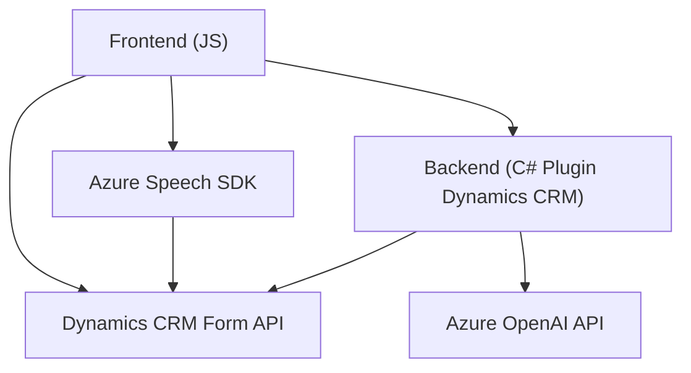

### Breve Resumen Técnico
El repositorio presenta una solución basada en la interacción entre cliente y servidor, utilizando servicios de Azure, Dynamics CRM y programación específica en JavaScript y .NET. Los principales componentes permiten la entrada y salida de voz (mediante SDK de Azure Speech) y la transformación de texto con reglas específicas mediante Azure OpenAI y plugins personalizados para Dynamics CRM.

---

### Descripción de Arquitectura
1. **Tipo de Solución:**  
   - Principalmente una aplicación cliente-servidor con funcionalidades de entrada y salida de voz, además de procesamiento de texto en el backend.
   - Los archivos sugieren una integración entre aplicaciones frontend y backend, conectadas por servicios externos.

2. **Arquitectura:**  
   - **N Capas:** La solución parece tener una separación lógica entre vistas (interfaz del usuario CRM en Dynamics), procesamiento (Azure Speech SDK, plugins para OpenAI), y datos (form API y Dynamics Web API).  
   - **SOA (Service-Oriented Architecture):** Servicios externos se utilizan para transcripción de voz, procesamiento de texto y transformación de datos.  
   - **Plugins Customizados:** El archivo backend utiliza plugins para extender las capacidades de Dynamics CRM.

---

### Tecnologías Usadas
- **Frontend:**  
   - *JavaScript:* Juega un papel principal en la creación de funcionalidades de entrada y salida de voz, además de la interacción con formularios CRM.  
   - *Azure Speech SDK:* Integra funcionalidades avanzadas de síntesis y reconocimiento de voz en tiempo real.  

- **Backend:**  
   - *C# y .NET Framework:* Extensión de Dynamics CRM mediante la implementación de plugins.  
   - *Azure OpenAI API:* Usa procesamiento avanzado de lenguaje natural (NLP) para transformar texto en JSON estructurado según reglas específicas.  

- **Integraciones:**  
   - Dynamics CRM Form API para interactuar con formularios del sistema empresarial.  
   - Azure Speech SDK para reconocimiento y síntesis de voz.  
   - Azure OpenAI para procesamiento en el backend.  

---

### Dependencias o Componentes Externos
1. **Azure Speech SDK:** Integrado dinámicamente para entrada y salida de voz.  
2. **Dynamics CRM API:** Herramienta principal para manipulación y lectura de formularios.  
3. **Azure OpenAI API:** Invocado por un plugin para transformar texto a un JSON estructurado.  
4. **Librerías .NET:** `HttpClient`, `Newtonsoft.Json` y otras para solicitudes HTTP y manejo de respuestas JSON.

---

### Diagrama Mermaid

---

### Conclusión Final
La solución presentada es una integración robusta entre frontend (interacciones con el SDK de Azure Speech y formularios CRM) y backend (transformación de texto con OpenAI mediante plugins de Dynamics). La arquitectura sigue principios de separación de responsabilidades (N Capas) y depende de un modelo de integración orientado a servicios (SOA). Además, la solución está diseñada para optimizar tareas específicas como reconocimiento de voz y procesamiento de texto estructurado para sistemas empresariales.

