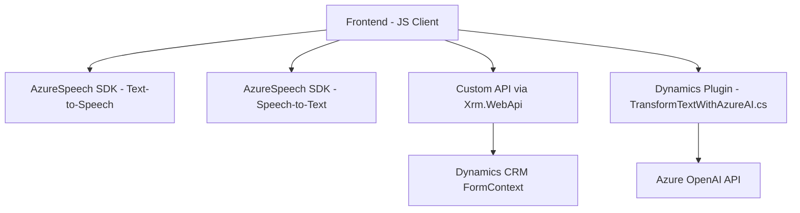

### Breve resumen técnico
El repositorio contiene funcionalidades distribuidas en archivos que integran servicios de Microsoft Azure y Dynamics CRM. Principalmente se enfoca en la interacción con Azure Speech SDK y la API de Azure OpenAI para realizar síntesis de voz, reconocimiento de voz y transformación de texto. Además, estructura lógica modular y plugins adaptados para interoperar con Dynamics CRM.

---

### Descripción de arquitectura
La arquitectura sigue un **n capas** para la integración de diferentes componentes:
1. **Frontend Layer**: En este caso, manejado con código JavaScript que se ejecuta en el navegador, utilizado para capturar, procesar y transmitir datos a servicios externos como Azure Speech SDK y APIs adicionales.
2. **Backend Logic Layer**: Implementa una capa de plugins (`TransformTextWithAzureAI.cs`) en Microsoft Dynamics CRM que consume servicios de Azure OpenAI API. Está diseñado para manejar eventos desencadenados.

El sistema opera bajo una **arquitectura orientada a servicios (SOA)**:
- **Desacoplamiento mediante API**: Tanto el frontend como el backend interactúan con servicios externos (OpenAI, Speech SDK), manteniendo las operaciones dependientes de dichas integraciones.

---

### Tecnologías usadas
#### Frontend:
1. **JavaScript**:
   - Modular con funciones responsables de distintas tareas.
2. **Microsoft Azure Speech SDK**:
   - Sintetización de voz (voz a texto, texto a voz).
   - Cargado dinámicamente desde una CDN.
3. **Dynamics CRM Context APIs**.
   - `formContext`: Interacciones con formularios de Dynamics CRM.
   - `Xrm.WebApi`: Para ejecutar solicitudes REST dentro del CRM (e.g., consultas y operaciones de entidades).

#### Backend:
1. **C# (Plugin)**:
   - API de Dynamics CRM: Para datos del usuario.
   - **Azure OpenAI GPT-4 API**: Habilita la transformación de textos según reglas definidas.
   - HTTP Client para comunicación con el API externo.
2. **Azure OpenAI API**:
   - Modelo de lenguaje utilizado: GPT-4o.
   - Transformación de texto con normas y directivas específicas.
   
#### Dependencias generales:
- Microsoft Dynamics CRM SDK (Frontend y Backend).
- Azure Speech SDK (synthesis y recognition).
- Azure OpenAI API para la generación de contenido (Backend).

---

### Diagrama Mermaid

---

### Conclusión final
La solución es una interacción compleja entre un **frontend en JavaScript** y un **backend basado en plugins para Dynamics CRM**, unidos por integraciones a servicios de Azure (Speech SDK y OpenAI API). Sigue una arquitectura de **n capas** y un **enfoque orientado a servicios (SOA)**, con una separación clara entre lógica de negocio y lógica de integración.

- **Fortalezas**:
  - Modularidad: Funciones y clases bien estructuradas.
  - Escalabilidad: Facilidad para agregar nuevas APIs.
  
- **Debilidades**:
  - Alta dependencia de Azure.
  - Necesidad de conexiones estables para integraciones.

Esta arquitectura es ideal para aplicaciones que procesan datos dinámicos y manejan flujos de información desde múltiples fuentes externas como APIs de Azure.