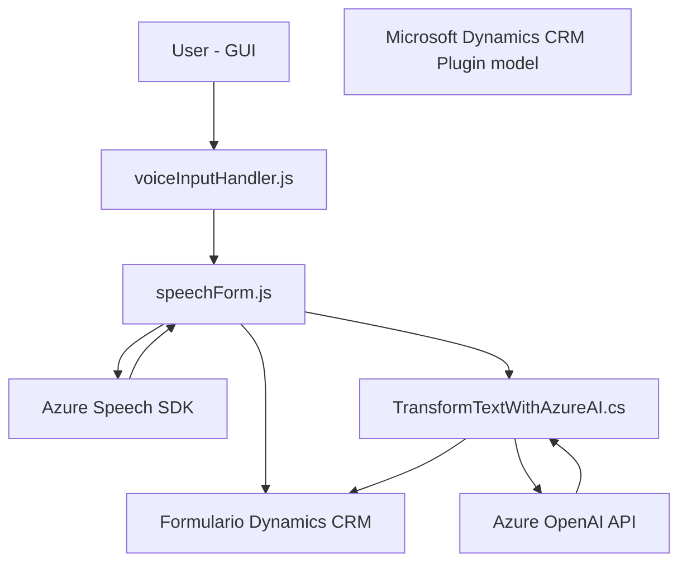

### Breve resumen técnico:
Este conjunto de archivos implementa una solución donde una interfaz de usuario (frontend) se conecta y automatiza la captura, procesamiento y entrada de datos en un formulario. Utiliza servicios de Azure (Speech SDK y Azure OpenAI) para lograr el reconocimiento de voz y la conversión de texto en datos estructurados. Además, interactúa directamente con Microsoft Dynamics CRM, indicando una solución diseñada para entornos empresariales.

---

### Descripción de arquitectura:
Esta solución sigue un **modelo híbrido entre arquitectura de capas y arquitectura de microservicios**, con los siguientes niveles:
1. **Frontend:** Implementado con JavaScript en el navegador, ofrece una UI que interactúa con Dynamics CRM a través de formularios. Usa el SDK de Azure Speech para reconocimiento de voz y generación de audio.
2. **Backend:** Implementado como complementos de Dynamics CRM, utiliza servicios externos como Azure OpenAI para procesamiento avanzado de datos. Funciona como un **plugin** dentro del entorno Dynamics 365.
3. **Servicios externos:** Azure OpenAI se integra como un microservicio que realiza transformaciones específicas de datos textuales enviados desde el plugin.

El diseño combina puntos clave de una arquitectura *hexagonal*, como las interfaces bien definidas para la interacción entre CRM y servicios externos, con patrones de *integración orientada a eventos*.

---

### Tecnologías usadas:
1. **Frontend:**
   - JavaScript (sin framework explícito).
   - Azure Speech SDK para reconocimiento y síntesis de voz.
   - DOM API para manipular formularios en tiempo real.
   - Microsoft Dynamics CRM SDK para el contexto del formulario.

2. **Backend:**
   - C# con Microsoft Dynamics CRM SDK para la creación de plugins.
   - Azure OpenAI API para transformación de texto.
   - Integración de servicios: HTTP client library (`System.Net.Http`) para el procesamiento sincrónico de respuestas.
   - JSON parsing/dynamic manipulation: `System.Text.Json`, `Newtonsoft.Json.Linq`.
   - Regular Expression API (`System.Text.RegularExpressions`) para validación y transformación de datos.

---

### Diagrama **Mermaid**:

---

### Conclusión final:
Este repositorio implementa una **API-driven, event-driven** solución con integración al ecosistema de Microsoft Dynamics CRM, diseñada para automatizar procesos de entrada y procesamiento de datos a partir de reconocimiento y síntesis de voz. Las tecnologías de Azure y patrones de arquitectura como la separación de responsabilidades y uso de SDKs externos son clave para la funcionalidad del sistema. Sin embargo, el diseño podría mejorar en términos de desacoplamiento, error handling y soporte para escenarios de escala.