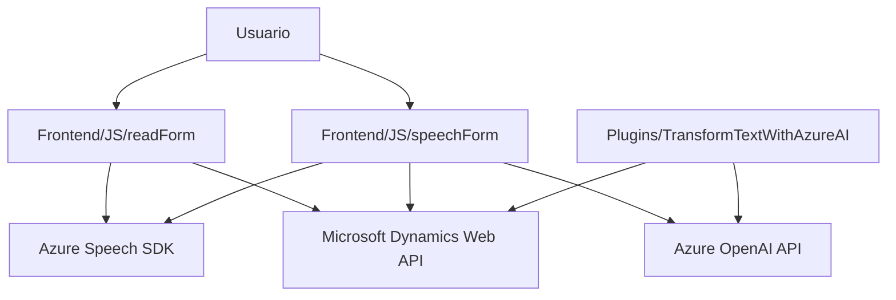

### **Breve resumen técnico**:
El repositorio en GitHub contiene tres archivos principales: dos archivos JavaScript orientados al frontend que interactúan con formularios y un archivo C# que define un plugin para Microsoft Dynamics CRM. La solución integra diversas tecnologías, como Azure Speech SDK y Azure OpenAI API, para habilitar la interacción entre voz, texto y estructuras de datos en el contexto de formularios. Las tareas están bien modularizadas y gestionadas siguiendo patrones de diseño como **Facade** y **Service Layer**.

---

### **Descripción de arquitectura**:
La arquitectura se puede clasificar como un sistema de **n capas**, con separación clara entre:
- **Capa de presentación (frontend)**: Implementada en JavaScript. Gestiona la interfaz de usuario del formulario, la entrada de voz y la síntesis de voz mediante Azure Speech SDK.  
- **Capa de lógica de negocio (plugin)**: Implementada en C# como extensiones para Dynamics CRM. Este componente realiza la interacción con Azure OpenAI, transformando el texto de entrada en JSON estructurado.  
- **Capa de integración con APIs externas**: El SDK de Azure Speech y la API de Azure OpenAI se utilizan para la entrada de voz, síntesis y análisis de texto.  

La solución tiene **componentes acoplados** a Microsoft Dynamics CRM y al ecosistema de Azure, lo que hace que sea una arquitectura específica para esta plataforma.

---

### **Tecnologías, frameworks y patrones usados**:

#### **Tecnologías**:
- **Frontend (JavaScript)**:
  - Azure Speech SDK para síntesis y transcripción de voz.
  - Microsoft Dynamics Web API para operaciones CRUD en formularios en el entorno del CRM.
- **Backend (C#)**:
  - Microsoft Dynamics SDK (Framework para desarrollo de plugins).
  - Azure OpenAI para la transformación de texto.

#### **Frameworks**:
- Microsoft Dynamics CRM SDK.
- Azure Speech SDK para servicios de voz.

#### **Patrones de diseño observados**:
1. **Facade**: Métodos como `startVoiceInput` y `leerFormulario` simplifican el acceso a operaciones complejas, encapsulando el flujo de trabajo en una única interfaz de llamada.
2. **Service Layer**: Implementado en el plugin C# para encapsular la lógica de interacción con Azure OpenAI.
3. **Integración de APIs externas**: Uso del SDK de Azure Speech y OpenAI en diferentes partes del sistema, manejado como dependencias externas.
4. **Dynamic Metadata Mapping**: Los mapeos dinámicos en los formularios permiten una interacción flexible y basada en metadatos visibles.

---

### **Dependencias o componentes externos**:
1. **Azure Speech SDK**:
   - Necesario para síntesis y transcripción de voz.
   - Cargado dinámicamente en el frontend.

2. **Azure OpenAI API**:
   - Utilizada en el plugin para transformar texto en JSON estructurado según reglas predefinidas.

3. **Microsoft Dynamics CRM SDK/Web API**:
   - Utilizado para gestionar interacción con datos y controlar los atributos del formulario.

4. **Servicios HTTP (API personalizada)**:
   - Ejemplo: API que procesa texto transcrito y retorna estructuras para entrada dinámica en el formulario.

5. **Librerías comunes de JSON**:
   - **Newtonsoft.Json.LINQ** o alternativas en C# para trabajar con objetos JSON.

---

### **Diagrama Mermaid**:

---

### **Conclusión final**:
El repositorio describe una solución basada en el ecosistema de Azure y Microsoft Dynamics CRM con un enfoque modular y distribuido. La arquitectura puede clasificarse como **n capas**, dividida entre la lógica de presentación (interacción entre usuario y formulario) y la lógica de negocio (procesamiento avanzado de estructuras textuales con Azure OpenAI). Las dependencias externas están correctamente integradas mediante API y SDK dinámicos, mientras que los patrones de diseño se han aplicado adecuadamente para garantizar flexibilidad y escalabilidad.

Aunque la solución se centra en el contexto de formularios en Dynamics CRM, podría extenderse agregando soporte para configuraciones más dinámicas o integrando más servicios API externos.