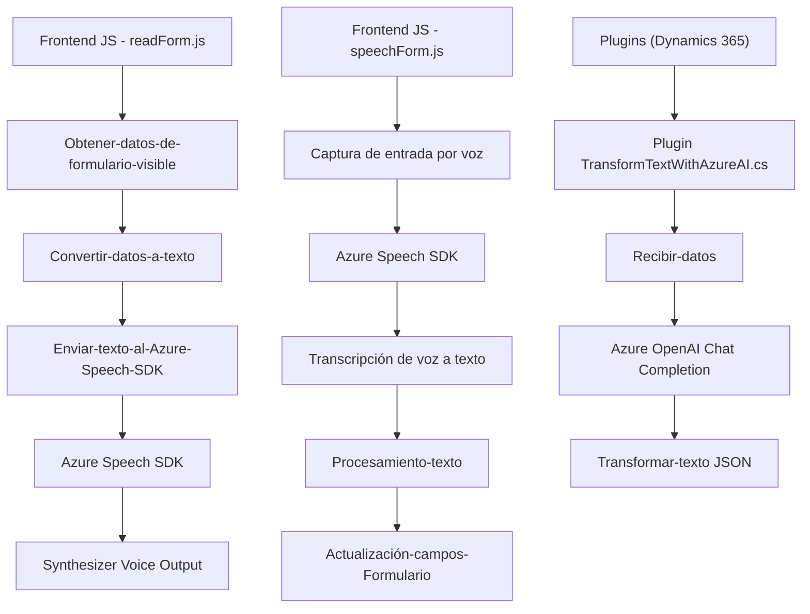

### Breve resumen técnico:

El repositorio parece estar diseñado para una aplicación que combina funcionalidades de entrada y salida de voz con integración a un sistema de gestión empresarial (CRM), específicamente Microsoft Dynamics 365. Utiliza Azure Speech SDK para la síntesis y transcripción de voz, y Azure OpenAI para transformar texto mediante inteligencia artificial. El sistema facilita el procesamiento automático de formularios mediante la entrada de voz enriquecida con IA y la salida de voz accesible.

---

### Descripción de arquitectura:

1. **Arquitectura general:**
   - Predominantemente **n capas**, con distinción clara entre las siguientes responsabilidades:
     - Capa de presentación (frontend/web).
     - Capa lógica de negocio (plugins y scripts).
     - Capa de integración con APIs externas (Azure Speech SDK y Azure OpenAI).
   - Los plugins funcionan como componentes distribuidos que extienden capacidades de **Dynamics 365**, pero su uso de servicios externos como Azure se alinea con patrones de **Microservicio ligero**.

2. **Patrones usados:**
   - **Modularidad:** Código bien dividido en funciones independientes para la entrada/salida de voz y lógica del plugin.
   - **API Integration:** Uso de servicios externos para síntesis de voz, transcripción y procesamiento IA.
   - **Delegate/Strategy Pattern:** Decisión entre procesamiento de texto simple o enriquecido mediante IA (indicador `ia`).
   - **DTO (Data Transfer Object):** JSON estructurado intercambiado entre los componentes y APIs externas.
   - **Resiliencia y carga dinámica:** SDK de Azure cargado en tiempo de ejecución si no está disponible.

---

### Tecnologías usadas:

1. **Frontend:**
   - JavaScript.
   - **Azure Speech SDK:** Interacción directa para transcripción y síntesis de voz, incluyendo carga dinámica.
   - Microsoft Dynamics 365 SDK: Para manipulación de datos de formularios.

2. **Backend (Plugins):**
   - C#: Desarrollo de un plugin conforme a la interfaz `IPlugin` de Dynamics CRM.
   - **Azure OpenAI:** Usado para transformar texto con procesamiento IA avanzado.
   - **Dynamics 365 SDK:** Gestión de datos y ejecución dentro del contexto del sistema CRM.

3. **Dependencias externas:**
   - `System.Net.Http` y `System.Text.Json`: Para servicios REST y JSON.
   - `Newtonsoft.Json.Linq`: Para manipulación de estructuras JSON en C#.
   - APIs externas:
     - Azure Speech SDK: Sintetiza y transcribe voz en el frontend.
     - Azure OpenAI API: Transforma texto mediante modelos IA.

---

### Diagrama Mermaid:

---

### Conclusión final:

El repositorio define un sistema integrado que utiliza Microsoft Dynamics 365 como base para la gestión de información empresarial, mientras que potencia sus capacidades con Azure Speech SDK (entrada/salida por voz) y Azure OpenAI (procesamiento IA). La arquitectura combina un frontend interactivo, plugins distribuidos y servicios externos en una solución escalable y moderna. Utiliza patrones de modularidad, event-driven, y API-driven design para garantizar flexibilidad y fácil mantenimiento. El sistema podría ser especialmente útil en interfaces accesibles, procesos automatizados, o escenarios de interacción avanzada mediante voz e inteligencia artificial.