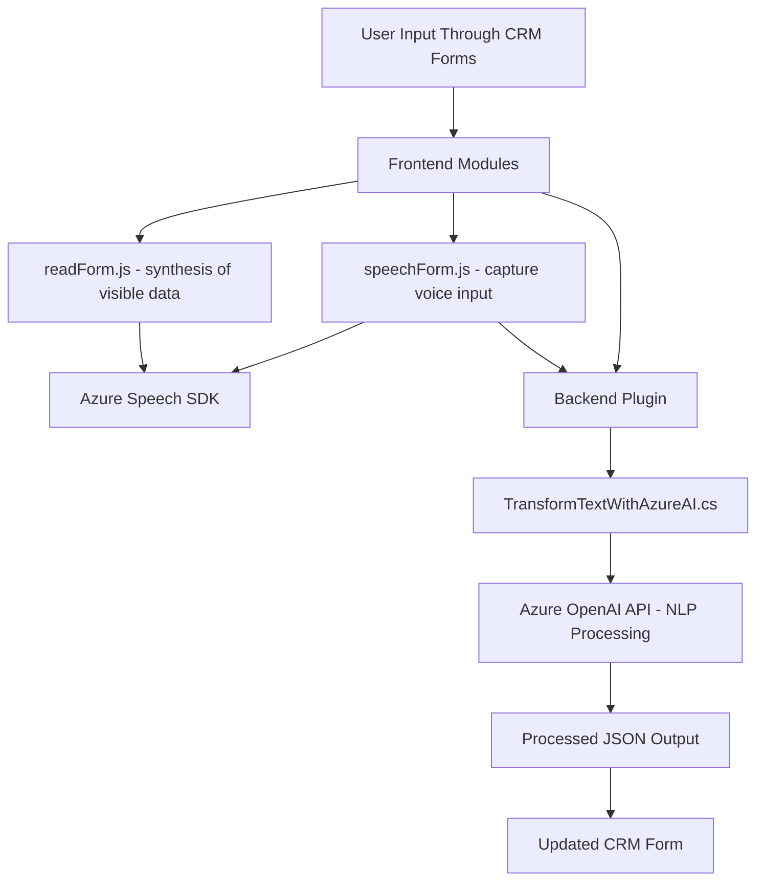

### Breve resumen técnico:
El repositorio contiene un conjunto de módulos que implementan funcionalidades relacionadas con entrada y salida de voz, reconocimiento de voz y procesamiento de texto en un ambiente CRM integrado con servicios de Azure. Los archivos proporcionados sugieren que el sistema interactúa con formularios y aprovecha tecnologías de inteligencia artificial y API empresariales para extender capacidades del CRM.

---

### Descripción de arquitectura:
El sistema sigue una arquitectura **n-capas**, donde hay una separación funcional entre:
1. **Presentación** (Frontend): Manejo de entrada y salida de voz para formularios. Archivos como `readForm.js` y `speechForm.js` procesan la interacción del usuario con formularios en el navegador y traducen estas interacciones en operaciones dinámicas (como reconocimiento de voz, síntesis de voz y estructuración de texto).
2. **Backend** (Plugins): `TransformTextWithAzureAI.cs` conecta el CRM con el servicio Azure OpenAI para ejecutar transformaciones avanzadas del texto según las reglas especificadas.
3. **Servicios externos**: Dependencias como Azure Speech SDK y OpenAI API delegan tareas de procesamiento intensivo hacia plataformas especializadas en IA.

El patrón predominante es **orientado a servicios**, donde cada módulo tiene una responsabilidad bien definida, como la síntesis de voz, reconocimiento de voz o el procesamiento de texto en el backend.

---

### Tecnologías utilizadas:
1. **Frontend**:
   - **JavaScript**: Base para lógica del cliente.
   - **Azure Speech SDK**: Para reconocimiento y síntesis de voz.
   - **Dynamics CRM context**: Integración con formularios dinámicos.

2. **Backend**:
   - **C# .NET**: Desarrollo de plugins.
   - **Microsoft Dynamics CRM SDK**: Contexto de ejecución de las extensiones al CRM.
   - **Azure OpenAI API**: Procesamiento avanzado de lenguaje natural.
   - **Newtonsoft.Json y System.Text.Json**: Manipulación de datos JSON.
   - **HTTP Client libraries en .NET**: Conexión con servicios externos.

---

### Diagrama Mermaid:
Se genera un diagrama global representando la relación entre los componentes mencionados, siguiendo tus reglas estrictas para GitHub.

---

### Conclusión final:
El repositorio implementa un sistema que permite a los usuarios interactuar con formularios a través de voz, sintetizar campos visibles en formato audible y convertir entradas verbales en texto procesado con reglas específicas para actualizar datos en el CRM. Destaca por sus integraciones con **Azure Speech SDK** para voz y **Azure OpenAI API** para procesamiento avanzado de lenguaje. Su **n-capas** y orientación modular aseguran la escalabilidad, mientras que las dependencias con servicios externos posibilitan funcionalidades empresariales avanzadas.