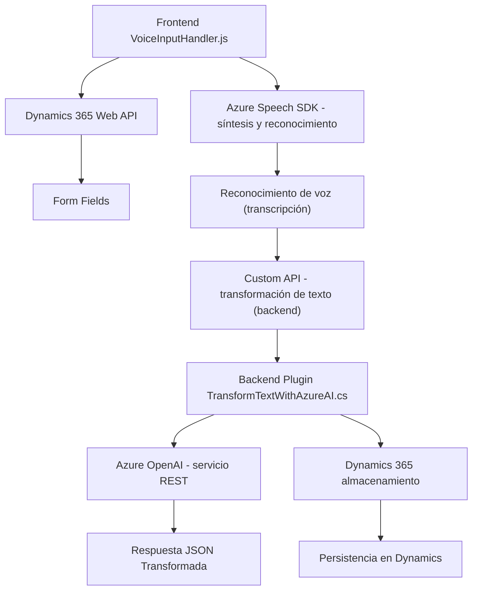

# Análisis Técnico Detallado del Repositorio

## Breve Resumen
Este repositorio consiste en una solución integrada para la manipulación de datos en formularios interactivos de Dynamics 365. Tiene dos grandes componentes principales:
1. **Frontend:** JavaScript para capturar, procesar, sintetizar voz y reconocer comandos. 
2. **Backend:** Plugin en C# que utiliza Microsoft Dynamics 365 y Azure OpenAI para transformar texto y manejar datos desde servicios externos.
El proyecto combina el uso de SDK de Azure con APIs externas y sigue patrones de arquitectura comunes para sistemas distribuidos.

---

## Descripción de Arquitectura
La solución implementada en el repositorio sugiere una arquitectura híbrida, en términos generales:

1. **Cliente-Servidor**: Los componentes frontend interactúan con APIs de terceros (Azure Speech SDK y Dynamics API), mientras que el backend realiza transformaciones con Azure OpenAI.
2. **Integración de Microservicios Internos**: El cliente (Javascript) hace uso de Custom APIs para la interacción dinámica, lo cual introduce modularidad en la solución.
3. **Uso de Plugins**: En el backend existe un plugin independiente que cumple funciones específicas con un ciclo de vida orientado al entorno de Dynamics 365.

Por lo tanto, la solución puede clasificarse principalmente como:
- Basada en **n capas**: Lógica cliente (frontend), lógica de presentación (Dynamics) y lógica del negocio (plugin backend).
- **Microservicios livianos**: Las Custom APIs invocadas desde el cliente implementan operaciones API específicas como procesamiento.

---

## Tecnologías y Patrones Usados

1. **Frontend**:
   - **JavaScript**: Dominante en la lógica cliente para manejar la interacción y manipulación digital.
   - **Azure Speech SDK**: Integración para reconocimiento y síntesis de voz usando inteligencia de Microsoft Azure.
   - **Dynamics 365 Web API**: Invocado en el cliente para manipulación de campos del formulario en tiempo real.
   - **Event-Driven Programming**: Uso extensivo de callbacks y eventos en el cliente.
   - **Modularidad Funcional**: Las funciones están altamente especializadas.

2. **Backend**:
   - **Microsoft Dynamics 365 SDK**: Utilizado para interacción con plugins y contexto organizacional.
   - **Azure OpenAI API**: Solicitudes HTTP para el procesamiento de texto con inteligencia artificial.
   - **JSON Manipulation**: Uso de Newtonsoft y System.Text.Json para comunicaciones JSON.
   - **Plugin Architecture**: Implementación de lógica extensible mediante "IPlugin".

---

## Diagrama Mermaid Compatible con **GitHub Markdown**

---

## Conclusión Final
Esta solución utiliza una integración inteligente de tecnologías modernas como Microsoft Azure Speech SDK, Dynamics 365 y Azure OpenAI. La solución opera principalmente en un modelo cliente-servidor con microservicios y arquitectura en capas, destacando por su modularidad y enfoque en el procesamiento de datos, síntesis y reconocimiento de voz. 

El diagrama Mermaid presentado refleja el flujo de datos y la interacción entre los componentes principales. Si bien la solución utiliza patrones sólidos y tecnologías avanzadas, podría beneficiarse de una mayor descentralización que permita a los servicios escalar independientemente.