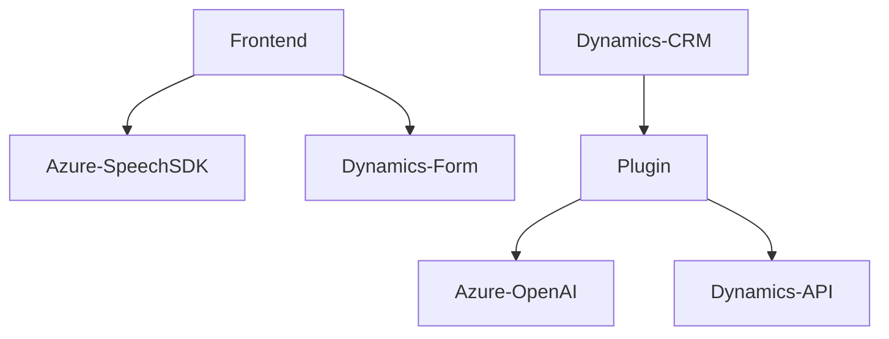

### Breve resumen técnico:
El repositorio se centra en una solución integrada para capturar entrada de voz, procesar formularios de Dynamics 365 y optimizar datos mediante servicios de inteligencia artificial como Azure Speech SDK y Azure OpenAI. Este enfoque permite una interacción avanzada con formularios empleando voz y texto como principales mecanismos de entrada.

---

### Descripción de arquitectura:
La arquitectura del sistema combina diferentes paradigmas y patrones:
1. **Arquitectura orientada a servicios**:
   - Las funcionalidades están claramente separadas en módulos (frontend) y plugins (backend).
   - Interacciones con servicios externos como Azure Speech SDK y Azure OpenAI, encapsulando completamente lógica relacionada con APIs.
   
2. **Multicapa**:
   - Acciones en la capa de frontend gestionan la interfaz del usuario con métodos para enlace dinámico y captura de datos.
   - En el backend, el plugin implementa una extensión estándar de Dynamics CRM.

3. **Patrón Hexagonal** (en el backend):
   - El plugin implementa un puerto/adaptador para interactuar con Dynamics y servicios externos como Azure OpenAI, cumpliendo características de arquitectura hexagonal, aislando la lógica de negocio de las dependencias externas.

---

### Tecnologías usadas:
1. **Frontend**:
   - **JavaScript**: Encapsulación de funciones para manejar entrada/salida de voz y comunicación con un formulario.
   - **Azure Speech SDK**: Uso de reconversión de texto a voz y de voz a texto.
   
2. **Backend**:
   - **C#:** Para crear plugins y realizar procesamiento en Dynamics.
   - **Microsoft Dynamics CRM SDK**.
   - **Azure OpenAI Service (GPT-4)** para transformación inteligente de texto.
   - **Protocolo HTTP** para comunicación con servicios de Azure.

3. **Patrones usados**:
   - Modularidad: Separación de responsabilidades entre funciones del frontend y backend.
   - Lazy Loading: El SDK se carga dinámicamente en el frontend.
   - Façade Pattern (backend): Abstracción para interactuar con OpenAI.
   - Pluggable Architecture: Extensión del CRM mediante un plugin.
   - Hexagonal Architecture: Manejo de puertos y adaptadores en la integración backend.

---

### Diagrama **Mermaid** válido para GitHub Markdown:

---

### Conclusión final:
La solución combina mejoras de interacción mediante voz y texto con datos estructurados en un entorno Dynamics 365. Utiliza frameworks robustos como Azure Speech SDK para entrada de voz en el frontend, mientras que el backend se extiende con un plugin de C# que utiliza inteligencia artificial en Azure OpenAI. La arquitectura divide claramente responsabilidades (frontend, backend, APIs externas), lo que sugiere una arquitectura multicapa con elementos de diseño hexagonal.