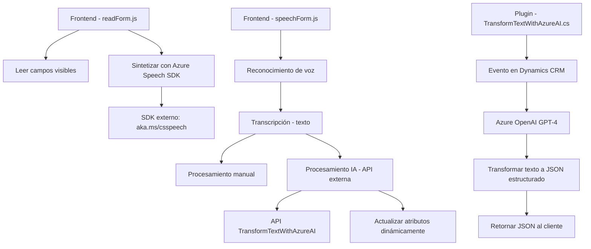

### Resumen Técnico
El repositorio describe una solución que combina frontend basado en JavaScript, integración de API personalizada, y un plugin para Dynamics CRM utilizando C# con Microsoft SDK. Su objetivo principal es ofrecer funcionalidades avanzadas de entrada y salida de voz vía Azure Speech SDK, procesar datos formateados, y transformar texto usando OpenAI integrado con Dynamics CRM.

---

### Descripción de Arquitectura
1. **Tipo de solución:** La solución fusiona estas piezas:
   - Un **frontend de JavaScript** que interactúa con el cliente para leer, sintetizar, y procesar datos de formularios.
   - Un **plugin de Dynamics CRM** que extiende la funcionalidad del servidor para transformar texto vía Azure OpenAI y devolver datos como JSON estructurado.
   
2. **Arquitectura y patrones:**
   - **Arquitectura multicapa (n capas):**
     - **Capa de presentación:** JavaScript frontend (`readForm.js` y `speechForm.js`) utilizado para interacción de usuario.
     - **Capa de aplicación:** Gestión del procesamiento de lógica (voz, formularios, API).
     - **Capa de negocio:** Plugin personalizado en C# para ejecutar transformaciones avanzadas del texto en Dynamics.
   - Uso del **Delegate Pattern** para modularizar la carga dinámica del SDK de Azure Speech.
   - Lógica orquestada con **flujos asíncronos** mediante promesas (`async/await`).
   - **Integración de servicios externos** para Azure Speech SDK y OpenAI.

---

### Tecnologías y Frameworks Usados
1. **Frontend:**
   - **JavaScript:** Frameworks como ES6 nativo.
   - **Azure Speech SDK:** Para síntesis y reconocimiento de voz.
   
2. **Backend/Plugin:**
   - **C# y .NET Framework:** Desarrollo del plugin.
   - **Azure OpenAI Service:** Integración para procesamiento avanzado de texto.
   - **Microsoft Dynamics SDK:** Para la interacción directa con el modelo de datos CRM.

3. **Dependencias y Servicios Externos:**
   - **Xrm.WebApi:** Localización y manipulación de datos en Dynamics CRM.
   - **Servicio HTTP:** Llamadas a Azure REST API y APIs personalizadas (Dynamics CRM).

---

### Diagrama Mermaid

### Conclusión Final
La solución combina frontend y backend para ofrecer una experiencia de usuario avanzada que integra inteligencia artificial y síntesis/reconocimiento de voz. Utiliza una arquitectura basada en capas (n capas) con integración orientada a servicios mediante APIs externas (Azure Speech SDK y OpenAI). Es modular, extensible, y altamente específica para entornos de Dynamics CRM.