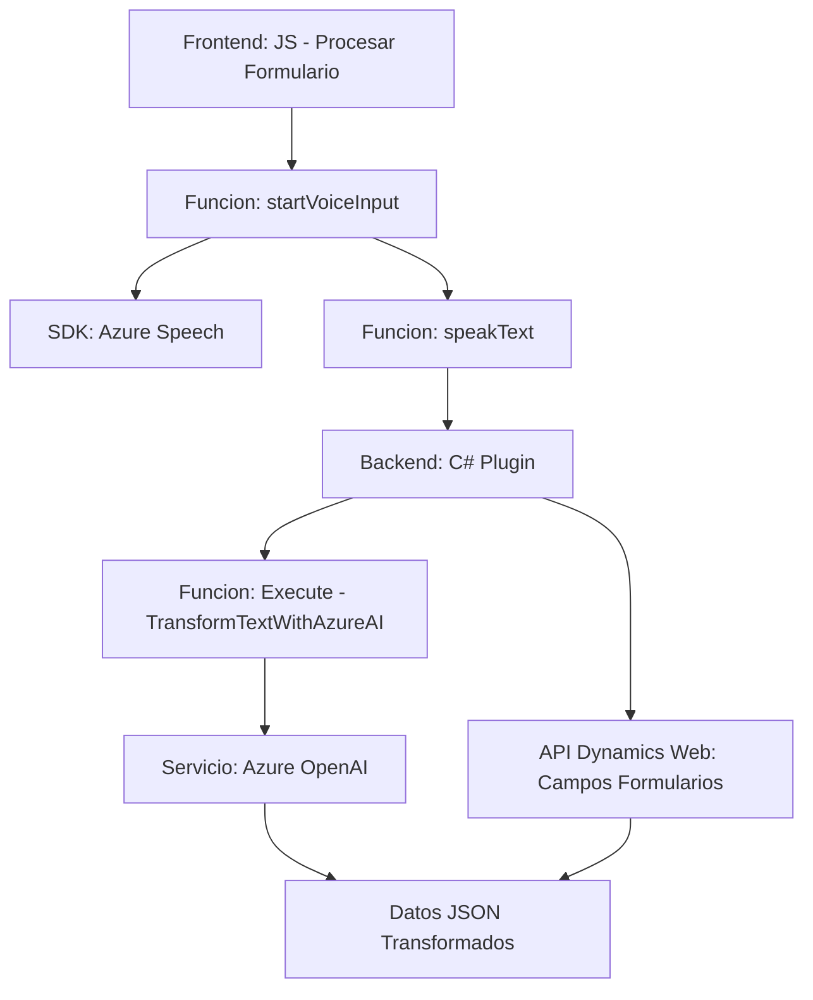

### Breve Resumen Técnico
El repositorio contiene tres archivos principales que implementan funcionalidades para manejar voz, texto y formularios con integración de servicios de Azure (Speech SDK y OpenAI) en aplicaciones Dynamics CRM. Este sistema es una solución que combina componentes de frontend (JavaScript) y backend (C# plugin), con un enfoque centrado en la interacción dinámica con usuarios, datos de formularios y servicios externos.

---

### Descripción de Arquitectura
La arquitectura utilizada es mixta, adopta conceptos de **n capas** y elementos de **arquitectura de servicios externos**:
1. **Frontend (JavaScript):** Procesa formularios y voz con una integración directa de Azure Speech SDK. Aquí, la estructura se orienta a funcionalidad modular con patrones de utilidad y callbacks.
2. **Backend (C# Plugin):** Extiende la capa lógica de negocio de Dynamics CRM mediante plugins que interactúan con formularios y reciben datos desde Azure OpenAI para transformarlos en JSON. Adopta *plugin-based architecture* específica de Dynamics CRM.

---

### Tecnologías Usadas
- **Frontend:**
  - **Azure Speech SDK:** Utilizado para síntesis de voz y reconocimiento de voz (procesamiento de audio).
  - **JavaScript**: Manejo del DOM, eventos y manipulación dinámica de datos en formularios.
- **Backend:**
  - **C# Plugin (CRM Dynamics):** Extiende la funcionalidad de Dynamics CRM con reglas específicas.
  - **Azure OpenAI:** Utilizado para transformar texto en formatos JSON estructurados.
  
### Patrones y Principios Aplicados:
- **Patrones de diseño:**
  - **Event-Driven:** Se utiliza en el frontend para manejar reconocimiento y síntesis de voz mediante callbacks.
  - **Modular Design:** Cada función en los archivos tiene una responsabilidad claramente definida.
  - **Plugin Design Pattern:** Implementado para extender la funcionalidad dentro de CRM Dynamics.
  - **Service Integration:** Arquitectura centrada en integrar servicios de terceros como Azure Speech y Azure OpenAI.
- **Principios:**
  - **Single Responsibility Principle:** Cada archivo tiene funciones específicas para convertir texto, procesar formularios o interactuar con APIs.

---

### Diagrama Mermaid Válido para GitHub
El siguiente diagrama representa el flujo general de datos y procesos en la solución.

---

### Conclusión Final
Esta solución implementa un sistema integrado de voz, formularios y texto para Dynamics CRM utilizando servicios de Azure como Azure Speech SDK y Azure OpenAI. La arquitectura es una combinación de componentes **n capas** y **servicios externos**, logrando modularidad, facilidad de extensión en aplicaciones CRM, y adaptabilidad para futuros incrementos funcionales. Sin embargo, aspectos como la gestión de claves API deben ser revisados para garantizar la seguridad del sistema.