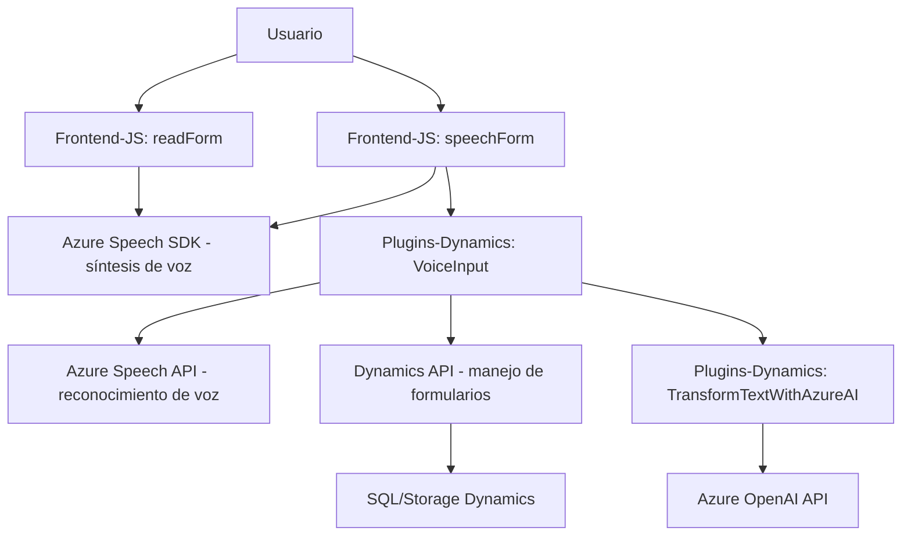

### Breve resumen técnico

La solución combina **frontend**, **plugins para Dynamics CRM**, y servicios **externos en Azure** para una aplicación empresarial que gestiona flujos de datos y entrada/salida de voz dinámica. Utiliza integraciones con **Azure Speech SDK** y **Azure OpenAI API**, y se distribuye entre varios componentes que interactúan en una arquitectura cliente-servidor.

---

### Descripción de arquitectura

La arquitectura utilizada parece tener un enfoque **híbrido multicapa**, donde cada componente cumple roles específicos:

1. **Frontend**: Procesa la interacción del usuario (visual y de voz), organiza los datos de formularios y los envía a APIs externas o sistemas internos.
2. **Plugins (Backend)**: En Dynamics CRM, los plugins funcionan como puntos de procesamiento discreto para datos complejos. Se integran con Azure OpenAI mediante solicitudes HTTP.
3. **Servicios en la nube**: Azure Speech SDK se utiliza para síntesis y reconocimiento de voz, mientras que Azure OpenAI transforma datos textuales con inteligencia artificial.
4. **Patrones de arquitectura**:
   - Modularidad: Cada función o componente tiene responsabilidades separadas (e.g., conversión de voz, procesamiento de datos dinámicos, integración con IA).
   - Gestión de dependencias externas: Los módulos garantizan que SDKs y APIs externas se carguen o sean consumidas de forma gestionada y optimizada.
   - Multicapa: Frontend, CRM Plugins (lógica empresarial), y APIs (servicios externos) forman diferentes capas de esta solución.

---

### Tecnologías usadas

1. **Frontend**:
   - **JavaScript**: Lógica de funciones en los archivos `readForm.js`, `speechForm.js`.
   - **Azure Speech SDK**: Para síntesis y reconocimiento de voz.
   - **Dynamics CRM API**: Manejo de formularios dinámicos (ej., `Xrm.WebApi`).
   - **DOM API**: Dinámica de carga de scripts y manipulación de elementos.

2. **Backend (Plugins)**:
   - **Microsoft Dynamics CRM SDK**: Para integración como plugin de CRM (`IPlugin` y servicios organizacionales).
   - **Azure OpenAI API**: Inteligencia artificial para transformar texto.
   - **C#**: Lenguaje utilizado para el plugin Dynamics CRM (`TransformTextWithAzureAI.cs`).
   - **System.Net.Http**: Manejo de solicitudes hacia APIs externas.
   - **Newtonsoft.Json**: Serialización y manejo de estructuras JSON.

3. **Servicios**:
   - **Azure Speech API**: Manejo de síntesis y reconocimiento de voz.
   - **Azure OpenAI**: Procesamiento de texto con el modelo GPT.

---

### Diagrama **Mermaid** válido para GitHub

---

### Conclusión final

Se trata de una solución híbrida que mezcla elementos **frontend (JavaScript)**, **backend (Dynamics CRM plugins)**, y **servicios en la nube** (Azure Speech y OpenAI APIs) para crear flujos de interacción basados en voz y datos dinámicos. La arquitectura no es estrictamente **monolítica** ni completamente orientada a **microservicios**, sino más bien sigue un enfoque **multicapa desacoplada** con integración a servicios externos.

Esta solución es adecuada para sistemas empresariales con requisitos de extensibilidad y uso de inteligencia artificial y voz, pero dependerá de configuraciones específicas en Dynamics CRM y credenciales seguras para las integraciones con Azure.