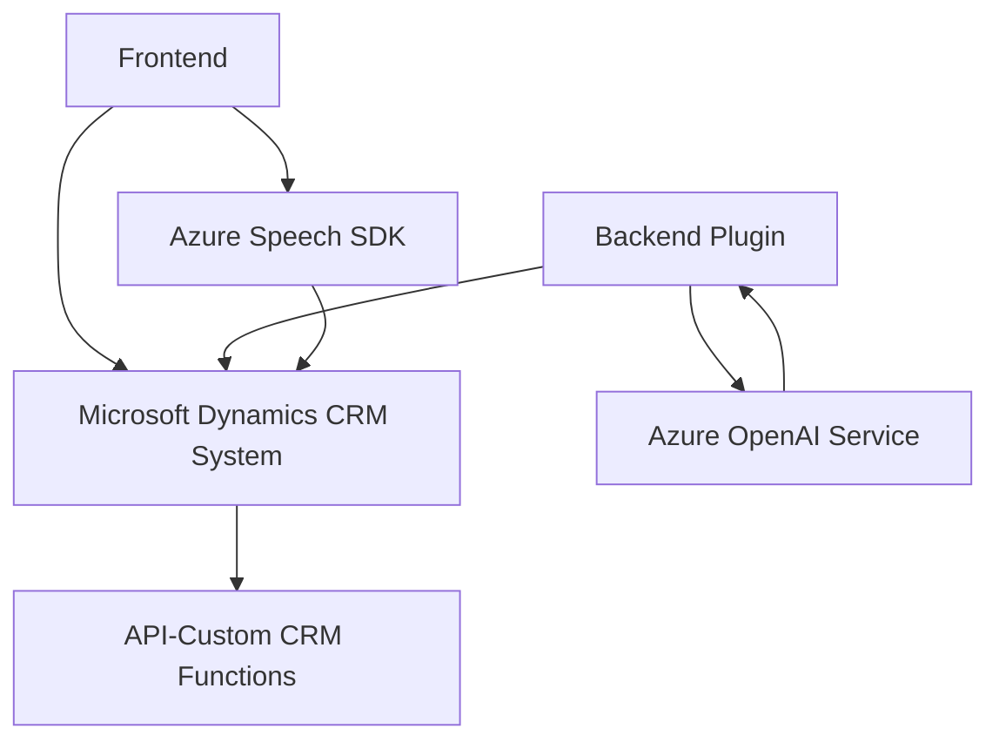

### **Breve resumen técnico**
El repositorio contiene tres archivos que implementan módulos enfocados en la integración de servicios cognitivos de Azure (Azure Speech SDK y Azure OpenAI) con un sistema basado en Microsoft Dynamics CRM. Sus funcionalidades principales incluyen la síntesis de texto a voz, captura de voz y traducción de voz a texto, procesamiento de entradas mediante IA, y transformación de texto en JSON estructurado a través de un plugin de Dynamics CRM. El enfoque general es la automatización del procesamiento de texto y datos obtenidos del usuario en formularios y análisis mediante servicios avanzados de IA.

---

### **Descripción de arquitectura**
La arquitectura presentada es mayormente del tipo **modular** con integraciones externas. Cada archivo tiene funciones bien segmentadas y encapsuladas para tareas específicas, evitando dependencias innecesarias entre sí:
1. **Frontend:**
   - Maneja interfaces de usuario basadas en formularios (presumiblemente utilizados en Dynamics CRM) y realiza operaciones con el Azure Speech SDK para sus funcionalidades de voz-a-texto y texto-a-voz.
   - Modularidad está presente al dividir las operaciones por tareas específicas (como leer datos visibles, aplicar transformaciones, llamar APIs, etc.).
2. **Plugin:**
   - Implementa una arquitectura **plugin** específicamente para el entorno de Dynamics CRM. Su propósito es realizar transformaciones usando Azure OpenAI y proporcionar un JSON estructurado como salida.
   - La comunicación también es modular y desacoplada mediante el uso de servicios REST y contextos de ejecución.

---

### **Tecnologías usadas**
1. **Frontend:**
   - **Lenguaje principal:** JavaScript.
   - **Frameworks/SDKs externos:** 
     - [Azure Speech SDK](https://learn.microsoft.com/en-us/azure/cognitive-services/speech-service/): Funcionalidades para síntesis de voz y reconocimiento de voz.
     - **Form Context API**: Para manejo de datos en formularios de Dynamics CRM.
   - **Patrones**:
     - Fachada para encapsulación.
     - Modularidad, evitando la dependencia compleja entre funciones.
     - Integración de APIs externas con callbacks para cargar el SDK.
2. **Backend Plugin**:
   - **Lenguaje principal:** C#.
   - **Frameworks/Librerías externas:**
     - `System.Net.Http`, `Newtonsoft.Json.Linq`: Para integración con servicios Azure OpenAI via REST.
     - Microsoft Dynamics CRM SDK: Patrones diseñados para ejecutar lógica personalizada en eventos CRM.
   - **Patrones**:
     - Plugin-based Architecture para Dynamics CRM.
     - Delegación y separación de responsabilidades en arquitectura orientada a objetos.

---

### **Tipo de arquitectura**
La solución utiliza una mezcla de **modular architecture** y **plugin-based architecture**, adaptándose para la interacción entre un sistema CRM, servicios cognitivos como Azure Speech SDK/Azure OpenAI, y estructuras propias del frontend.

1. **Clientes:** Crear interacciones visuales (formularios frontend).
2. **Middleware:** Comunicación entre el cliente y los servicios.
3. **Backend/API/Plugin:** Procesamiento back-end del contenido en Dynamics CRM/IA/REST.

---

### **Dependencias o componentes externos presentes**
1. **Azure Speech SDK:** Para la síntesis de voz y procesamiento de voz a texto.
2. **Azure OpenAI Service:** Uso del modelo chat GPT (API `chat/completions`) para transformar texto en JSON estructurado.
3. **Microsoft Dynamics CRM API:** Gestión de datos en formularios, campos y configuración en una solución basada en Dynamics.
4. **System.Net.Http** y otras librerías relacionadas con solicitud HTTP: Utilizadas para interactuar con Azure OpenAI vía REST.

---

### **Diagrama Mermaid**

---

### **Conclusión final**
La solución presentada es un sistema híbrido que combina tecnologías frontend basadas en JavaScript y Azure Speech SDK para la interfaz de interacción con servicios cognitivos, junto con una arquitectura de plugin en C# que opera en el backend de Dynamics CRM. Este enfoque permite crear una integración robusta para manejar formularios, convertir voz a texto y texto a voz, y estructurar datos con el apoyo de inteligencia artificial de Azure OpenAI.

Los principales patrones de diseño que pueden observarse son la **fachada** y el enfoque modular en el frontend, junto con una integración de APIs externas bien encapsulada. En el backend, se emplea una arquitectura de plugin altamente integrable para Dynamics CRM, lo que facilita modificar el comportamiento del sistema en base a eventos predeterminados sin alterar el core.