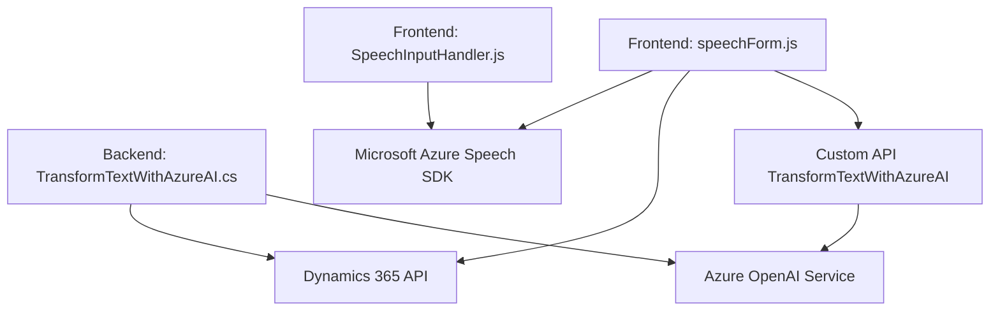

### Breve resumen técnico:

El repositorio es una solución orientada a integrar capacidades de síntesis y reconocimiento de voz en formularios de Dynamics 365, con apoyo de Azure Speech SDK y Azure OpenAI. Está compuesto principalmente por dos archivos front-end en JavaScript y un archivo C# backend para el plugin del sistema CRM.

---

### Descripción de arquitectura:

1. **Tipo de solución**: Se trata de una solución híbrida que combina un front-end basado en JavaScript y un backend desarrollado como plugin de Dynamics CRM. La solución permite la integración de capacidades de procesamiento de voz (Azure Speech SDK) y procesamiento avanzado de texto (Azure OpenAI) directamente en formularios del sistema CRM.
   
2. **Patrones arquitectónicos presentes**:
   - **Patrón de capa de integración**: Conexión entre los módulos de Dynamics CRM, Azure Speech API, y el modelo GPT.
   - **Patrón Plugin**: Usado en Dynamics CRM para extender funcionalidad con lógica personalizada.
   - **Modularización** en los archivos de JavaScript: Cada archivo se compone de funciones con responsabilidades específicas (Single Responsibility Principle), lo que fomenta la reutilización.

3. **Tipo de arquitectura**: 
   - **Mixta entre n capas y plugin**: Los módulos frontales (JavaScript) pueden ser considerados como parte de una arquitectura de capa de presentación y lógica de aplicación, mientras el plugin en C# actúa como una capa de negocio dentro del sistema CRM.
   - **Sistemas distribuidos**: La solución utiliza APIs externas de Azure y OpenAI para procesamiento de voz y texto.

---

### Tecnologías utilizadas:

1. **Frontend (JavaScript)**:
   - Microsoft Azure Speech SDK (integración externa para síntesis y reconocimiento de voz).
   - Dynamics 365 SDK (contextos del formularios).
   - Básico del DOM (manejo dinámico de scripts).
   
2. **Backend (C#)**:
   - Dynamics CRM Plugin API (`Microsoft.Xrm.Sdk`).
   - Azure OpenAI API (modelo GPT para procesamiento de texto).
   - `HttpClient` y `Newtonsoft.Json` para solicitudes REST y parsing JSON.

3. **Dependencias externas**:
   - Servicios de Azure (Azure Speech SDK, Azure OpenAI).
   - Dynamics CRM API y Custom API personalizada dentro del tenant de Dynamics 365. 

---

### Diagrama Mermaid válido para GitHub:

---

### Conclusión final:

La solución está diseñada para extender las capacidades de Dynamics 365 mediante integración con servicios avanzados de Azure, ofreciendo funciones tanto de síntesis de voz como reconocimiento y procesamiento de texto. La arquitectura modular y su enfoque en servicios externos facilitan la escalabilidad y el mantenimiento. Además, la implementación cumple principios modernos de programación como la modularidad, separación de responsabilidades y adaptabilidad al entorno.

- **Ventajas**: Modularidad clara, integración potente con servicios de Azure y arquitectura compatible con Dynamics 365.
- **Mejoras sugeridas**:
   - Incorporar pruebas unitarias en JavaScript para funciones críticas.
   - Aprovechar técnicas de asincronía en el C# plugin para mejorar la eficiencia de las solicitudes API.
   - Documentar más detalladamente la configuración de las API externas.