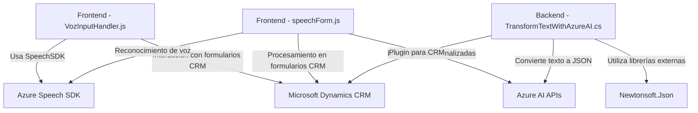

### Breve Resumen Técnico

El repositorio contiene archivos destinados a ofrecer interacción avanzada con formularios y sistemas CRM, integrando funcionalidades de síntesis de voz y reconocimiento de audio mediante Azure Speech SDK, y procesamiento de texto mediante Azure OpenAI Service. La solución parece ser un subsistema basado en la web con énfasis en interacción de voz y transformación de datos.

---

### Descripción de Arquitectura

La solución implementa un modelo **cliente-servidor** con integración directa con servicios en la nube como Azure Speech SDK y Azure AI. Además, emplea el patrón de plugin estándar de Dynamics CRM para extender sus funcionalidades, lo que refuerza su interoperabilidad. La arquitectura del sistema se alinea con un diseño **modular en capas**, donde el cliente web interactúa con formularios y servicios externos en la nube, mientras que los plugins procesan data en el backend de Dynamics CRM.

---

### Tecnologías Usadas

1. **Frontend:**
   - **JavaScript (ES6+):** Para la lógica relacionada con la interacción de voz y procesamiento de datos.
   - **Azure Speech SDK:** Reconocimiento de voz y síntesis de texto a voz.
   - Integración con formularios CRM usando APIs de Dynamics.

2. **Backend:**
   - **Microsoft Dynamics CRM:** Framework para almacenamiento y manipulación de datos en aplicaciones empresariales.
   - **Azure OpenAI:** Para transformar texto en información estructurada (JSON).
   - **C#/.NET Framework:** Implementación de plugins para trabajo con CRM y consumo de APIs externas.
   - **Newtonsoft.Json:** Para manejo de datos JSON en .NET.

3. **Patrones:**
   - Modularización.
   - Carga condicional de recursos.
   - Evento-Controlador en frontend (por interacción de usuario).
   - Cliente-Servidor (por consumo de APIs internas/externas).
   - Plugin para lógica extendida en Dynamics CRM.

---

### Diagrama Mermaid válido para GitHub Markdown

---

### Conclusión Final

El repositorio integra múltiples componentes para facilitar la síntesis, reconocimiento de voz y procesamiento de datos en formularios CRM, apoyándose en tecnologías de Microsoft y servicios en la nube. Su arquitectura es modular y en capas, con el frontend encargado de interacción directa con usuarios mediante eventos y APIs en tiempo real, y el backend funcionando como extensiones (plugins) para Microsoft Dynamics CRM.

Los puntos destacados incluyen:
- **Modularidad:** Cada archivo aborda un aspecto específico (voz, datos, procesamiento).
- **Uso de servicios en la nube:** Alta integración con Azure para IA y servicios de voz, apoyando innovación y escalabilidad.
- **Eficiencia:** Carga condicional de SDKs y separación de responsabilidades facilita mantenimiento.

Sin embargo, este diseño depende fuertemente de servicios de Microsoft Azure para su funcionalidad completa, lo que puede representar una limitación económica o técnica dependiendo del contexto de uso.