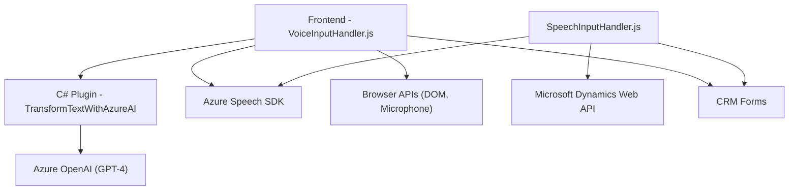

### Breve Resumen Técnico

El repositorio se centra en la integración de sistemas CRM con tecnologías de reconocimiento de voz y procesamiento mediante IA. Los archivos proporcionados tienen responsabilidades específicas: los scripts JavaScript gestionan la interacción entre usuarios y formularios dinámicos mediante reconocimiento de voz y síntesis de texto, mientras que el plugin en C# conecta la plataforma Dynamics CRM con servicios de Azure OpenAI para transformaciones avanzadas de texto en formatos estructurados (JSON). 

### Descripción de Arquitectura

La arquitectura del sistema tiene un enfoque basado en **microservicios** e integración con APIs para tareas específicas. Los scripts en JavaScript están diseñados como componentes modulares que implementan lógica focalizada de transcripción de voz, síntesis, y procesamiento de datos en el cliente dentro de formularios Dynamics CRM. Por otro lado, el plugin en C# actúa como un conector entre Dynamics CRM y Azure OpenAI, aislando la lógica en un encargado específico.

Aunque las funciones están distribuidas entre cliente y servidor, el sistema tiene una estructura orientada funcionalmente, con cierta modularidad y un marco de trabajo basado en eventos.

### Tecnologías, Frameworks y Patrones Usados

#### **Frontend:**
1. **Tecnologías:**  
   - JavaScript (compatible con navegadores).
   - Browser APIs como DOM manipulation y micrófono.
   - Azure Speech SDK para síntesis y transcripción de voz.
   - Microsoft Dynamics API para trabajar con formularios y entidades CRM.

2. **Patrones:**  
   - Modularización: funciones especializadas.
   - Delegación: Encapsulación de tareas dentro de métodos específicos (`startVoiceInput`, `callCustomApi`).
   - Integración: comunicación directa con servicios externos mediante SDKs y APIs HTTP.

#### **Backend:**
1. **Tecnologías:**  
   - Microsoft Dynamics SDK para extensibilidad del sistema CRM.
   - Azure OpenAI (GPT-4) para procesamiento avanzado de lenguaje.
   - HTTP y JSON.
   - Newtonsoft.Json para manipulación de objetos JSON.

2. **Patrones:**  
   - **Plugin architecture:** Conexión al framework Dynamics para amplificar capacidades del CRM.  
   - **Facade/Adapter:** Implementa un adaptador para encapsular la lógica de comunicación entre el plugin y Azure OpenAI API.
   - **Microservicios:** Funcionalidad discreta para transformar datos mediante IA.

### **Diagrama Mermaid**

Este diagrama muestra las relaciones funcionales entre los elementos principales del sistema, así como las dependencias clave.

### **Conclusión Final**

Este repositorio construye un sistema centrado en el procesamiento de voz y texto para su integración con Microsoft Dynamics CRM, habilitando una experiencia enriquecida para los usuarios con capacidades de síntesis, transcripción y generación de contenido estructurado con IA. Su arquitectura modular basada en microservicios otorga flexibilidad y escalabilidad al sistema, destacando por el uso de servicios avanzados de Azure (Speech SDK y OpenAI) combinados con el marco Dynamics CRM.